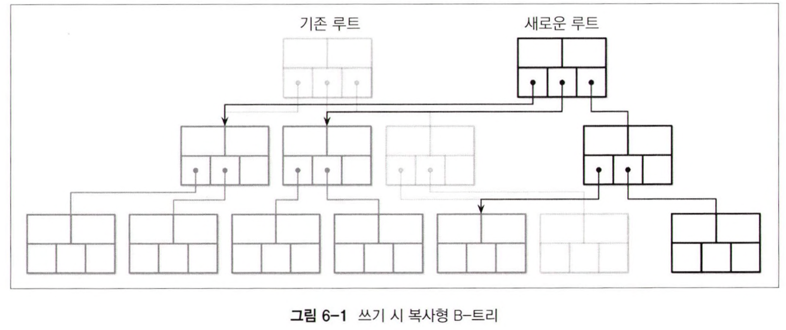
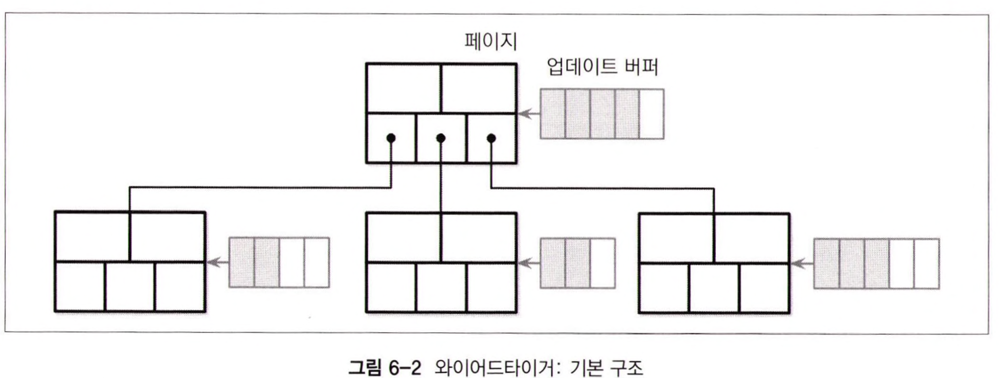
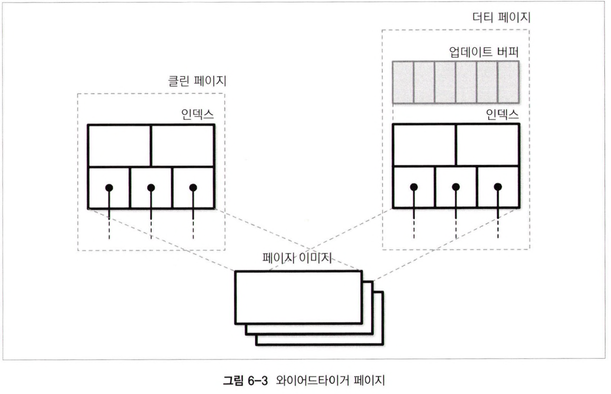
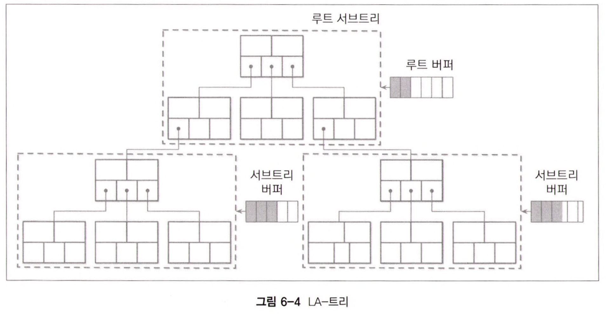

# 5장 트랜잭션 처리와 복구

DBMS에서 **트랜잭션**은 하나의 **논리적 작업 단위**를 의미한다. 여러 작업을 한 단계로 표현하는 방법이다.
작업에는 **읽기**와 **쓰기** 모두 포함된다.

모든 데이터베이스 트랜잭션은 **원자성**, **일관성**, **격리성**, **지속성**을 보장한다.
이 네 가지 속성을 줄여서 **ACID**라고 부른다

- 원자성(Atomicity)
    - 트랜잭션을 더 작은 단계로 나눌 수 없다.
    - 트랜잭션과 관련된 작업은 **모두 실행**되거나, **모두 실패**해야 한다.
    - 다르게 말하면 트랜잭션은 **커밋**되거나 **실패**하거나 둘 중 하나여야 한다.
    - 실패한 트랜잭션은 **재시도**할 수 있다.
- 일관성(Consistency)
    - 일관성은 애플리케이션이 제어하는 속성이다. 즉, 유일하게 사용자가 제어할 수 있는 속성이다.
    - 트랜잭션은 참조 무결성 등의 제약 조건을 위반하지 않고 데이터베이스를 하나의 유효 상태에서 다른 유효 상태로 변경한다.
    - 예를 들어 사용자가 고객 테이블의 잔고가 양의 정수여야 한다는 조건을 걸었다면 테이블의 모든 잔고는 양의 정수일 것이다.
    - 이때 일관된 상태는 잔고가 양의 정수라는 것이다.
    - 만약 한 트랜잭션이 잔고를 음수로 만드는 시도를 한다면 데이터베이스는 이를 거부해야 한다.
- 격리성(Isolation)
    - 트랜잭션이 동시에 수행되는 경우 한 트랜잭션이 다른 트랜잭션에 간섭할 수 없는 성질을 말한다.
    - 이에 따라 트랜잭션 밖에 있는 연산은 트랜잭션 중간 단계의 데이터를 볼 수 없다.
    - 하지만 많은 데이터베이스는 **성능** 상의 이유로 이것보다 **약한 수준의 격리 수준**을 사용한다.
- 지속성(Durability)
    - 트랜잭션이 **커밋**되었다면 그 상태는 시스템에 문제가 생겨도 유지되어야 한다.

트랜잭션을 수행하기 위해서는 데이터를 디스크에 저장하고 유지하는 자료구조 외에도 여러 컴포넌트가 필요하다.

- 트랜잭션 매니저
    - 트랜잭션의 세부 단계를 제어하고, 관리하고 스케줄한다
- 잠금 매니저
    - 리소스에 대한 **동시 접근**을 제어하고 **데이터 무결성**을 보장한다.
    - 잠금이 요청되면 매니저는 다른 트랜잭션이 공유(shared) or 배타적(exclusive) 잠금 모드로 해당 리소스를 소유하고 있는지 확인한다.
    - 가능하면 접근을 허용하고, 불가능하면 잠금이 해제되거나 트랜잭션이 끝날 때 대기 트랜잭션에게 이 사실을 알려준다.
- 페이지 캐시(page cache)
    - 영구 저장소(디스크)와 스토리지 엔진 사이의 중개자 역할을 한다.
    - 메인 메모리의 변경 사항을 저장하고 영구 저장소와 동기화되지 않은 페이지를 캐시한다.
    - 모든 데이터베이스 상태 변경은 우선 페이지 캐시에 저장된다.
- 로그 매니저
    - 영구 저장소와 동기화되지 않은 페이지 캐시의 내용이 손실되지 않도록 작업 히스토리(로그)를 저장한다.
    - 로그를 기반으로 부팅시 작업을 재수행 해 캐시의 내용을 재구성한다.
    - 중단된 트랜잭션의 내용을 되돌릴 때도 로그를 사용한다.

## 버퍼 관리

데이터베이스는 상대적으로 느린 영구 저장소(디스크)와 빠른 메인 메모리로 구성되어있다. 즉, 메모리 계층 구조를 이루고 있다.
따라서 영구 저장소의 접근 횟수를 줄이기 위해서 **페이지**를 메모리에 **캐시**한다.

다른 프로세스가 페이지에 저장된 값을 변경하지 않았다면 메모리에 캐시된 페이지를 사용할 수 있다.
이와 같은 방식을 **가상 디스크(virtual disk)** 라고 부르기도 한다.
더 일반적인 명칭은 **페이지 캐시**, **버퍼 풀(buffer pool)** 이다.

**페이지 캐시**는 디스크에서 읽은 **페이지**를 메모리에 저장한다.
시스템 장애가 발생하면 캐시된 데이터는 사라진다.

아직 캐시되지 않은 페이지를 디스크에서 메모리로 가져오는 과정을 **페이징(paging)** 이라고 한다.
변경되었지만 아직 디스크로 플러시되지 않은 페이지를 **더티(dirty) 페이지**라고 한다.

일반적으로 페이지 캐시의 메모리 영역이 전체 데이터 셋보다 작기 때문에 **페이지 만료**가 필요하다.


페이지 캐시는 순서를 고려하지 않고 빈 슬롯에 페이지를 복사한다.
즉, 디스크와 메모리에서 페이지가 정렬되는 방식에는 연관성이 없다.

페이지 캐시의 주요 기능은 다음과 같다.

- 페이지를 메모리에 캐시한다
- 디스크에 저장된 페이지의 변경 사항을 함께 버퍼링하고 캐시된 페이지에 반영한다
- 캐시되지 않은 데이터가 요청되면 메모리에 공간이 충분하면 페이징하고 캐시된 버전을 반환한다.
- 캐시된 페이지가 요청된 경우 메모리에서 반환한다.
- 메모리에 새로운 페이지를 추가할 공간이 없는 경우 일부 페이지를 만료시키고 **플러시**시킨다.

> 많은 데이터베이스 시스템이 `O_DIRECT` 플래그를 사용해서 파일을 읽는다. 이 플래그를 사용하면 I/O 시스템 호출 시 커널 페이지 캐시를 우회하고 디스크에 바로 접근할 수 있다. 덕분에 데이터베이스에
> 특화된 버퍼 관리 기법을 사용할 수 있다.

## 캐싱

버퍼에 대한 변경 사항은 디스크에 쓰기 전까지 메모리에 남겨둔다.
어떤 프로세스도 원본 파일을 수정할 수 없기 때다.
따라서 동기화는 메모리에서 디스크로 플러시하는 **단방향 작업**이다.(메모리가 디스크에 비해 뒤쳐질 일이 없다)

데이터베이스는 **페이지 캐시**를 사용해 메모리를 관리하고 디스크 접근을 제어한다.
페이지 캐시를 애플리케이션에 특화된 **커널 페이지 캐시**라고 생각할 수도 있다.
더 나아가 **디스크 접근**을 **추상화**하고, **논리적 쓰기**와 **물리적 쓰기**를 분리한다.

페이지를 캐시하면 트리의 일부를 메모리에 저장할 수도 있다.

스토리지 엔진이 특정 페이지를 요청하면 동작은 다음과 같다.

- 캐시된 버전이 있으면 이를 반환한다.
- 없으면 물리적 주소로 변환해 해당 페이지를 메모리로 복사하고 반환한다.

이때 해당 페이지가 저장된 버퍼는 **참조(reference)** 상태가 된다.
작업이 끝나면 스토리지 엔진은 해당 페이지를 캐시에 **반환** or **참조 해제(dereference)** 해야 한다.
페이지를 고정시키면 페이지 캐시에서 제거되지 않는다.

페이지가 변경되면 **더티 플래그**를 설정한다.
이는 해당 페이지가 변경되었지만 아직 디스크와 동기화되지 않았음을 의미한다. 즉, 플러시가 필요한 페이지다.

## 캐시 만료

캐시된 데이터가 많으면 더 많은 읽기 요청을 디스크 접근 없이 처리할 수 있다.
또한 같은 페이지에 대한 변경 사항을 더 많이 버퍼할 수 있다.

하지만 페이지 캐시의 크기는 한정적이기 때문에 오래된 페이지는 제거할 필요가 있다.

- 페이지가 동기화됐고(플러시 되었거나 변경되지 않음) 고정, 참조 상태가 아니라면 즉시 제거할 수 있다.
- 더티 페이지는 제거 전에 먼저 플러시해야 한다.
- 참조 상태의 페이지는 사용이 끝날 때까지 제거할 수 없다.

페이지를 제거할 때마다 플러시한다면 성능이 저하될 수 있다.
따라서 일부 데이터베이스는 백그라운드 프로세스가 제거될 가능성이 높은 **더티 페이지**를 주기적으로 플러시한다.
> PostgreSQL : background flush writer

데이터베이스에 장애가 발생하면 플러시되지 않은 데이터는 손실된다.
따라서 데이터 손실을 방지하기 위해 **체크포인트(checkpoint) 프로세스**가 **플러시 시점**을 제어한다.
체크포인트 프로세스는 **선행 기록 로그(WAL, Write-ahead logging)** 와 **페이지 캐시**의 싱크가 맞도록 조정한다.
오직 플러시가 완료된 캐시된 페이지와 관련된 로그만 WAL에서 삭제될 수 있다.

종합하면 캐싱에는 여러 트레이드 오프가 존재한다.

- 디스크 접근 횟수를 줄이기 위해서 플러시 시점을 늦춘다
- 페이지를 우선적으로 플러시 해 빠르게 캐시에서 제거한다
- 제거할 페이지를 선택하고 최적의 순서로 플러시한다
- 캐시 크키를 메모리 범위 내로 유지한다
- 기본 저장소에 저장되지 않은 데이터는 손실되지 않아야 한다

## 페이지 고정

B-트리는 상위 레벨로 올라갈수록 좁기 때문에 상위 레벨에 가까운 노드는 대부분의 읽기 작업에서 접근한다. 분할과 병합도 결국 상위로 전파되므로 트리의 일부를 캐시해두면 도움이 된다.

페이지를 캐시에 가둬두는 것을 **고정(pinning)** 한다고 표현한다.
가까운 시간 내에 요청될 확률이 높은 페이지는 고정시킬 수 있다.
고정된 페이지는 캐시에 오래유지 되므로 디스크 접근 횟수를 낮추고 성능을 높일 수 있다.

트리 입장에서 **상위 레벨 노드**는 극히 일부분이므로 상위 레벨 노드를 메모리에 **고정**시키고 나머지 노드는 요청시 **페이징**해도 된다. 이 방식은 쿼리 요청마다 디스크에 트리 높이만큼 접근하지 않고,
캐시되지 않은 하위 레벨 노드만 디스크에서 읽는다.

서브트리에 대해서 수행된 여러 작업이 상충되는 **구조 변경**을 일으키는 경우 디스크에 바로 쓰는 대신 메모리에 모아뒀다가 일괄 적용하면 **디스크 접근 횟수**와 **작업 비용**을 줄일 수 있다.

페이지 캐시를 사용하면 **페이지 프리페치**와 **만료 시기**를 세부적으로 제어할 수 있다.
범위 스캔과 같이 다음 리프 노드를 읽을 확률이 높은 경우 미리 페이징할 수도 있다.
유지관리 프로세스가 접근한 페이지는 쿼리에서 사용할 확률이 낮으므로 즉시 캐시에서 만료시킬 수도 있다.
PostgreSQL을 포함한 일부 데이터베이스는 대량 순차적 스캔에 원형 버퍼를 사용한다.

## 페이지 교체 알고리즘

저장 공간이 부족한 캐시에 새로운 페이지를 추가하려면 일부 페이지를 만료시켜야 한다.
하지만 빈번하게 요청될 수 있는 페이지를 만료시키면 같은 페이지를 여러 차례 페이징하는 상황이 벌어질 수도 있다.

캐시된 페이지는 **만료 정책(eviction policy)** 또는 **페이지 교체 알고리즘**에 따라 캐시에서 제거된다.
다시 요청될 확률이 낮은 페이지를 만료시키고 새로운 페이지를 페이징한다.

페이지 교체 알고리즘은 페이지 캐시의 성능을 결정하는 중요한 요인이다.
페이지 요청 순서는 특정 패턴이나 분포를 따르지 않기 때문에 정확한 예측이 불가능하다.
하지만 적절한 알고리즘을 사용하면 불필요한 페이징을 방지할 수 있다.

캐시 용량을 늘리면 제거되는 페이지가 줄어들 것 같지만 그렇지 않다.
**벨레이디의 모순(Belady's Anomaly) 현상**은 적합하지 않은 페이지 교체 알고리즘을 사용했을 때 페이지 수가 증가하면 제거되는 페이지 수도 증가하는 현상을 의미한다.
즉, 적절한 페이지 교체 알고리즘을 사용해야 한다.

### FIFO와 LRU

**FIFO** 방식은 페이지의 ID를 삽입 순서대로 큐 끝에 추가한다.
페이지 캐시에 공간이 부족하면 큐 헤드에 저장된 페이지를 만료시킨다.
이 방식은 페이지 접근 순서를 전혀 고려하지 않기 때문에 실용적이지 않다.
예를 들어 루트와 최상위 레벨의 페이지는 먼저 페이징되고, 재요청될 확률이 높지만 FIFO에선 우선 제거 대상이다.

**LRU** 방식은 FIFO를 확장한 방식이다.
FIFO처럼 삽입 순서대로 큐 끝에 추가하지만 재요청되면 다시 큐 끝에 추가한다.
하지만 이 방식은 페이지를 요청할 때마다 페이지에 대한 참조와 노드를 갱신해야 하기 때문에 동시 접근 환경에서 매우 비효율적이다.

LRU 기반의 다른 알고리즘도 있다.
**2Q LRU**는 2개의 큐를 사용해서 자주 요청되는 페이지를 구분한다.
**LRU-K 알고리즘**은 마지막으로 참조된 k개의 페이지를 기반으로 자주 요청되는 페이지를 구분하고, 페이지 별 요청 횟수를 예측한다.

### CLOCK 알고리즘

어떤 상황에는 **정확성**보다 **효율성**이 중요할 수도 있다.
LRU의 대안으로 사용되는 **CLOCK 알고리즘**은 더 단순하고, **캐시 친화적**이고, **동시성**을 지원한다.
리눅스는 변형된 CLOCK 알고리즘을 사용한다.

**CLOCK-sweep 알고리즘**은 페이지에 대한 **참조**와 **접근 여부**를 나타내는 **비트**를 **원형 버퍼**에 저장한다. 일부 구현은 비트 대신 요청 횟수를 나타내는 카운터를 사용하기도 한다.
페이지가 **요청**될 때마다 해당 페이지의 **접근 비트를 1**로 설정한다.
CLOCK-sweep 알고리즘은 원형 버퍼를 순회하며 접근 비트를 확인한다.

- 접근 비트가 **1**이고, 페이지가 참조 중이 아니라면 접근 비트를 **0**으로 설정하고 다음 페이지로 넘어간다
- 접근 비트가 **0**이라면 해당 페이지를 **제거 대상**으로 선정하고 만료 작업을 스케줄링한다.
- 현재 **참조** 중인 페이지의 접근 비트는 그대로 유지한다. 참조 중인 페이지의 접근 비트는 0이 될 수 없기 때문에 제거될 수도 없고 제거될 확률도 낮다.


원형 버퍼의 장점은 클럭 포인터와 페이지를 **CAS(compare-and-swap)** 방식으로 쉽게 수정할 수 있고 추가적인 **잠금** 메커니즘이 필요없다는 것이다.

**LRU**가 항상 데이터베이스 시스템에서 사용할 수 있는 최적의 페이지 교체 알고리즘은 아니다.
어떤 경우에는 **최신성(recency)** 보다 **사용 빈도**를 예측 변수로 사용하는 것이 더 효과적일 수 있다.

### LFU

페이징 횟수 대신 **페이지 참조 횟수**를 기반으로 제거할 페이지를 선택하는 방법도 있다.
**LFU(Least-Frequently Used)** 알고리즘은 요청 빈도가 가장 낮은 페이지를 제거한다.

**TinyLFU**는 페이징 시점이 아니라 요청 빈도를 고려해 페이지의 만료 여부를 결정한다.
즉, 요청 빈도 기반 페이지 교체 알고리즘이다.
이는 자바의 Caffeine 라이브러리가 사용하는 방식이다.
> Caffeine is presented as part of research papers evaluating its novel eviction policy.
> [TinyLFU: A Highly Efficient Cache Admission Policy](https://dl.acm.org/doi/10.1145/3149371?cid=99659224047)by Gil
> Einziger, Roy Friedman, Ben Manes

TineLFU는 **캐시 접근 이력**을 **빈도수 히스토그램**에 저장한다. 전체 이력을 저장하는 것은 비실용적이고 비용도 높다.

TinyLFU는 페이지를 다음 중 하나의 큐에 저장한다.

- 등록(admission) 큐 : LRU 알고리즘을 기반으로 새로 추가된 페이지를 저장한다
- 관찰(probation) 큐 : 제거될 확률이 높은 페이지를 저장한다
- 보호(protected) 큐 : 큐에 오랫동안 남아있을 페이지를 저장한다


TinyLFU는 제거할 페이지 대신 **큐에 유지할 페이지**를 선택한다.
요청 빈도가 높은 페이지를 **관찰 큐**로 옮기고 다시 요청되면 **보호 큐**로 옮긴다.
**보호 큐**가 가득 차면 일부 페이지를 다시 **관찰 큐**로 옮긴다.
따라서 요청 빈도가 높은 페이지일수록 큐에 더 오랫동안 유지되며, 요청 빈도가 낮은 페이지는 큐에서 제거될 확률이 높다.

페이지 교체 알고리즘은 시스템의 레이턴시와 I/O 작업 횟수에 큰 영향을 미치므로 신중하게 선택해야 한다.

## 복구

데이터베이스는 각자 다른 안정성, 신뢰성 문제를 내재한 여러 하드웨어와 소프트웨어 계층으로 구성된다.
데이터베이스 시스템 자체나 기반 소프트웨어, 하드웨어 컴포넌트에 **장애**가 발생할 수 있기 때문에 여러 장애 시나리오를 고려해서 **"약속된" 데이터**가 실제로 **저장**되게 해야 한다.

선행 기록 로그(WAL, Write-ahead logging or 커밋 로그)는 **장애 및 트랜잭션 복구**를 위해 **디스크**에 저장하는 추가 전용 보조 자료 구조다.
**페이지 캐시**는 페이지 변경 사항을 메모리에 **버퍼링**하는데 이 내용이 디스크에 **플러시**되기 전까지 이 작업들의 유일한 **디스크 복사본**은 **WAL**이다.
PostgreSQL, MySQL 등 다양한 데이터베이스가 추가 전용 WAL을 사용한다.

- [PostgreSQL](https://www.postgresql.org/docs/current/wal-intro.html)
- [MySQL Redo Log](https://dev.mysql.com/doc/refman/8.0/en/innodb-redo-log.html)

WAL의 주요 기능은 다음과 같다.

- 디스크에 저장된 페이지 변경 사항을 페이지 캐시에 버퍼링하면서 동시에 데이터의 지속성을 보장할 수 있게 한다.
- 캐시된 페이지가 디스크와 동기화될 때까지 작업 이력을 디스크에 저장한다.
- 데이터베이스의 상태를 변경하는 모든 작업은 실제 페이지에 적용되기 전에 먼저 디스크에 로깅한다.
- 장애 발생 시 로그를 기반으로 마지막 메모리 상태를 재구성한다.

WAL은 **트랜잭션 처리**에도 중요한 역할을 한다.
WAL은 로그를 재수행해서 커밋되지 않은 트랜잭션을 완료하거나, 장애가 발생하기 이전 상태로 되돌릴 수 있게 해준다.

즉, 요약하면 다음과 같다.

- 페이지 캐시에 변경 사항을 버퍼링하면 장애가 발생했을 때 메모리가 날라가면서 플러시되지 않은 내용이 소실될 수 있는데 디스크에 먼저 로깅을 함으로써 데이터의 지속성을 보장한다.
- 로그를 재수행해 커밋되지 않은 트랜잭션을 완료하거나, 이전 상태로 되돌려 트랜잭션 처리를 끝마칠 수 있도록 한다.

## 로그의 시맨틱

WAL은 **추가 전용 자료구조**이며, 작성된 데이터는 모두 **불변**하기 때문에 **모든 쓰기 작업은 순차적**이다.
덕분에 로그에 새로운 데이터를 추가하는 도중에 특정 최신 값까지 안전하게 읽을 수 있다.

WAL은 여러 레코드로 구성된다.
모든 레코드에는 단조 증가하는 **고유 로그 시퀀스 번호(LSN, Log Sequence Number)** 가 있다. 일반적으로 카운터 값 혹은 타임스탬프 값을 사용한다.
로그 레코드의 크기가 디스크 블록의 크기보다 작을 수 있기 때문에 로그 버퍼에 임시 저장하고 포스(force) 작업 시 디스크로 플러시한다.
포스 작업은 로그 버퍼가 가득 찰 때 수행되며 트랜잭션 매니저, 페이지 캐시가 요청할 수도 있다.
모든 로그 레코드는 LSN과 동일한 순서로 플러시되어야 한다.

Ex) [MySQL innodb_flush_log_at_trx_commit](https://systemv.tistory.com/48)

WAL은 작업 로그 레코드 외에도 **트랜잭션 완료 여부**를 나타내는 레코드도 저장한다.
트랜잭션의 커밋 레코드의 LSN까지 **플러시** 되어야 해당 트랜잭션이 커밋되었다고 간주한다.

일부 시스템은 트랜잭션 롤백 또는 복구 중 장애가 발생해도 시스템이 정상 작동할 수 있도록 **보상 로그 레코드(CLR, Compensation Log Record)** 를 로그에 저장하고 **언두(undo)**
작업 시 사용한다.

일반적으로 **WAL**은 **체크포인트**에 도달하면 이전 로그를 **정리(trimming)** 하는 인터페이스를 통해 **기본 저장소**와 동기화한다.

**체크포인트**는 해당 시점 이전의 모든 로그 레코드가 **플러시**되어 더 이상 필요하지 않다는 것을 로그에 명시하는 수단이다.
덕분에 체크포인트를 남기면 데이터베이스 가동 시 수행해야 하는 작업을 대폭 줄일 수 있다.

모든 더티 페이지를 기본 저장소와 완전 동기화하는 작업을 **싱크(sync) 체크포인트**라고 한다.

하지만 모든 데이터를 한 번에 디스크로 플러시하게 되면 체크포인트 작업이 완료될 때까지 다른 작업을 처리할 수 없으므로 비효율적이다.
따라서 대부분의 데이터베이스는 퍼지(fuzzy) 체크포인트를 사용한다.

> [참고](https://blog.ex-em.com/1700)
> [참고 2](https://github.com/meeeejin/til/blob/master/mysql/how-innodb-performs-a-checkpoint.md#fuzzy-checkpoint)
>
> MySQL
> A technique that**flushes**small batches of**dirty pages**from the**buffer pool**, rather than flushing all dirty
> pages at once which would disrupt database processing.

마지막으로 성공한 체크포인트 작업에 대한 정보를 로그 헤더에 저장한 `last_checkpoint` 헤더에 저장한다.
퍼지 체크포인트는 `begin_checkpoint`라는 특별한 레코드로 시작해서 더티 페이지에 대한 정보와 트랜잭션 테이블의 내용을 저장한 `end_checkpoint`라는 레코드로 끝난다.
이 레코드에 명시된 모든 페이지가 플러시되면 해당 체크포인트가 완료되며 `last_chckpoint` 레코드를 `begin_checkout`의 LSN으로 업데이트한다.
이때 명시된 페이지들은 비동기적으로 플러시된다.

## 작업 로그 대 데이터 로크

시스템 R 등의 데이터베이스 시스템은 데이터의 지속성과 트랜잭션의 원자성을 보장하는 **쓰기 시 복사(copy-on-write)** 방식의 **섀도 페이징(shadow paging)** 기법을 사용한다.
새로운 데이터를 우선 내부 섀도 페이지에 쓴 다음에 이전 버전의 페이지를 가리키는 포인터를 섀도 페이지를 가리키도록 변경해 업데이트된 내용을 반영한다.

모든 상태 변화는 **이전 상태**와 **이후 상태** 조합으로 나타낼 수 있다.

- 리두 작업 : 이전 상태 -> 이후 상태
- 언두 작업 : 이후 상태 -> 이전 상태

**물리적 로그**나 **논리적 로그**를 사용해서 레코드와 페이지의 상태를 되돌리거나 재구성할 수 있다.

- 물리적 로그 : 전체 페이지 상태 또는 바이트별 변경 사항
    - 로깅 대상 작업에 의해 영향을 받은 모든 페이지 참조
- 논리적 로그 : 현재 상태에 대해 수행해야 하는 작업
    - "Y 키에 레코드 X 삽입"과 같은 형태로 저장

대부분의 데이터베이스 시스템은 물리적 로그와 논리적 로그 모두 사용한다.
**언두 작업**에는 **동시성**과 **성능**을 위해 **논리적 로그**를 사용하고, **리두 작업**에는 **복구 시간 단축**을 위해 **물리적 로그**를 사용한다.

## 스틸과 포스 정책

DBMS는 다음 정책을 기반으로 메모리에 캐시된 변경 사항을 디스크로 플러시로 하는 시점을 결정한다.

- 스틸(steal) / 노스틸(no-steal) 정책
- 포스(force) / 노포스(no-force) 정책

이 정책들은 **페이지 캐시**와도 관련되지만 **복구 알고리즘** 선택에 큰 영향을 미친다.

**더티 페이지**를 **스틸**한다는 것은 메모리에 캐시된 데이터를 디스크로 **플러시**하고 디스크에서 다른 페이지를 **페이징**하는 것을 말한다.
**스틸 정책**은 트랜잭션이 수정한 페이지를 커밋하기도 전에 플러시하는 것을 허용한다.
**노스틸 정책**은 커밋되지 않은 트랜잭션이 디스크로 플러시되는 것을 허용하지 않는다.

**더티 페이지**를 **포스**한다는 것은 **커밋** 전에 디스크로 **플러시**하는 것을 의미한다.
**포스 정책**은 트랜잭션이 수정한 모든 페이지를 커밋 전에 플러시하는 것을 말한다.
**노포스 정책**은 일부 페이지가 디스크로 플러시되지 않았더라고 트랜잭션 커밋을 허용한다.

스틸과 포스 정책은 트랜잭션 언두와 리두 작업과 관련되어 있다.
**언두**는 **포스된 페이지**를 **롤백**하고, **리두**는 **커밋된 트랜잭션**을 다시 수행한다.

**노스틸 정책**을 사용하면 디스크에는 이전 상태의 페이지가 저장되어 있고, 디스크에는 최신 변경 사항이 있으므로 **리두 로그**만 사용해서 상태를 복구할 수 있다. 커밋된 트랜잭션만 플러시되기 때문이다.

**노포스 정책**을 사용하면 커밋 전에 플러시될 필요가 없으므로 플러시 시점을 늦춰 더 많은 변경 사항을 **버퍼링**할 수 있다. 대신 페이지를 더 오래 캐시해야 하므로 **더 큰 페이지 캐시**가 필요할 수도
있다.

**포스 정책**을 사용하면 트랜잭션이 수정한 페이지가 커밋 전에 플러시되므로 **장애 복구**시 트랜잭션 커밋 결과를 **재구성**할 필요가 없다. 커밋되기전에 미리 디스크에 반영하기 때문이다.
하지만 **많은 I/O**로 인해 **트랜잭션 커밋 시간**이 증가한다.

트랜잭션에서 수정한 페이지가 **플러시**되면 해당 내용을 **롤백**할 수 있도록 **커밋**될 때까지 **언두** 관련 정보를 로그에 유지해야 한다.
**플러시**되지 않았다면 **리두 레코드**를 로그에 유지해야 한다.
두 경우 모두 **언두, 리두 로그**를 로그 파일에 쓰기 전까지 트랜잭션을 **커밋**할 수 없다.

## ARIES

ARIES(Algorithm for Recovery and Isolation Exploiting Semantics)는 **스틸/노프스 정책** 기반의 **복구 알고리즘**이다.
**빠른 복구**를 위해 **물리적 로그**를 사용한다. 물리적 로그는 변경사항을 빠르게 반영할 수 있다.
일반 작업의 **동시성**을 위해 **논리적 언두**를 사용한다. 논리적 언두는 페이지에 독립적으로 적용할 수가 있다.

복구 시 커밋되지 않은 트랜잭션을 언두하기 전에 데이터베이스 상태를 재구성하기 위해 **WAL 레코드**를 기반으로 작업을 **재수행(repeating history)** 하고 언두 중에 **보상 로그 레코드(
CLR)** 를 기록한다.

장애 발생 후 데이터베이스 시스템을 재시작하면 복구는 다음 3단계로 진행된다.

1. 분석(analysis) 단계
    - 페이지 캐시에 저장된 **더티 페이지**와 장애 발생 당시 **수행 중이던 트랜잭션**을 파악한다.
    - 더티 페이지에 대한 정보를 기반으로 리두 단계의 시작점을 결정한다.
    - 트랜잭션 목록을 활용해 언두 단계에서 미완료된 트랜잭션을 롤백한다.
2. 리두 단계
    - 장애가 발생하기 전까지의 작업을 수행하고 데이터베이스를 이전 상태로 복원한다.
    - 이는 불완전한 트랜잭션뿐만 아니라 커밋됐지만 결과가 디스크로 플러시되지 않은 트랜잭션을 롤백하기 위한 준비 단계다.
3. 언두 단계
    - 불완전한 트랜잭션을 롤백하고 데이터베이스를 마지막 일관된 상태로 복원한다.
    - 모든 작업은 실제 수행 순서의 역순으로 롤백된다.
    - 복구 중에도 장애가 발생할 수 있으므로 언두 작업도 로그에 기록해야 한다.

ARIES는 **LSN**을 사용해 로그 레코드를 식별한다.
트랜잭션에서 어떤 페이지를 수정했는데 **더티 페이지 테이블**에 기록하며 **물리적 리두**, **논리적 언두**, **퍼지 체크포인트**를 사용한다.

## 동시성 제어

**동시성**은 **트랜잭션 매니저**와 **잠금 매니저**가 제어한다.
동시성 제어는 동시에 수행되는 여러 트랜잭션 사이의 **상호작용**을 제어하는 기법이다.

동시성 제어는 다음과 같이 분류할 수 있다.

- 낙관적 동시성 제어(OCC, Optimistic Concurrency Control)
    - 여러 트랜잭션이 동시에 읽고 쓰는 것을 허용하며 결합된 여러 작업이 직렬화가 가능한지 여부를 결정한다.
    - 트랜잭션이 서로 간섭하지 않고 각자의 작업 내역을 유지할 수 있게 하며, 커밋 전에 충돌이 발생할 수 있는지 확인한다.
    - 만약 충돌이 발생하면 트랜잭션 중 하나를 중단한다.
- 다중 버전 동시성 제어(MVCC, Multiversion Concurrency Control)
    - 여러 버전의 레코드를 저장해 과거의 특정 타임스탬프의 데이터베이스의 일관성을 보장한다.
    - MVCC는 하나의 트랜잭션만을 채택하는 검증 기법을 사용해서 구현하거나 타임스탬프 순서화 기법(timestamp ordering)과 같은 무잠금 기법 방식을 사용하거나 2단계 잠금(two-phase
      locking)과 같은 잠금 방식으로 구현할 수 있다.
- 비관적(보수적) 동시성 제어(PCC, Pessimistic(Conservative) Concurrency Control)
    - PCC는 잠금 방식과 무잠금 방식이 있다.
    - 잠금 기반 방식은 각 트랜잭션이 다른 트랜잭션이 같은 레코드를 동시에 수정 및 접근할 수 없도록 레코드에 대한 잠금을 획득한다.
    - 무잠금 방식은 읽기, 쓰기 작업에 대한 목록을 유지하고 완료되지 않은 트랜잭션 스케줄에 따라 다른 트랜잭션의 수행을 제한한다.
    - 여러 트랜잭션이 서로 잠금을 해제하기 기다리는 교착 상태가 발생할 수 있다.

## 직렬화 가능성

**트랜잭션**은 데이터베이스의 상태를 **읽고 쓰는 작업**과 **비즈니스 로직**으로 구성된다.
데이터베이스의 관점에서 **스케줄**이란 트랜잭션을 수행하는데 필요한 **작업의 목록**이다.
> 읽기, 쓰기, 커밋, 중단 등 데이터베이스 상태를 변경하는 모든 작업

이때 목록에 포함되지 않은 작업은 부작용이 없다고 가정한다.

**완전한(complete) 스케줄**은 관련 트랜잭션의 모든 작업을 포함한다.
**올바른(correct) 스케줄**은 논리적으로는 전체 작업 목록과 동일하지만 **ACID 속성**과 트랜잭션 결과의 **정확성**이 보장된다면 일부 작업이 **병렬 수행**되거나 **성능**을 위해 **수행 순서
**가 바뀔 수 있다

포함된 모든 트랜잭션이 교차하지 않고 완전히 독립적으로 수행될 수 있는 스케줄을 **직렬(serial) 스케줄**이라고 한다.
**직렬 스케줄**은 한 트랜잭션이 끝나야 다음 트랜잭션이 수행될 수 있으므로 매우 **직관적**이다. 하지만 항상 트랜잭션을 하나씩 실행하면 시스템의 **처리량**이 크게 제한되고 **성능**도 떨어진다.

트랜잭션을 **동시에 수행**하면서 직렬 스케줄의 **정확성**과 **단순성**을 유지하는 방법은 없을까?
**직렬화 가능한(serializable) 스케줄**이 이 문제를 해결할 수 있다.
동일한 트랜잭션 집합에 대해 **완전한 직렬 스케줄** 중에서 동일한 스케줄이 있을 경우 해당 스케줄은 **직렬화 가능**하다고 한다.
**직렬화 가능한 스케줄**의 결과는 트랜잭션을 임의의 순서로 순차 수행한 결과와 같다.


## 트랜잭션 격리

데이터베이스 시스템은 여러 **격리 수준(isolation level)** 을 지원한다.
**격리 수준**은 트랜잭션이 **변경한 내용** 중 **어떤 부분**이 **언제** 다른 트랜잭션에서 접근할 수 있는지를 정의한다.

즉, 격리 수준은 동시에 수행되는 트랜잭션이 **고립된 정도**와 **이상 현상**이 발생할 수 있는지를 나타낸다.
> Dirty Read, Non-Repeatable Read, Phantom Read

트랜잭션을 격리하기 위해서는 일부 데이터가 트랜잭션 경계를 넘어 전파되는 것을 막아야하기 때문에 추가적인 **코디네이션**과 **동기화**가 필요하다.
즉, **추가 비용**과 **성능 저하**가 발생한다.

## 읽기와 쓰기 이상 현상

SQL 표준은 여러 트랜잭션이 동시 수행될 때 발생할 수 있는 이상 현상을 분류해놨다.

- 읽기 이상 현상
    - 더티 읽기(dirty read)
        - 아직 커밋되지 않은 다른 트랜잭션의 결과를 읽는 현상
    - 반복 불가능 읽기(Non-repeatable read)
        - 트랜잭션이 동일한 로우를 두 번 쿼리했을 때 둘의 결과가 다른 현상
    - 팬텀 읽기(phantom read)
        - 범위 쿼리를 수행했을 때 팬텀 레코드(phantom record)가 포함되는 현상
- 쓰기 이상 현상
    - 갱신 분실(lost update)
        - 트랜잭션이 같은 값을 수정할 때 발생
        - 먼저 수정한 값이 사라진다
    - 더티 쓰기(dirty write)
        - 트랜잭션이 커밋되지 않은 값을 읽고(더티 읽기) 수정 및 커밋하는 현상
        - 커밋되지 않은 값에 따라 트랜잭션 결과가 달라질 수 있다
    - 쓰기 치우침(write skew)
        - 개별 트랜잭션은 불변 조건을 충족하지만 동시 수행 시 조건이 위반되는 현상

## 격리 수준

가장 약한 격리 수준은 **커밋 이전 읽기(read uncommitted)** 수준이다.
이는 여러 트랜잭션이 동시에 수행될 때 커밋되지 않은 데이터를 읽을 수 있다. 즉, **더티 읽기** 현상이 발생한다.

트랜잭션이 오직 커밋된 데이터만 읽도록 하면 **더티 읽기** 현상을 방지할 수 있다.
하지만 **팬텀 읽기**와 **반복 불가능 읽기**는 발생할 수 있다.
이와 같은 격리 수준을 **커밋 이후 읽기(read committed)** 라고 한다.

가장 높은 격리 수준은 **직렬화 가능(SERIALIZABLE)** 수준이다.
이는 트랜잭션이 순차적으로 수행된 것처럼 결과를 반환한다.
만약 동시에 트랜잭션을 수행하지 않는다면 데이터베이스의 **성능**은 매우 떨어지기 때문에 불변 조건을 위반하지 않고 트랜잭션을 동시에 수행할 수 있다면 트랜잭션 수행 순서를 바꿔서라도 동시 수행을 한다. 단지
결과는 반드시 어떤 순차적인 순서로 나타나야 한다.

서로 의존성이 없는 트랜잭션은 독립적이다. 따라서 임의의 순서로 수행할 수 있다.
분산 시스템 맥락에서의 **선형화 가능성(linearizability)** 와 다르게 **직렬화 가능성**은 임의의 순서로 수행된 여러 작업에 대한 속성이다. 수행 순서에 대한 특정 순서를 강제하거나 미리 정의하지
않는다.

ACID의 격리성은 **직렬화 가능성**을 의미한다. **직렬화 가능성**을 구현하기 위해서는 추가적인 **코디네이션 과정**이 필요하다. 동시 수행 중인 트랜잭션이 조건을 위반하지 않도록 하고, 충돌이 발생하는
순차적으로 실행시켜야 한다.

일부 데이터베이스는 **스냅숏 격리(snapshot isolation)** 수준을 지원한다. 스냅숏 격리 수준에서 각 트랜잭션은 시작 당시의 다른 트랜잭션이 커밋한 내용을 확인할 수 있다.
트랜잭션은 데이터의 스냅숏을 생성하고 이에 대해 쿼리한다. 트랜잭션 수행 중에는 스냅숏을 변경할 수 없다.
트랜잭션이 수정한 값이 수행 중에 변경되지 않은 경우에만 커밋될 수 있다. 만약 변경되었다면 롤백된다.

따라서 두 개의 트랜잭션이 같은 값을 수정한 경우 한 개의 트랜잭션만 커밋될 수 있다. 따라서 **갱신 분실(lost update)** 이 발생하지 않는다. 먼저 커밋을 시도한 트랜잭션이 커밋되고 이후에 커밋한
트랜잭션은 중단된다.

**스냅숏 격리 수준**에서도 **쓰기 치우침(write skew)** 가 발생할 수 있다. 두 개의 트랜잭션이 각자의 스냅숏에서 값을 읽고, 수정한 결과가 조건을 위반하지 않는다면 모두 커밋이 허용된다.

## 낙관적 동시성 제어

**낙관적 동시성 제어**는 트랜잭션 충돌이 거의 발생하지 않는다고 가정한다.
**잠금**과 **블로킹 트랜잭션**을 사용하지 않고 결과를 **커밋**하기 전에 트랜잭션을 **검증**해 동시 수행 트랜잭션의 읽기/쓰기 **충돌**을 방지하고 **직렬화 가능성**을 확인한다.

일반적으로 트랜잭션 수행은 다음 세 단계로 구성된다.

- 읽기 단계
    - 트랜잭션은 자신이 변경한 내용을 다른 트랜잭션이 볼 수 없도록 개별 컨텍스트에서 실행한다.
    - 이 단계 후에는 모든 트랜잭션 존속성(읽기 대상)과 트랜잭션의 효과(쓰기 대상)을 알 수 있다.
- 검증 단계
    - 동시 수행 트랜잭션의 읽기, 쓰기 대상에서 직렬화 가능성을 보장하지 않는 충돌이 발생할 수 있는지 검증한다.
    - 트랜잭션이 쿼리한 데이터가 최신이 아니거나 읽기 단계 중 수정 및 커밋한 값을 다른 트랜잭션이 덮어쓴 경우를 확인한다.
    - 만약 그렇다면 컨텍스트를 초기화하고 읽기 단계부터 다시 수행한다.
    - 트랜잭션을 커밋해도 **ACID 속성**이 유지되는지 검증하는 단계이다.
- 쓰기 단계
    - 검증 단계에서 충돌이 발견되지 않았다면 결과를 개별 컨텍스트에서 데이터베이스 상태로 **커밋**한다.

검증은 이미 커밋된 트랜잭션(역방향) 또는 현재 검증 중인 트랜잭션(순방향)과의 충돌 여부를 확인하는 작업이다.

트랜잭션의 검증과 쓰기 단계는 **원자적**으로 수행되어야 한다.
따라서 트랜잭션이 검증되는 동안 다른 트랜잭션은 커밋될 수 없다. 일반적으로 검증과 쓰기 단계는 읽기 단계에 비해 짧기 때문에 합리적인 제한이다.

역방향 동시성 제어는 모든 T1, T2 트랜잭션 쌍에 대해서 다음 속성을 보장한다.

- T2의 **읽기 단계**가 시작되기 전에 T1이 **커밋**하면 T2도 **커밋**할 수 있다.
- T2의 **쓰기 단계**가 시작되기 전에 T1이 **커밋**하고 T1의 **쓰기 대상**과 T2의 **읽기 대상**이 겹치지 않는다면 T1이 쓴 값은 T2에서 참조하지 않는다는 뜻이다.
- T1의 **읽기 단계**가 T2의 **읽기 단계**보다 먼저 완료되고 T2의 **쓰기 대상**과 T1의 **읽기** 또는 **쓰기 대상**과 겹치지 않는다면 두 트랜잭션은 서로 **독립적인 레코드**를 사용하기
  때문에 모두 **커밋**이 허용된다.

낙관적 동시성 제어는 일반적으로 검증이 성공정이고 트랜잭션을 재시도할 필요가 없는 경우 효율적이다. 트랜잭션 재시도로 인해 성능이 저하될 수 있기 때문이다.

낙관정 동시성 제어에도 한 번에 한 개의 트랜잭션만 접근할 수 있는 **크리티컬 섹션**이 존재한다. 일부 작업에 **비독점적 소유**를 허용하는 또 다른 방법으로는 **리더-라이터 잠금(readers-writers
lock)** 과 **업그레이드할 수 있는 잠금**이 있다.

## 다중 버전 동시성 제어

**MVCC**는 여러 버전의 레코드를 저장하고 단조 증가하는 **트랜잭션 ID** 또는 **타임스탬프**로 식별해 트랜잭션의 **일관성**을 보장하는 **동시성 제어 방식**이다.
새로운 버전이 커밋될 때까지 이전 버전을 읽을 수 있기 때문에 비교적 간단한 조정 단계를 통해 동시 읽기 및 쓰기 작업을 수행할 수 있다.

MVCC는 **커밋된 값**과 **커밋되지 않은 값**을 구분한다. 가장 마지막에 커밋된 값이 현재 값이다.
**트랜잭션 매니저**는 한 번에 최대 하나의 커밋되지 않은 값이 존재하도록 제어한다.

읽기 작업이 커밋되지 않은 값을 참조할 수 있는지에 대한 여부는 **격리 수준**에 따라 바뀔 수 있다.
MVCC는 잠금과 스케줄링, 2단계 잠금과 같은 **충돌 해결 알고리즘** 또는 **타임스탬프 순서화 알고리즘**을 사용해 구현할 수 있다.
MVCC로 구현된 대표적인 **격리 수준**은 **스냅숏 격리**다.

## 비관적 동시성 제어

**비관적 동시성 제어**는 낙관적 동시성 제어보다 보수적이다.
트랜잭션 수행 중에 **충돌 가능성**을 확인하고 계속 수행하거나 중단한다.

가장 단순한 **무잠금 방식**의 비관적 동시성 제어 방식은 각 트랜잭션에 타임스탬프를 설정하는 **타임스탬프 순서화 알고리즘**이다.
트랜잭션 수행 여부는 더 높은 타임스탬프가 설정된 트랜잭션이 커밋됐는지 여부에 따라서 결정된다.
이를 위해 트랜잭션 매니저는 값별로 읽기와 쓰기를 수행한 동시 수행 트랜잭션 정보를 `max_read_timestamp`, `max_write_timestamp`에 저장한다.

`max_write_timestamp`보다 낮은 타임스탬프가 설정된 트랜잭션이 값을 요청한 경우 이미 새로운 버전의 값이 존재하므로 이 작업을 허용해서는 안 된다. 허용하면 트랜잭션 순서를 위반하게 된다.
`max_read_timestamp`보다 낮은 타임스탬프가 설정된 트랜잭션의 쓰기 작업은 뒤에 실행된 읽기 작업과 충돌한다. 따라서 허용해서는 안 된다.
그러나 `max_write_stamp`보다 낮은 타임스탬프가 설정된 쓰기 작업은 무시해도 되기 때문에 허용한다.
이와 같은 규칙을 **토마스 기록 규칙(Thomas Write Rule)** 라고 한다.

읽기 또는 쓰기 작업이 수행되는 즉시 해당 값의 최대 타임스탬프 값으로 업데이트된다.
실패한 트랜잭션은 새로운 타임스탬프로 다시 수행한다.

## 잠금 기반 동시성 제어

**잠금 기반 동시성 제어**는 **타임스탬프 순서화 기법**과 같은 **스케줄링 기반**이 아니라 데이터베이스 객체에 **명시적**으로 **잠금**을 설정하는 **비관적 동시성 제어**의 한 종류다.

**잠금 기반 방식**은 **경합 현상** 및 **확장성 문제**가 발생할 수 있다는 단점이 있다.

가장 보편적인 잠금 방법은 **2단계 잠금(2PL, Two-Phase Locking)** 이다. 이는 다음 2단계로 구성된다.

- 확장 단계(growing/expanding phase) : 필요한 잠금을 획득하고 유지한다.
- 축소 단계(shrinking phase) : 획득한 잠금을 해제한다.

즉, 트랜잭션은 하나의 잠금이라도 해제하면 더 이상 다른 잠금을 획득할 수 없다.

중요한 점은 2PL은 어떤 단계에서도 트랜잭션 수행을 제한하지 않는다. **보수적 2PL(conservative 2PL)** 과 같이 변형된 2PL은 수행을 제한한다.

> 2단계 잠금과 2단계 커밋은 전혀 다르다.
> 2단계 커밋은 분산 트랜잭션을 위한 프로토콜이고 2단계 잠금은 직렬화 가능성을 위해 사용되는 동시성 제어 기법이다.

### 교착 상태

트랜잭션은 데이터베이스 객체에 대한 잠금을 요청한다. 잠금을 바로 획득하지 못할 경우 다른 트랜잭션이 잠금을 해제할 때까지 기다려야 한다.
만약 서로 사용 중인 잠금을 해제하기 기다리게 된다면 **교착 상태(deadlock)** 이 발생할 수도 있다.


교착 상태를 해결하는 가장 간단한 방법은 **타임아웃**을 설정해 오랫동안 트랜잭션이 끝나지 않으면 **교착 상태**가 발생한 것으로 간주하고 **중단**하는 것이다.

**보수적 2PL**의 경우 시작 전에 모든 잠금을 획득하지 못한 트랜잭션은 중단된다. 하지만 이 방법은 시스템의 **동시성**을 크게 저하시키기 대문에 대부분의 데이터베이스는 **트랜잭션 매니저**를 통해 **교착
상태**를 **감지 및 예방**한다.

교착 상태는 일반적으로 동시 수행중인 트랜잭션 간의 대기 상태를 그래프로 그려 표현하는 대기 **그래프(wait-for graph)** 를 사용해 감지한다.
대기 그래프의 **사이클**은 교착 상태를 의미한다.
교착 상태 감지는 주기적 또는 지속적(그래프가 업데이트될 때마다) 수행할 수 있다.
일반적으로 더 늦게 잠금을 요청한 트랜잭션이 중단된다.

잠금으로 인한 교착상태를 예방하기 위해 **트랜잭션 매니저**는 트랜잭션의 **타임스탬프**를 기반으로 우선순위를 지정한다. 타임스탬프가 낮을수록 우선순위가 높다.

트랜잭션 T2보다 우선순위가 더 높은 T1이 T2가 소유한 잠금을 요청할 경우 다음과 같은 방법으로 교착 상태를 방지할 수 있다.

- 대기 또는 중지 (wait-die)
    - T1은 잠금이 해제되길 기다리거나 중단 후 재시도한다.
    - 자신보다 타임스탬프가 더 높은 트랜잭션만이 자신의 트랜잭션을 블록할 수 있다.
- 선점 또는 대기(wound-wait)
    - T1이 T2를 중단시킨다. 만약 T2가 T1보다 먼저 시작되었다면 T1이 대기할 수 있다.
    - 타임스탬프가 더 낮은 트랜잭션만이 자신의 트랜잭션을 블록할 수 있다.

트랜잭션 사이의 교착 상태를 방지하기 위해서는 **스케줄러**가 필요하다.
**래치**의 경우 **교착 상태 방지 알고리즘**을 사용하지 않고 프로그래머가 직접 교착 상태가 발생하지 않도록 구현해야 한다.

### 잠금, 래치

같은 **데이터 세그먼트**를 수정하는 **두 개의 트랜잭션**을 동시에 수행할 때 **논리적 일관성**을 보장하기 위해서는 서로의 중간 결과를 **볼 수 없어야 한다.**
하지만 **동일한 트랜잭션**에서 실행되는 **스레드**는 동일한 데이터베이스 상태에 대해서 작업하고, 서로의 **결과에 접근할 수 있어야 한다.**

트랜잭션 처리에서 데이터의 논리적 무결성, 물리적 무결성을 유지하는 매커니즘은 다르다.

- 논리적 무결성 : 잠금
- 물리적 무결성 : 래치

- 잠금
    - **동시 수행 트랜잭션**을 격리 및 스케줄링하고 데이터베이스 상태를 관리한다.
    - 내부 스토리지 구조와는 무관하다.
    - 특정 **키** 또는 특정 **키 범위**를 보호한다.
    - 트리 외부에 따로 저장, 관리되며 데이터베이스 잠금 매니저가 관리하는 상위 레벨의 개념이다.
    - 래치보다 무겁고 트랜잭션이 수행되는 동안 유지된다.
- 래치
    - **물리적 구조**를 보호한다.
        - 물리적 트리 구조(페이지, 트리 구조)를 보호한다.
    - **페이지**에 대해 요청할 수 있다.
    - **특정 페이지**에 대해 동시 접근하기 위해서는 반드시 **래치**를 획득해야 한다.
    - **무잠금 동시성 제어 방식** 또한 래치는 사용한다.
    - 동시성을 높이기 위해서는 래치를 페이지를 읽거나 업데이트하는 동안에만 가능한 최대한 짧게 유지해야 한다.

동시 수행 작업은 다음과 같이 분류할 수 있다.

- 동시 읽기 : 여러 스레드가 같은 페이지를 요청하고 수정하지 않는다
- 동시 업데이트 : 여러 스레드가 같은 페이지를 수정한다
- 쓰기 중 읽기 : 스레드가 페이지를 수정하는 동안 다른 스레드가 같은 페이지를 읽는다

### 리더-라이터 잠금

가장 간단한 래치 구현 방식은 요청하는 스레드에 배타적 읽기/쓰기를 허용하는 것이다.
하지만 이렇게 해야만 하는 것은 아니다. 같은 페이지를 읽기만 한다면 동시 접근해도 아무런 문제가 발생하지 않는다.

여러 라이터가 동시에 겹치지 않고, 리더와 라이터가 겹치지 않도록 하면 된다. **리더-라이터(RW, Readers-Writer) 잠금**을 사용하면 제어를 세분화할 수 있다.

RW 잠금은 여러 리더가 동시에 같은 객체를 읽는 것을 허용한다. 그러나 라이터는 객체를 독점해야 한다.

동일한 페이지에 동시에 접근하는 읽기 작업은 페이지 캐시가 디스크에서 같은 페이지를 반복해서 페이징하는 것만 방지할 수 있다면 동기화가 필요 없고 공유 잠금 모드에서 동시에 안전하게 읽을 수 있다.
하지만 쓰기 작업은 다른 동시 수행 읽기, 쓰기 작업과 분리되어야 한다.

### 래치 크래빙

래치를 가장 단순하게 획득하는 방법은 루트부터 대상 리프 노드 사이의 **모든 래치**를 획득하는 것이다.
이 방식은 **동시성 병목 현상**이 발생할 수 있다. 하지만 **래치 크래빙(crabbing) 기법**을 사용하면 래치 **소유 시간을 최소화**해 비교적 쉽게 해결할 수 있다.

래치 크래빙의 원리는 간단하다. 래치를 최대한 짧게 소유하고 래치가 더 이상 필요하지 않으면 바로 해제한다.
예를 들어 자식 노드의 래치를 획득한 상태에서 부모 노드의 래치가 더 이상 필요하지 않다면 부모 노드의 래치를 바로 해제한다.
> 물론 삽입 및 삭제로 인해 구조 변경이 일어나는 경우 부모 노드의 래치가 필요하지만 이는 미리 조건을 검사함으로써 부모 노드의 래치를 반납하지 않음으로써 해결할 수 있다.

예를 들어 삽입의 경우 루트에서 리프까지의 탐색 과정은 다음과 같다.

1. **루트 레벨**에 대한 **쓰기 래치**를 획득한다.
2. 다음 레벨의 노드의 쓰기 래치를 획득한다. 해당 노드가 구조 변경을 일으키지 않는다면 부모 레벨의 래치는 해제한다.
3. 또 다음 레벨의 노드의 쓰기 래치를 획득하고, 해당 노드가 구조 변경을 일으키지 않는다면 부모 레벨의 래치는 해제한다.

이 방법은 **낙관적**이다. 대부분의 삽입, 삭제 작업이 상위 레벨로 전파되는 구조 변경을 일으키지 않는다고 가정한다. 실제로 구조 변경이 일어날 확률은 상위 레벨로 올라갈수록 줄어들기 때문에 타당하다.
대부분의 작업은 대상 노드의 래치만을 필요로 하고 부모 레벨의 래치를 유지해야 하는 경우는 드물다.

자식 페이지가 아직 **페이지 캐시**에 **페이징**되지 않은 경우 부모 래치를 해제하고 페이징이 완료되면 루트에서부터 다시 탐색한다.
루트에서부터 다시 탐색하는 것은 비효율적으로 보일 수 있지만 자주 발생하지 않는다.
마지막 탐색 이후 상위 레벨에서 구조 변경이 발생했는지 여부는 다른 메커니즘을 통해 알 수 있다.

### B link-트리

B link-트리는 B*-트리에 **하이 키**와 **형제 링크 포인터**를 추가한 것이다. 따라서 루트 노드를 제외한 모든 노드에는 **자식 포인터**와 **형제 포인터**가 존재한다.
> 하이 키 : 서브트리의 가장 큰 키

B link-트리에는 **중간 분할(half-split) 상태**가 존재한다. 노드를 가리키는 형제 포인터는 있지만 부모 노드에서 참조하는 자식 포인터는 없는 상태이다.

중간 분할 상태는 하이 키를 통해 확인할 수 있다. 검색 키가 노드의 **하이 키**보다 클 경우 룩업 알고리즘은 **트리의 구조가 현재 변경 중**이라고 간주하고 **형제 링크**를 따라 계속해서 탐색한다.

성능을 위해서는 포인터가 빠르게 부모 노드에 추가되어야 한다. 그러나 형제 포인터 덕분에 노드가 추가되지 않아도 트리의 모든 노드에 접근할 수 있다. 따라서 탐색을 중단하거나 재시작할 필요가 없다.
이에 따른 장점은 다음과 같다.

- 자식 노드가 분할되더라도 부모 노드에 대한 잠금을 유지할 필요가 없다
    - 성능, 정확성
        - 형제 노드를 통해 접근할 수 있으므로 부모 노드는 천천히 업데이트해도 정확성이 보장된다
        - 물론 부모 노드를 빠르게 업데이트하는 것이 성능이 더 좋다.
            - 형제 노드를 통해 접근하면 덜 효율적이고 접근해야 하는 페이지도 증가한다.
        - 하지만 루트-리프 탐색 시 동시 접근을 단순화할 수 있다.
    - 경합
        - 경합이 감소하고 구조 변경 시 필요한 잠금의 수도 줄어든다.
        - 또한 트리의 구조 변경과 읽기를 동시에 수행할 수 있다.
        - 부모 노드를 동시에 수정하려는 시도로 인한 교착 상태도 방지할 수 있다.

-  쓰기 시 복사형(copy-on-write) B-트리
	- B-트리와 구조가 유사하지만 노드를 **수정**할 수 없으며 **인플레이스 업데이트**를 지원하지 않는다.
	- 그 대신 페이지를 **복사**하고 업데이트 한 뒤에 새로운 위치에 **저장**한다.
- 지연형(lazy) B-트리
	- **동일 노드**에 대한 **연속된 쓰기 작업**의 **I/O 요청 횟수**를 줄이기 위해 수정 내용을 **버퍼**에 저장한다.
	- **이중 컴포넌트 LSM 트리**는 이와 비슷한 **버퍼** 메커니즘을 사용하는 **불변 B-트리**다.
- FD-트리
	- LSM 트리와 유사한 버퍼 메커니즘을 사용한다.
	- 작은 크기의 B-트리를 버퍼로 사용한다.
	- 버퍼가 가득차면 불변 형태로 기록한다.
	- 수정 사항은 상위 레벨에서 하위 레벨로 전파된다
- Bw-트리
	- B-트리를 추가 전용 방식으로 기록하는 여러 작은 그룹으로 나눈다.
	- 여러 노드에 대한 쓰기 작업을 배치 단위로 처리해 비용을 낮춘다.
- 캐시 비인지형(cache-oblivious) B-트리
	- 디스크 기반 자료구조를 인메모리 자료 구조처럼 사용한다.

## 쓰기 시 복사
일부 데이터베이스는 **동시** 작업의 **데이터 무결성**을 보장하기 위해서 복잡한 **래치 메커니즘** 대신 **쓰기 시 복사 방식**을 사용한다.
페이지를 수정하기 전에 내용을 복사해 원본 대신 복사본을 수정한다. 따라서 **평행 트리 계층 구조**가 생성된다.


**라이터**가 **수정**할 때 **리더**는 **과거 버전의** 트리를 읽을 수 있다.
그러나 수정 중인 페이지에 접근해야 하는 **라이터**는 먼저 수행 중인 쓰기 작업이 완료될 때까지 **대기**해야 한다.

새로운 페이지 계층이 생성되면 최상단 페이지를 가리키는 포인터를 업데이트한다. 수정되지 않은 페이지는 재사용한다.

이 방식의 명확한 단점은 더 많은 메모리와 프로세서 사용량이다.
> 이전 버전은 매우 짧은 시간 동안만 유지한다.
> 이전 페이지를 참조하는 동시 수행 작업이 끝나는 대로 해당 페이지를 회수한다.

하지만 B-트리는 일반적으로 **높이**가 낮으므로 **쓰기 시 복사**의 **단순함**과 **장점**은 단점을 능가한다.

**쓰기 시 복사**의 장점은 리더를 위해 **동기화**하지 않아도 된다는 것이다. 한 번 쓴 페이지는 수정할 수 없고 접근하는데 **래치**가 필요없기 때문이다.
또한 쓰기 작업은 **복사본**에 대해 수행돼 리더는 라이터를 **블록**하지 않는다.
모든 수정 완료 작업이 완료되어야 최상단 포인터를 갱신하므로 어떤 작업도 **불완전한 상태의 페이지**에 접근할 수 없고, 시스템 장애 또한 **손상된 페이지**를 남기지 않는다.

### 쓰기 시 복사 방식 구현: LMDB
**쓰기 시 복사** 방식을 사용하는 데이터베이스 엔진으로는 **LMDB(Lightning Memory-Mapped Database)** 가 있다.
LMDB는 OpenLDAP 프로젝트에서 사용하는 **키-값 데이터베이스**다. 구조와 설계상 **페이지 캐시**와 **선행 기록 로그**, **체크포인트**, **컴팩션**을 사용하지 않는다.
> LDAP : Lightweight Directory Access Protocol

LMDB는 **단일 레벨** 구조의 데이터베이스다.
애플리케이션 레벨의 **캐싱**은 하지 않고 읽기와 쓰기 작업이 **메모리 맵**에 직접 접근한다.
따라서 **페이지**를 **구체화**할 필요가 없으며 데이터를 **중간 버퍼**로 복사하지 않고 메모리 맵에서 바로 읽을 수 있다.
**업데이트** 시 루트에서 리프 노드까지 경로의 모든 노드를 **복사**하며 업데이트가 전파되는 노드는 **수정**하고 나머지는 그대로 유지한다.

LMDB에는 두 개 버전의 **루트 노드**가 있다. 최신 버전과 변경 사항이 커밋될 버전이다.
모든 **쓰기** 작업은 **루트 노드**에서 시작하므로 합당한 구조다.

새로운 **루트 노드**가 생성되면 이전 **루트 노드**는 더 이상 읽기와 쓰기에 사용될 수 없다.
이진 트리를 참조하는 **읽기** 작업이 끝나는 즉시 **페이지**를 회수하고 **재사용**할 수 있다.
LMDB의 **추가 전용 구조**는 **형제 노드 포인터**가 없기 때문에 **순차적 접근** 시 **부모 노드**를 재방문해야한다.

이런 구조에서 과거 데이터를 복사한 노드에 저장하는 것은 비효율적이다.
이미 MVCC와 현재 실행 중인 읽기 트랜잭션이 참조할 수 있는 복사본이 존재한다. 즉, 본질적으로 멀티 버전 구조다.

리더와 라이터는 어떤 방식으로도 겹치지 않으므로 잠금이 필요 없다.

[참고](https://www.snia.org/sites/default/files/SDC15_presentations/database/HowardChu_The_Lighting_Memory_Database.pdf)
## 노드 업데이트 추상화
디스크에 저장된 페이지를 업데이트 하기 전에 메모리에 저장된 상태부터 업데이트해야 한다.

메모리에 저장된 노드에 접근하는 방법은 여러 가지가 있다.
- 캐시된 버전에 바로 접근하는 방법
- 기반 언어로 인메모리 객체를 생성하는 방법
- 래퍼 객체를 사용하는 방법

**메모리 모델**이 없는 언어는 B-트리 노드에 저장된 **raw 이진 데이터**를 해석하고 **네이티브 포인터**를 사용해서 제어할 수 있다. 대부분 **페이지 캐시**가 관리하는 메모리 영역을 가리키거나 **메모리 매핑**을 사용한다.

B-트리 노드를 **객체** 또는 **기반 언어의 고유 자료 구조**로 **구체화**하는 방법도 있다.
이 자료 구조를 삽입, 업데이트, 삭제 시 사용할 수 있으며 **플러시** 작업은 변경 사항을 **메모리**에 저장된 페이지에 반영한 뒤에 **디스크**로 플러시한다.
이 방식은 **원시 페이지 수정**이 중간 객체에 대한 접근과 별개로 이루어지므로 **동시 접근**이 쉽다.
하지만 메모리에 두 개의 버전(raw 이진 데이터, 언어 고유의 자료 구조)의 페이지를 저장하므로 **메모리 오버헤드**가 발생한다.

변경 사항을 즉시 B-트리에 구체화하는 **래퍼 객체**를 통해 노드가 **복사된 버전**을 읽는 방법도 있다.
이는 주로 **메모리 모델**을 지원하는 언어에서 사용하며 래퍼 객체는 **버퍼**에 **변경 사항**을 반영한다.

디스크에 저장된 페이지, 캐시된 버전, 인메모리 버전을 모두 각각 관리하면서 각각 다른 라이프 사이클을 갖게하는 것도 가능하다.
예를 들면 삽입 및 업데이트, 삭제 내역은 버퍼에 저장하고 읽기 작업 시 메모리에 저장된 수정 사항을 디스크에 저장된 원본과 동기화할 수도 있다.

## 지연형 B-트리
지연형 B-트리의 알고리즘은 다음과 같은 특징을 지닌다.
- 가볍고 동시성 지원과 업데이트가 쉬운 인메모리 자료 구조를 사용한다.
	- 이를 이용해 변경 사항을 버퍼링하고 동기화를 지연한다
		- 덕분에 업데이트 비용을 낮출 수 있다.
### 와이어드타이거
**버퍼링**을 사용해서 **lazy B-트리**를 구현하는 방법을 알아보자.
B-트리 노드는 페이징 즉시 메모리에 구체화되고, 플러시되기 전까지 업데이트 내용을 메모리에 유지한다.

MongoDB의 기본 스토리지 엔진인 **와이어드타이거(WiredTiger)** 가 유사한 방식을 사용한다.
와이어드 타이거는 **로우 스토어(row-store) B-트리**를 **인메모리**와 디스크의 **페이지**에 각각 **다른 형식**으로 저장한다.
**인메모리 페이지**는 영구 저장되기 전에 **조정** 과정을 거친다.


**클린(clean) 페이지**는 디스크 페이지 이미지에서 생성된 **인덱스**만으로 구성된다.
변경 사항은 먼저 **업데이트 버퍼**에 저장한다.

업데이트 버퍼는 **읽기 작업** 시 접근된다.
**버퍼된 내용**과 **원본 디스크 페이지**를 합쳐서 **가장 최신 데이터**를 반환한다.
페이지를 **플러시**하면 업데이트 버퍼의 내용과 페이지 내용을 합쳐 기존 디스크에 저장된 페이지를 덮어쓴다.
만약 합친 내용이 페이지의 최대 허용 크기보다 크다면 여러 페이지로 분할한다.

업데이트 버퍼는 검색 트리와 복잡도는 유사하지만 더 나은 **동시성**을 지원하는 **스킵리스트(skiplist)** 를 기반으로 한다.


위 사진은 **인 메모리 버전**과 **디스크 페이지 이미지에 대한 레퍼런스**가 저장된 클린 페이지와 더티 페이지의 모습이다.
**더티 페이지**는 **업데이트 버퍼**를 추가로 가지고 있다.

와이어드타이거의 가장 큰 장점은 **페이지 업데이트**와 **구조 변경**이 **백그라운드 스레드**에 의해 처리되기 때문에 **읽기**와 **쓰기 작업**이 **다른 스레드**를 기다릴 필요가 없다는 것이다.
### 지연 적응형 트리(LA-트리, Lazy-Adaptive Tree)
각 노드마다 **업데이트 버퍼**를 유지하는 것이 아니라 노드를 **서브트리 단위**로 그룹화하고 각 서브트리별로 **배치 작업**을 저장하는 업데이트 버퍼를 사용하는 방법도 있다.
**업데이트 버퍼**에는 해당 서브트리의 최상단 노드와 자식 노드에 대해 수행된 모든 작업 내용을 저장한다.
이 알고리즘을 지연 **적응형(Lazy-Adaptive) 트리(LA-트리)** 라고 한다.


새로운 데이터 레코드를 삽입하면 값을 우선 **루트 노드의 업데이트 버퍼**에 저장한다.
만약 버퍼가 가득차면 변경 사항을 **하위 레벨의 버퍼**로 복사해 공간을 확보한다.
하위 레벨 버퍼에 공간이 부족해지면 리프 노드까지 이 과정을 반복한다.

모든 변경 사항은 상위 레벨 버퍼에서 하위 레벨 버퍼로 전파된다. 즉, 버퍼는 계층 종속적이다.
업데이트가 리프 레벨에 전달되면 삽입, 업데이트, 삭제 작업을 배치 단위로 수행해 한번에 반영한다.
덕분에 특정 페이지에 대한 연속적인 업데이트 작업을 한 번에 수행할 수 있다.

결과적으로 디스크 요청 횟수도 줄어들고, 구조 변경도 배치로 처리하므로 구조 변경 횟수도 줄어든다.

앞서 말한 버퍼링 방식은 모두 **배치 단위 쓰기** 작업을 통해 **트리 업데이트 시간**을 단축한다.
그에 따라 추가적인 **인메모리 버퍼 탐색**과 **원본 데이터와의 병합/조정** 단계가 필요하다.

## FD-트리
HDD는 헤드 위치를 물리적으로 이동하는 과정 때문에 랜덤 쓰기가 매우 느리다.
SSD는 물리 부품은 없지만 추가적인 I/O 작업으로 **가비지 컬렉션 비용**이 추가적으로 발생한다.
따라서 데이터베이스는 여러 **소규모 랜덤 쓰기**를 피하고 더 큰 규모로 쓰기 작업을 수행하기 위해서 **버퍼링**을 사용한다.

B-트리 유지 관리를 하면서 리프 노드 수정과 부모 레벨로 전파되는 분할 및 병합 작업은 많은 **랜덤 쓰기**를 요한다. 따라서 랜덤 쓰기와 노드 업데이트 횟수를 낮출 수 있는 방법이 필요하다.

앞서 개별 노드나 노드 그룹에 **보조 버퍼**를 사용해서 변경 사항을 **버퍼링**하는 방법을 살펴봤다.
다른 방법으로는 **추가 전용 스토리지**와 **병합 프로세스**를 사용해 여러 노드에 대한 업데이트 작업을 **그룹화**하는 방법도 있다.
**LSM 트리**에서 사용하는 방식이다.
이는 쓰기 작업 시 대상 **리프 노드**를 찾을 필요가 없고 작업 내용을 **추가**하기만 하면 된다.
**FD-트리(FD-Tree, Flash Disk Tree)** 는 이 방식으로 데이터를 인덱싱한다.

FD-트리는 작은 **가변 헤드 트리(head tree)** 와 여러 개의 **정렬된 불변 배열**로 구성된다. 덕분에 랜덤 쓰기 하는 위치가 변경 사항을 **버퍼**하는 작은 B-트리(헤드 트리)로 줄어든다.

헤드 트리가 가득 차면 저장된 내용을 불변 배열로 옮긴다.
새로운 배열의 크기가 일정량보다 크면 다음 레벨의 배열과 합친다. 따라서 데이터 레코드는 상위 레벨에서 하위 레벨로 복사된다.

### 부분적 캐스케이딩
FD-트리는 **부분적 캐스케이딩(fractional cascading)** 을 사용해 레벨 간 포인터를 유지한다.
이 방식을 사용하면 정렬된 배열에서 특정 아이템을 찾는 비용을 줄일 수 있다. 첫 번째 배열에서 아이템을 찾을 때는 `log n` 번의 단계가 필요하지만 이후부터는 이전 레벨에서 찾은 근삿값에서 시작하기 때문에 검색 범위가 줄어든다.

**갭(gap, 상위 레벨에서 참조하는 포인터가 없는 그룹)** 을 최소화하기 위해 인근 레벨의 배열을 **브리지(bridge)** 를 통해 연결하고 레벨 사이의 지름길을 만든다.
브리지는 상위 레벨에 존재하지 않는 요소를 하위 레벨에서 끌어올리고 하위 레벨의 위치를 가리키는 포인터다.
> 브리지를 어떻게 만드냐도 성능에 큰 영향을 미친다.
> 많이 만들면 포인터 사용과 유지보수 비용이 증가하고, 적게 만들면 요소 사이의 갭이 많아진다.
> 따라서 하위 레벨 배열의 모든 N번째 아이템을 상위 레벨로 끌어올려서 이 문제를 해결할 수 있다.

```
A1 = [12, 24, 32, 34, 39]
A2 = [22, 25, 28, 30, 35]
A3 = [11, 16, 24, 26, 30]
```
인덱스가 높은 레벨에서 낮은 레벨로 한 요소씩 걸러 끌어올리면 검색을 단순화할 수 있다.
```
A1 = [12, 24, 25, 30, 32, 34, 39]
A2 = [16, 22, 25, 26, 28, 30, 35]
A3 = [11, 16, 24, 26, 30]
```


모든 배열에서 특정 원소를 찾으려면 우선 최상위 레벨에서 이진 탐색을 수행한다.
브릿지를 따라서 레벨을 내려갈수록 더 근접한 값의 위치로 이동하기 때문에 탐색 공간을 크게 줄일 수 있다.
즉, 여러 정렬된 리스트를 연결해 탐색 비용을 줄일 수 있다.

### 로그 배열
FD-트리는 **부분적 캐스케이딩**과 크기가 로그 단위로 증가하는 **배열**을 결합해서 사용한다.
이 배열은 이전 레벨과 현재 배열을 합친 정렬된 **불변 배열**이며, k의 배수로 증가한다.

헤드 트리가 가득 차면 리프에 저장된 값을 첫 번째 최상위 레벨 배열에 저장한다. 헤드 트리가 또 차면 값을 첫 번째 배열과 합치고 이전 배열을 덮어쓴다.
만약 일정 크기에 도달하면 다음 레벨 배열을 생성한다. 이때 다음 레벨 배열이 이미 존재하면 이전 레벨과 합친 배열로덮어쓴다.
이는 불변 테이블을 합쳐 더 큰 테이블로 만드는 LSM 트리의 컴팩션과 유사하다.


정렬된 배열의 모든 요소에 접근할 수 있도록 FD-트리는 개선된 버전의 **부분적 캐스케이딩**을 사용한다.
하위 레벨 페이지의 헤드 요소를 상위 레벨의 포인터로 끌어올린다. 이 포인터를 사용해 상위 레벨에서 검색 대상 키에 더 가까운 요소를 찾을 수 있어 하위 레벨 탐색 비용을 줄일 수 있다.

FD-트리는 인플레이스 업데이트를 사용하지 않는다. 따라서 같은 키가 여러 레벨에 존재할 수 있다. FD-트리는 삭제된 키에는 삭제됐음을 나타내는 **툼스톤**을 삽입한다.
하위 레벨에 존재하는 같은 키의 레코드도 모두 삭제되어야 하는데 톰스톤이 최하위 레벨까지 전파되고 나면 더 이상 남은 값이 없으므로 모두 삭제해도 된다.

## Bw-트리
B-트리의 **인플레이스 업데이트** 구현에는 다음과 같은 문제들이 있다.
- 쓰기 증폭(write amplification)
	- 연속된 B-트리 페이지 수정으로 인해 모든 요청마다 디스크에 저장된 페이지 원본을 업데이트하는 상황
- 메모리 증폭(space amplification)
	- 업데이트를 위한 공간을 미리 확보할 때 발생
	- 요청된 데이터를 담고 있는 유용한 바이트를 전송하기 위해서는 매번 빈 바이트와 해당 페이지의 나머지 부분을 같이 전송해야 한다
- 해결하기 어려운 동시성 문제, 래치 사용의 복잡성

업데이트 내용을 버퍼링하면 쓰기, 메모리 증폭 문제를 일부 해결할 수 있지만 동시성 문제는 여전히 남아있다.

**추가 전용 스토리지**를 사용해 여러 노드에 대한 **업데이트**를 **일괄 적용**하고 노드를 서로 연결하는 **체인**을 형성하는 방법도 있다.
한 번의 **CAS 연산**으로 노드 사이를 연결하는 포인터를 생성할 수 있는 **인메모리 자료 구조**를 사용하면 **잠금이 없는 트리**를 만들 수 있다.
이와 같은 방식을 **Buzzword-트리(BW-트리)** 라고 한다.

### 체인 업데이트
**Bw-트리**는 **변경 사항(델타 노드)** 과 **원본 노드(base node)** 를 따로 저장한다.
변경 사항은 체인을 형성한다. 또한 삽입, 업데이트(삽입과 구별 불가능), 삭제 작업 모두 포함한다.
가장 최신 수정본부터 순서대로 정렬하고 원본 노드를 가장 마지막에 두는 연결 리스트 형태의 체인이다.
각 업데이트 내용을 따로 저장하기 때문에 디스크에 저장된 원본 노드를 수정할 필요가 없다.

원본 노드, 델타 노드의 크기는 페이지 크기와 일치하지 않을 가능성이 높기 대문에 **연속된 공간**에 저장하는 것이 합리적이다.
또한 두 노드 모두 **업데이트**되지 않고 연결 리스트에 노드가 추가되는 형태이므로 **추가 공간**을 미리 할당할 필요도 없다.

노드를 물리적 개체가 아니라 논리적 개체로 사용하는 것은 흥미로운 접근이다.
공간을 미리 할당하거나, 노드 크기를 미리 고정하고 연속된 메모리 세그먼트에 저장할 필요도 없다.
하지만 읽기 작업 시 모든 델타 노드를 순회해 원본 노드를 최신 상태로 동기화해야 한다는 단점이 있다. 이는 변경 사항을 메인 자료 구조와 별도로 저장하고 읽기 시 반영하는 LA-트리와 유사하다.

### CAS 연산으로 동시성 문제 해결
노드 앞에 데이터를 추가(prepend)할 수 있는 디스크 기반 트리는 유지 비용이 매우 높다.
부모 노드가 새로운 노드를 가리키도록 주기적으로 업데이트해야 하기 때문이다.

Bw-트리는 원본과 델타 노드 외에 **논리적 식별자**와 **디스크**에서의 위치를 매핑하는 **인메모리 매핑 테이블**을 저장한다.
매핑 테이블을 사용하면 쓰기 작업 시 **배타적 잠금**을 획득하는 대신 매핑 테이블의 **물리적 오프셋을** **CAS(Compare-and-swap) 연산**으로 변경할 수 있어 **래치**가 필요 없다.


Bw-트리의 노드 업데이트 알고리즘의 단계는 다음과 같다.
1. 루트 노드에서 리프 노드까지 순회하면서 대상 논리적 리프 노드를 찾는다. 매핑 테이블에는 원본 노드 또는 업데이트 체인에서 가장 최신 델타 노드를 가리키는 가상 링크를 저장한다.
2. 1단계에서 찾은 원본 노드(또는 최신 델타 노드)를 가리키는 새로운 델타 노드를 생성한다.
3. 2단계에서 생성한 델타 노드를 가리키는 포인터를 매핑 테이블에 업데이트한다.

3단계에서 CASE 연산을 사용한다. 이는 원자적인 연산이므로 리더와 라이터를 블록하지 않고 진행할 수 있다.
업데이트 전에 실행된 읽기 작업은 추가된 델타 노드를 알 수 있으며, 업데이트 이후에 실행된 읽기 작업은 최신 상태를 볼 수 있다.
두 개의 스레드가 동시에 같은 논리적 노드를 수정하려고 하면 둘 중 하나만 성공하고 나머지는 재시도해야 한다 .

### 구조 변경 작업
Bw-트리는 논리적으로 B-트리와 구조가 같다.
따라서 노드가 너무 크거나(오버플로우 발생) 거의 비어있는(언더플로우 발생) 상태일 수 없다.
또한 분할, 병합 등의 **구조 변경 작업(SMO, Structure Modification Operation)** 이 필요하다.
분할, 병합 방식은 B-트리와 유사하지만 구현 방식은 다를 수 있다.

분할 SMO는 분할 대상 노드의 원본 노드에 델타를 반영해 최신 상태로 업데이트한다.
그리고 분할 지점의 오른쪽에 새로운 페이지를 추가한다. 이후 단계는 다음과 같다.
1. 분할 - 리더가 분할 중이란 것을 알 수 있도록 특수한 분할 델타(split delta) 노드를 분할 노드의 끝에 추가한다. 분할 델타 노드는 분할 노드의 레코드를 무효화하기 위한 중간 지점의 구분 키와 새로운 형제 노드를 가리키는 링크로 구성된다.
2. 부모 노드 업데이트 - 이는 B link-트리의 중간 분할 상태와 유사하다. 새로운 노드는 분할 델타 노드 포인터를 통해 접근할 수 있지만 아직 참조하는 부모 노드가 없다. 따라서 리더는 분할 노드의 형제 포인터를 통해 접근할 수밖에 없다. 리더가 분할 노드를 통하지 않고 바로 새로운 노드로 접근할 수 있도록 포인터를 부모 노드에 추가하면 분할 작업이 완료된다.

부모 포인터 업데이트는 성능 최적화 부분이다. 부모 포인터를 업데이트하지 않아도 모든 노드와 요소에 접근할 수 있다.

Bw-트리는 래치를 사용하지 않으므로 모든 스레드가 불완전한 SMO 결과에 접근할 수 있다.
다음 스레드가 형제 포인터가 형제 포인터가 아니라 새로운 부모 노드 포인터를 통해 접근할 수 있도록 스레드는 진행 전에 미완료된 다중 단계의 SMO를 완료한다.

병합 SMO도 분할 SMO와 유사하다.
1. 형제 노드 제거 - 병합 SMO 시작과 삭제 대상 노드를 의미하는 특수 삭제 델타(remove delta) 노드를 오른쪽 형제 노드에 추가한다.
2. 병합 - 왼쪽 형제 노드에 오른쪽 형제 노드를 가리키는 병합 델타(merge delta) 노드를 추가해 오른쪽 형제 노드를 왼쪽 형제 노드의 논리적 노드로 만든다.
3. 부모 노드 업데이트 - 이제 왼쪽 형제 노드에서 오른쪽 형제 노드 요소에 접근할 수 있다. 부모 노드에서 오른쪽 자식 노드를 가리키는 포인터를 삭제하면 병합 작업이 완료된다.

SMO가 동시에 같은 노드를 분할하거나 병합하는 것을 방지하기 위해 부모 노드에 중지 델타(abort delta) 노드를 추가해야 한다.
중지 델타 노드는 쓰기 잠금과 비슷하다. 동시에 한 개의 스레드만이 노드에 대한 쓰기 권한을 가질 수 있고 해당 델타 노드에 새로운 노드를 추가하는 모든 다른 스레드는 중단된다.
SMO가 완료되면 부모에서 중지 델타 노드를 제거한다.

루트 노드 분할시 Bw-트리의 높이가 증가한다. 루트 노드가 일정 크기 이상 커지면 새로운 루트 노드를 생성하고 기존 루트 노드와 새로운 노드가 자식 노드가 된다.

### 노드 통합과 가비지 컬렉션
아무 조치를 취하지 않으면 델타 체인은 매우 길어질 수 있다.
길어지면 읽기 작업 비용이 커지므로 길이를 적당하게 유지해야 한다.
따라서 체인의 길이가 일정 길이 이상 길어지면 원본 노드와 델타 노드를 합쳐 새로운 원본 노드로 **통합(consolidation)** 한다.

통합된 노드는 디스크의 새로운 위치에 저장하고 매핑 테이블의 노드 포인터가 새로운 노드를 가리키도록 업데이트한다.

노드가 통합되면 기존 내용은 더 이상 매핑 테이블을 통해 접근할 수 없다.
하지만 다른 진행 중인 작업에서 아직 해당 부분을 참고하고 있을 수 있다. 따라서 바로 메모리를 해제하지 않는다.
리더는 **래치**를 사용하지 않아 리더가 노드에 접근하는 것을 제한하지 않으므로 **페이지의 유효 여부**를 확인할 수 있는 방법이 필요하다.

특정 노드에 접근이 허용되는 스레드와 허용되지 않는 스레드를 구분하기 위해서 Bw-트리는 **에포크 기반의 교정 기법(epoch-based reclamation)** 을 사용한다.
특정 시점에 일부 노드와 델타가 통합되어 매핑 테이블에서 삭제되어도 기존 노드는 이전에 시작된 리더의 작업이 완료될 때까지 유지되어야 한다.
이후에 시작된 리더는 해당 노드에 접근할 수 없기 때문에 해당 작업이 완료되면 안전하게 가비지 컬렉션을 통해 정리한다.

Bw-트리는 흥미로운 B-트리의 변형이다. 쓰기 증폭 문제를 해결하고 논블로킹 액세스와 캐시 친화적이다.
Sled에서 수정된 버전의 Bw-트리를 사용하며 카네기멜론 대학 데이터베이스 그룹(CMU Database Group)은 OpenBW-트리라는 인메모리 버전의 Bw-트리를 개발하고 구현 방법을 공유했다.

## 캐시 비인지형 B-트리
곧 작성될 예정...

### 반 엠데 보아스 레이아웃


