# 7장 로그 구조 스토리지
불변 스토리지에서는 저장된 파일을 수정할 수 없다.
새로운 레코드는 새로운 파일에 추가하며, 레코드의 최신값을 확인하기 위해서는 여러 파일을 참조해 레코드를 재구성해야 한다.

반면에 가변 스토리지는 디스크에 저장된 레코드를 바로 수정한다.

불변 자료구조는 함수형 프로그래밍에서 주로 사용된다.
한 번 생성되면 변경될 수 없어 동시에 참조할 수 있으며, 무결성이 보장된다는 점 때문에 안전하다.

불변 파일은 여러 버전의 파일 사본을 저장하며, 최신 버전이 구 버전을 덮어쓴다. 불변 파일이 요청되면 중복 저장된 복사본을 조정하고,최신 버전을 클라이언트에게 반환한다.
반면에 가변 파일은 최신 버전만 저장한다.

**B-트리**를 가변 자료 구조의 대표적인 예, **로그 구조 병합 트리(Log-Structured Merge Tree)** 를 불변 자료 구조의 대표적인 예로 여기는 경우가 많다.

불변 LSM 트리는 **추가 전용 구조**를 기반으로 하며, **병합 조정(merge reconciliation)** 방식을 사용한다.
B-트리는 디스크에서 레코드를 찾아 해당 페이지의 기존 오프셋 위치에 업데이트 한다.

**인플레이스 업데이트**를 지원하는 자료 구조는 **읽기 작업**에 효율적이다. 찾아서 바로 반환하면 된다.
하지만 업데이트의 경우 대상 레코드를 디스크에서 찾아야 하므로 **쓰기 성능**이 떨어진다.

**추가 전용 스토리지**는 **쓰기 작업**에 유리하다. 업데이트 대상 레코드를 찾을 필요가 없기 떄문이다.
하지만 읽기 작업의 경우 여러 레코드를 읽고 조정해야 하므로 **읽기 성능**이 떨어진다.

가변 B-트리의 구조와 구성 방식 때문에 쓰기 및 유지보수 작업의 IO는 대부분 **랜덤 I/O**다.
모든 쓰기 작업은 데이터가 저장된 페이지를 찾은 뒤에 업데이트할 수 있으며 노드 분할 및 병합 시 일부 레코드를 재배치해야 한다.
페이지에서 단 하나의 셀만 변경해도 페이지 전체를 재작성해야 한다.

일부 I/O 작업을 순차 처리하고, 수정 시 페이지 전체를 재작성하는 것을 방지하면 이런 문제를 일부 완화할 수 있다.
불변 자료 구조를 사용하는 것이 하나의 방법이다.

## LSM 트리
B-트리의 메모리 공간 문제, 쓰기 증폭 문제는 버퍼링을 통해 개선할 수 있다.
일반적으로 스토리지 자료 구조에 버퍼링을 적용하는 방법에는 2가지가 있다.
1. 변경 사항을 디스크 페이지에 적용하는 **시점을 늦추는 방식**
2. 쓰기 작업을 **순차적**으로 수행하는 방식

가장 많이 사용하는 **디스크 불변 자료**인 **LSM 트리**는 **버퍼링**과 **추가 전용 구조**를 사용해 **순차 쓰기**를 지원한다.
LSM 트리는 B-트리와 유사한 **디스크 기반 자료 구조**의 변형이다. 모든 노드는 완전히 찬 상태이며, **순차 접근**에 최적화된 자료 구조다.
LSM 트리는 불변 파일을 생성하고 순차적으로 병합한다.
각 파일에는 효율적인 데이터 검색을 위해 **자체 인덱스**를 유지하는데 이때 **B-트리**를 LSM 트리의 **불변 파일의 인덱스 구조**로 사용한다.

LSM 트리의 **병합**은 **불변성 유지**를 위해 트리를 **병합 정렬**과 유사한 방식으로 **병합**하는 것을 말한다. 병합은 다음 2가지 경우에 발생한다.
- 중복된 복사본이 차지하는 공간을 다시 확보하기 위한 유지보수 작업
- 읽기 요청 시 데이터를 반환하기 전에

LSM 트리는 데이터 파일의 **쓰기**를 지연시키고 변경 사항을 **메모리 기반 테이블**에 저장한다.
그리고 나중에 내용을 불변 디스크 파일에 저장해 변경 사항을 반영하다.
모든 데이터 레코드는 파일이 완전히 저장될 때까지 메모리를 통해 참조 가능한 상태를 유지한다.

불변 파일은 **순차 읽기**에 적합한 구조다.
데이터를 디스크에 **싱글 패스**로 저장할 수 있으며 파일은 **추가 전용 자료 구조**다.
데이터를 **연속된 공간**에 저장해 **단편화**를 방지한다,
또한 공간을 미리 할당할 필요도 없어 밀도가 더 높다.

가변 자료 구조도 **싱글 패스**로 블록을 미리 할당할 수 있다(예를 들면 인덱스 순차 접근 방식(**ISAM**, Indexed Sequential Access Method)를 통해)
하지만 이후 접근에서는 여전히 **랜덤 읽기**와 **쓰기**가 필요하다.


> 싱글 패스 : 데이터를 한 번에 저장하는 방법
> 멀티 패스 :  데이터를 여러 단계로 나눠서 저장하는 방법. 중간 상태가 존재하므로 낭비가 발생

> 불변 파일의 경우 파일이 수정되지 않으므로 한 번 저장하면 끝이라 싱글 패스로 저장할 수 있다.
> ISAM 또한 초기에 데이터를 저장할 때는 싱글 패스로 저장할 수 있으나 이후에는 랜덤 읽기, 랜덤 쓰기가 요구된다.

불변 파일의 경우 파일이 수정되지 않으므로 삽입, 수정, 삭제 작업은 디스크에서 레코드를 찾을 필요가 없다. 덕분에 **쓰기 성능**과 **처리량**이 크게 향상된다.
그러나 **중복 저장**을 허용하고, **충돌**은 읽기 중에 해결되므로 **읽기 성능**은 떨어진다.
따라서 LSM 트리는 읽기보다 쓰기가 더 많은 애플리케이션에 적합하다.

또한 읽기와 쓰기 작업은 설계상 겹칠 수 없다. 따라서 디스크에 저장된 레코드는 세그먼트 단위의 잠금 없이 읽고 쓸 수 있어 동시 접근이 복잡하지 않다.
LSM 기반 스토리지 엔진은 **데이터**와 **인덱스 파일**을 **선형화 가능한 인메모리 뷰**로 사용하며, 이를 관리하는 객체에 대한 **동시 접근**만 제어하면 된다.
> 가변 구조는 계층형 잠금, 래치 등을 사용한다.

B-트리와 LSM 트리 모두 유지보수 작업이 필요하다. 하지만 다른 목적의 성능을 최적화하기 위함이다.
할당된 **파일의 수**는 꾸준히 증가하므로 요청된 데이터가 **여러 파일**에 존재할 수 있다. LSM 트리의 경우 읽기 작업이 **최대한 적은 수의 파일**을 읽도록 파일을 **병합**하고 **재작성**한다.
반면에 **가변 파일**은 **단편화**를 방지하기 위해서 부분 또는 전체를 다시 쓰고, 업데이트 또는 삭제된 공간을 **재확보**한다.

### LSM 트리 구조
LSM 트리에는 데이터를 정렬해서 저장하는 **정렬된 LSM 트리**와 **삽입 순서**대로 저장하는 **비정렬 LSM 트리**가 있다. 우선 정렬된 LSM 트리부터 살펴보자.

LSM 트리는 **작은 메모리 기반 컴포넌트**와 **큰 디스크 기반 컴포넌트**로 구성된다.
디스크에 내용을 쓰기 위해서는 우선 내용을 메모리 버퍼에 저장하고 정렬해야 한다.

메모리 기반 컴포넌트인 **멤테이블(memtable)** 은 **불변 자료 구조**로 데이터 레코드를 **버퍼**에 저장하고 **읽기**와 **쓰기** 작업을 적용한다.
멤테이블에 저장된 내용의 크기가 기준값에 도달하면 이를 디스크로 복사한다.
덕분에 멤테이블 업데이트는 디스크 I/O가 발생하지 않는다.

멤테이블은 레코드의 **지속성**을 보장하기 위해서 **선행 기록 로그 파일**을 따로 유지한다.
즉, 데이터 레코드를 로그에 추가하고, 메모리에 커밋한 다음에 작업 결과를 사용자에게 반환한다.

**버퍼링**은 **메모리 기반 작업**이다. 즉, 모든 **읽기, 쓰기** 작업은 메모리에 상주하는 **테이블**에 적용된다.
테이블은 **동시 접근**을 지원하는 **정렬된 자료 구조** 형태를 유지하는데, 주로 **인메모리 정렬 트리**나 그와 비슷한 자료 구조가 쓰인다.

버퍼에 저장된 데이터는 **디스크 기반 컴포넌트**로 **플러시**된다.
디스크 기반 컴포넌트는 읽기 작업에만 사용되며 영구 저장된 데이터는 수정할 수 없다.
따라서 기본 작업을 다음과 같이 분류할 수 있다.
- 인메모리 테이블에 쓰는 작업
- 디스크와 메모리 기반 테이블에서 읽는 작업
- 병합 작업
- 파일 삭제 작업


### 이중 컴포넌트 LSM 트리
**이중 컴포넌트(two-component) LSM 트리**와 **다중 컴포넌트 LSM 트리**는 개념이 다르다.
여기서는 이중 컴포넌트 LSM 트리를 살펴본다.

**이중 컴포넌트 LSM 트리**에는 **불변 세그먼트**로 구성된 **단일 디스크 기반 컴포넌트**가 있다.
디스크 기반 컴포넌트는 **100% 채워진 노드**와 **읽기 전용 페이지**로 구성된 **B-트리**다.

메모리 기반 트리에 저장된 데이터는 여러 파트로 나뉘어 디스크로 **플러시**된다.
플러시 과정에서는 플러시된 인메모리 서브트리별로 디스크에서 해당 서브트리를 찾아 두 세그먼트를 **병합**하고, **디스크**의 **새로운 세그먼트**에 저장한다.

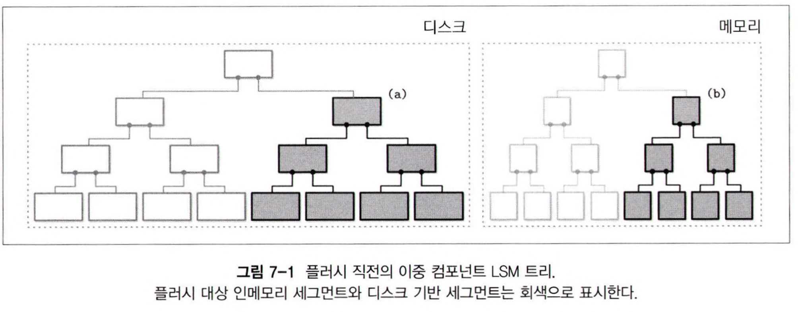

서브트리가 플러시되면 인메모리와 디스크 기반 서브트리는 삭제되고, 새로운 병합된 서브트리로 대체된다.
이 서브트리는 디스크 기반 트리의 기본 위치에서 그대로 접근할 수 있다.

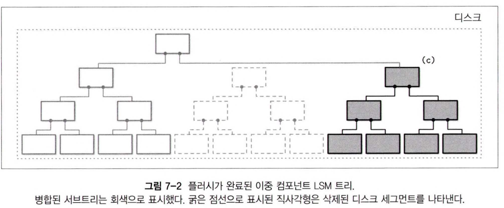

병합 작업은 **디스크 기반 리프 노드**와 **인메모리 트리 노드**를 순회하면서 순서대로 **값을 비교**한다.
두 트리는 모두 정렬되어있으므로 병합 결과도 순서가 보장된다.
순회 과정에서 두 노드 중 더 최신 값을 선택한다.

이런 방식은 B-트리 구조를 논리적으로 확장한 형태다.
**LSM 트리**는 **쓰기 시 복사형 B-트리**와 비슷한 구조지만 **변경사항**을 **버퍼**에 저장해 디스크에 저장된 트리를 업데이트하는 **비용**이 발생하지 않는다.

서브트리 병합과 플러시를 구현할 때 다음 세 가지 사항을 기억해야 한다.
1. 플러시 과정이 시작되는 즉시, 그 이후의 모든 새로운 쓰기 요청은 새로운 멤테이블에 저장해야 한다.
2. 서브트리 플러시 과정을 진행하는 중에도 읽기 작업은 디스크와 인메모리 서브트리에 접근할 수 있어야 한다.
3. 플러시가 완료되면 병합된 트리를 접근 가능한 상태로 만드는 작업과 병합되지 않은 디스크 및 인메모리 데이터 삭제 작업을 원자적으로 수행해야 한다.

이중 컴포넌트 LSM 트리는 **인덱스 파일**에 적합한 구조지만 사용 사례는 없다.
**멤테이블 플러시**로 인한 잦은 **병합** 작업이 **쓰기 증폭**을 유발하기 때문이다.

### 다중 컴포넌트 LSM 트리
**다중 컴포넌트(multicomponent) LSM 트리**는 두 개 이상의 **디스크 기반 테이블**이 있다.
이 구조는 **멤테이블** 전체를 한 번에 **플러시**한다.

**플러시**가 여러 번 발생하면 디스크에 테이블에 여러 개 생성된다. 그리고 그 수는 점점 증가한다.
어떤 테이블에 어떤 레코드가 있는지 항상 정확히 알 수 없기 때문에 데이터를 찾기 위해 **여러 파일**을 읽어야 할 수도 있다.

하지만 여러 위치에서 데이터를 읽는 것은 비용이 크다.
따라서 이 문제를 해결하고, 테이블의 수를 최소한으로 유지하기 위해서 **컴팩션**이라는 **병합 작업**을 주기적으로 수행한다.
**컴팩션**은 여러 테이블의 내용을 읽고 **병합**한 뒤 **새로운 파일**에 결과를 저장한다. 그리고 기존 테이블은 삭제한다.

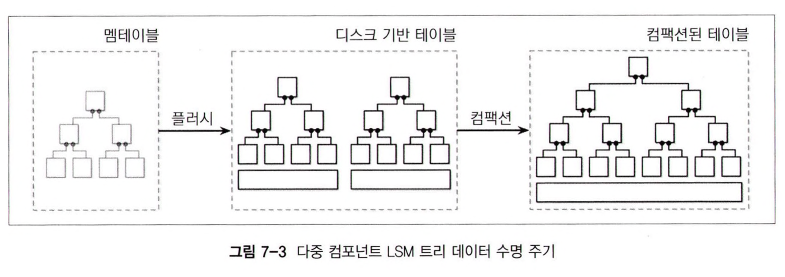
이 사진은 다중 컴포넌트 LSM 트리의 **데이터 수명 주기(data life cycle)** 을 나타낸다.
데이터는 먼저 **메모리 기반 컴포넌트**에 **버퍼링**되며, 버퍼의 크기가 너무 커지면 **디스크 기반 컴포넌트**로 플러시한다.
여러 개의 테이블을 **병합**해 더 큰 테이블을 생성한다.


### 인메모리 테이블
멤테이블 플러시는 **주기적**, 혹은 **기준 플러시 크기 값**을 사용해 발동시킬 수 있다.

플러시를 위해서는 우선 멤테이블을 전환해야 한다.
새로운 멤테이블을 할당해 그 이후에 들어오는 쓰기 작업을 담당하도록 설정하고, 기존 테이블은 플러시 상태로 전환한다.
이 두 단계는 **원자적**으로 수행되어야 한다.

플러시 대상 테이블은 그 내용이 완전히 플러시될 때까지 접근 가능한 상태로 유지되어야 한다.
플러시가 완료되면 기존 멤테이블은 삭제되며, 그 내용은 새로운 디스크 기반 테이블에서 읽을 수 있게 된다

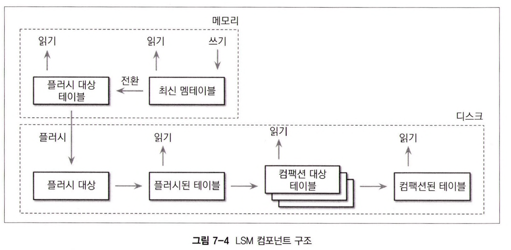
- 최신 멤테이블
	- 읽기와 쓰기 요청 처리
- 플러시 대상 멤테이블
	- 읽기 가능
- 온디스크 플러시 대상
	- 불완전한 상태이기 때문에 읽을 수 없음
- 플러시된 테이블
	- 플러시가 완료된 멤테이블이 제거되면 바로 읽을 수 있는 상태가 됨
- 컴팩션 대상 테이블
	- 병합 중인 디스크 기반 테이블
- 컴팩션된 테이블
	- 플러시된 테이블 또는 다른 컴팩트된 테이블로부터 만들어진 테이블

데이터는 이미 메모리에 정렬되어 있으므로 **순차적**으로 디스크에 쓰면 **디스크 기반 테이블**이 만들어진다.
플러시가 진행되는 동안 **플러시 대상 멤테이블**과 **최신 멤테이블** 모두 읽을 수 있다.

멤테이블이 완전히 **플러시**되기 전까지 해당 내용이 유일하게 **디스크**에 저장된 곳은 **선행 기록(write-ahead) 로그**다.
멤테이블이 완전히 디스크로 플러시되면 로그에서 멤테이블과 관련된 작업이 기록된 부분은 **삭제**한다.

## 수정과 삭제
LSM 트리는 삽입, 수정, 삭제 시 디스크에서 데이터를 찾을 필요가 없다.
대신 **읽기** 중에 **중복 데이터**는 조정된다.

삭제 작업은 단순히 멤테이블에서 레코드를 삭제하는 것만으로는 충분하지 않다. 다른 디스크 혹은 인메모리 테이블에 동일한 키에 대한 데이터가 존재할 수 있기 때문이다.
따라서 삭제 내역을 명시적으로 기록해야 한다.
해당 키의 값이 삭제되었음을 나타내는 특수한 삭제 항목(delete entry, 혹은 툼스톤 또는 휴면 표시(dormant certificate))을 삽입한다.

**조정 프로세스**는 **툼스톤**을 찾아 가려져 있는 값을 제거한다.

특정 키가 아니라 연속된 키 범위를 삭제하는 것이 더 효율적인 경우도 있다.
삭제 항목에 조건(predicate)을 붙여 **레코드 정렬 규칙**을 그대로 유지하면서 삭제 항목을 추가하는 **조건 제시 삭제(predicate delete) 방식**을 사용하면 된다.
이를 사용하면 조정 단계에서 지정한 조건에 해당하는 레코드는 건너뛰고 클라이언트에게 반환하지 않는다.

조건을 이용하면 `DELETE FROM table WHERE key >= "k2" AND key < "k4"`와 같은 범위를 사용할 수 있다.
**아파치 카산드라**가 이와 같은 방식을 **범위 툼스톤(range tombstone)** 이라는 이름으로 사용한다.

이때 디스크 테이블 사이의 범위가 겹칠 수 있다는 점을 기억해야 한다.

```
디스크 테이블 1  디스크 테이블 2
| k1 | v1 |  | k2 | <start_tombstone_inclusive> |
| k2 | v2 |  | k4 | <end_tombstone_exclusive>   |
| k3 | v3 |
| k4 | v4 |
```

## LSM 트리 룩업
LSM 트리는 **여러 컴포넌트**로 구성된다.
따라서 **룩업** 시 일반적으로 여러 컴포넌트에 접근하기 때문에 클라이언트에게 결과를 반환하기 전에 내용을 **병합**하고 **조정**해야 한다.

## 병합-반복
디스크 테이블은 정렬되어 있으므로 **다방향 병합 정렬(multiway merge sort)** 을 사용할 수 있다.
일반적으로 스토리지 엔진은 파일을 순회할 수 있는 커서(cursor) 또는 반복자(iterator)를 제공한다.
다방향 병합 정렬은 N개의 원소를 반복자와 최소 힙 등의 우선순위 큐를 사용해서 정렬한다.

병합-반복 과정에서 같은 키에 대한 둘 이상의 데이터 레코드가 존재할 수 있다.
반복자 특성상 각 반복자에는 중복되는 키가 존재하지 않으므로 같은 키를 가지는 여러 레코드는 반드시 모두 다른 반복자에서 온 것들이다.

이러한 과정을 살펴보면 다음과 같다.
```
반복자 1:               반복자 2:
{k2: v1} {k4: v2}     {k1: v3}  {k3: v5}
```
우선순위 큐에 각 반복자 헤드를 삽입한다.
```
반복자 1:        반복자 2:              우선순위 큐:
{k4: v2}       {k2: v4} {k3: v5}    {k1: v3} {k2: v1}
```
가장 작은 값인 k1을 결과에 추가하고 값을 반환한 반복자 2의 원소를 다시 큐에 삽입한다.
```
반복자 1:     반복자 2:      우선순위 큐:            결과:
{k4: v2}    {k3: v5}     {k2: v1} {k2: v4}    {k1: v3}
```
큐에 k2에 대한 값이 2개 존재한다.
동일한 키를 병합하고 결과에 추가한다. 그리고 두 반복자의 값을 큐에 추가한다.
```
반복자 1:  반복자 2:     우선순위 큐:           결과:
{}       {}          {k3: v5} {k4: v2}    {k1: v3} {k2: v4}
```
반복자에 원소가 없으므로 큐의 나머지 원소를 결과와 병합한다.
```
반복자 1:  반복자 2:  우선순위 큐:    결과:
{}       {}       {}           {k1: v3} {k2: v4} {k3: v5} {k4: v2}
```

복잡도 관점에서 반복자 병합과 정렬된 컬렉션의 병합은 같다.
N이 반복자의 수일 때 메모리 오버헤드는 `O(N)`이다.
정렬된 반복자 헤드의 컬렉션의 평균 복잡도는 `O(log N)`이다.

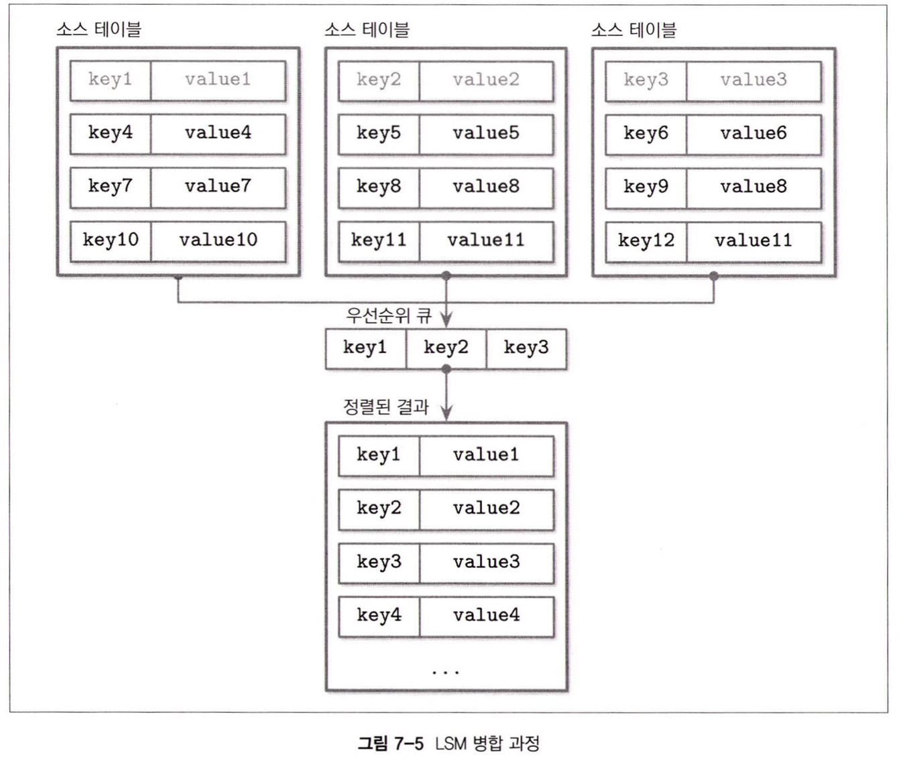
## 조정
여러 다른 테이블에 같은 키에 대한 업데이트 또는 삭제 내역이 존재할 수 있다.
이와 같은 중복된 키는 반드시 조정해야 한다. 즉, 앞에서 본 우선순위 큐를 구현할 때 중복 키 저장을 허용하고 조정 작업을 발동시키도록 해야 한다.

여러 데이터 레코드를 조정하기 위해서는 **우선순위**가 필요하다.
각 레코드에는 **타임스탬프**와 같은 **메타데이터**가 저장되어 있다. 이를 비교하면 여러 소스에서 오는 레코드 사이의 순서를 정하고, 어떤 것이 더 최근 것인지 알 수 있다.

더 높은 타임스탬프로 인해 감춰진 레코드는 클라이언트에게 반환하지 않으며 컴팩션에도 포함하지 않는다.

## LSM 트리 유지보수
불변 B-트리처럼 LSM 트리도 유지보수가 필요하다.
일반적으로 유지보수 작업은 알고리즘의 불변 요소에 영향을 많이 받는다.

B-트리의 유지보수 프로세스는 참조되지 않은 셀을 찾고, 페이지 조각 모음을 수행하고 삭제 및 섀도 처리된 레코드가 차지하는 공간을 회수한다.

LSM 트리는 주기적인 컴팩션을 통해 꾸준히 증가하는 디스크 테이블의 수를 줄인다.
컴팩션은 병합과 조정 알고리즘을 통해 전체 레코드를 순회하고 결과를 새로운 테이블에 저장한다.

디스크 테이블의 레코드는 정렬되어 있고, 병합 정렬 알고리즘 특성상 반복자의 헤드만 메모리에 저장하므로 컴팩션에 사용되는 이론적인 메모리 상한이 존재한다.
테이블의 레코드는 순차적으로 읽고 병합된 결과도 순차적으로 쓴다.

컴팩트 대상 테이블은 컴팩션이 끝날 때까지 읽을 수 있는 상태를 유지한다.
따라서 디스크에 컴팩트된 테이블을 쓸 수 있을 만큼의 충분한 공간을 미리 확보해야 한다.

동시에 여러 컴팩션 작업이 수행될 수 있지만 일반적으로 대상 테이블이 겹치진 않는다.

툼스톤에 의해 감춰진 과거 레코드가 존재하는 경우 툼스톤을 먼저 제거하면 과거 데이터가 부활할 수 있으므로 컴팩션 과정에서 바로 툼스톤을 삭제해서는 안된다.
스토리지 엔진은 다른 테이블에 더 작은 타임스탬프가 설정된 동일한 키의 레코드가 존재하지 않는 것을 확인해야 툼스톤을 삭제할 수 있다.

RocksDB는 최하위 레벨을 확인할 때까지 툼스톤을 유지하며 아파치 카산드라는 GC 유예기간 동안 툼스톤을 유지해 다른 노드가 툼스톤을 참조할 수 있도록 한다.

### 레벨형 컴팩션
컴팩션을 최적화할 수 있는 다양한 방법이 있다.
가장 많이 사용되는 방법은 **RocksDB**가 사용하는 **레벨형 컴팩션(leveled compaction)** 이다.
> 아파치 카산드라도 레벨형 컴팩션 방식을 제공한다

레벨 컴팩션은 디스크 테이블을 여러 레벨로 나눈다.
각 레벨의 테이블 크기는 제한되며 각 레벨을 나타내는 인덱스 번호가 있다.
가장 큰 인덱스가 최하위 레벨을 가리키는데 여기서는 레벨 1, 레벨 2와 같은 표현을 사용한다.

멤테이블을 플러시하면 0번 레벨의 테이블이 생성된다.
0번 레벨 테이블의 키의 범위는 겹칠 수 있다.
0번 레벨의 테이블 수가 일정 수에 도달하면 병합해 1번 레벨 테이블을 생성한다.

1번 레벨의 키 범위와 인덱스가 높은 레벨의 키 범위는 겹치지 않는다.
따라서 컴팩션 시 0번 레벨 테이블을 여러 범위로 파티션하고, 같은 범위의 테이블끼리 병합하는 방법도 있고 0번과 1번 레벨의 테이블을 모두 합치고 여러 개의 파티션된 1번 레벨 테이블을 생성하는 방법도 있다.

높은 인덱스 레벨에 대한 컴팩션은 이전 2개의 레벨에서 범위가 겹치는 테이블을 합쳐 다음 레벨에 새로운 테이블을 생성한다.

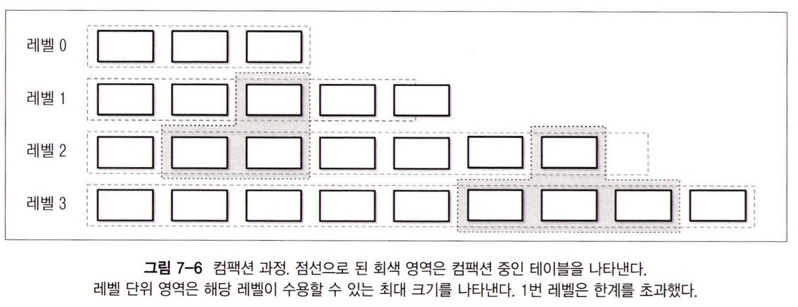
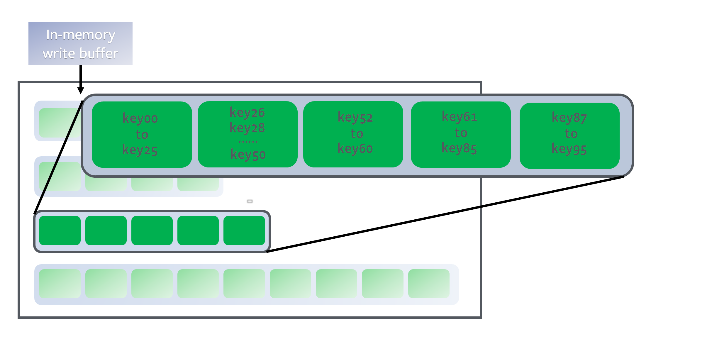
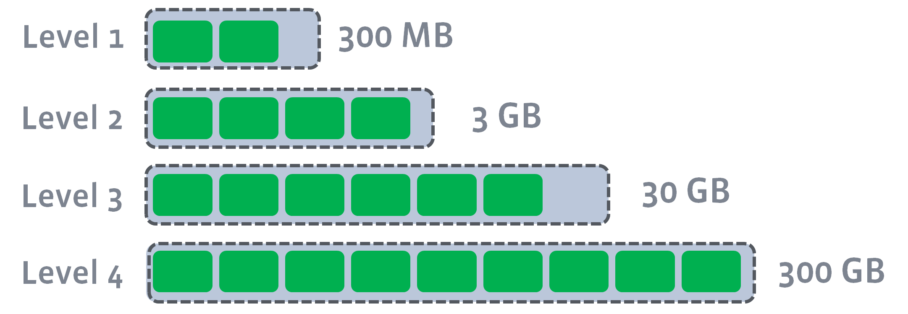
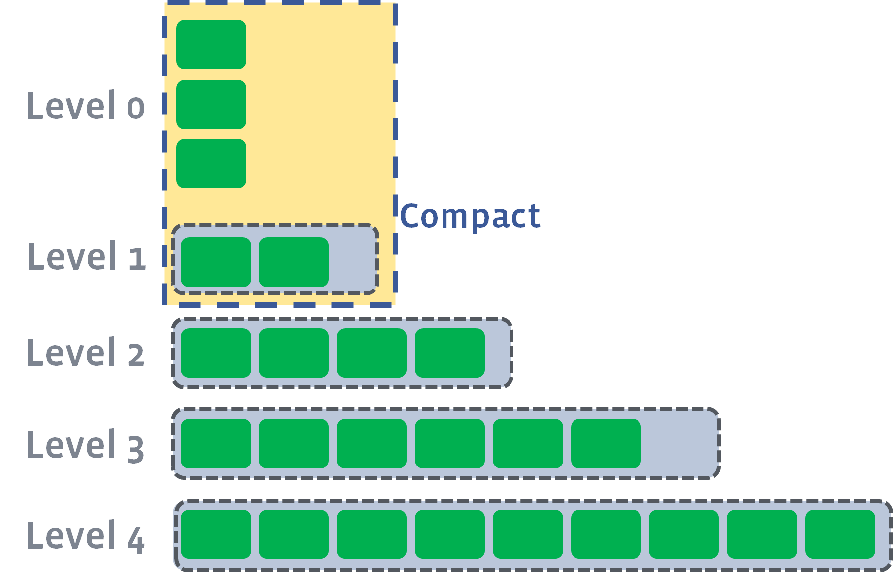
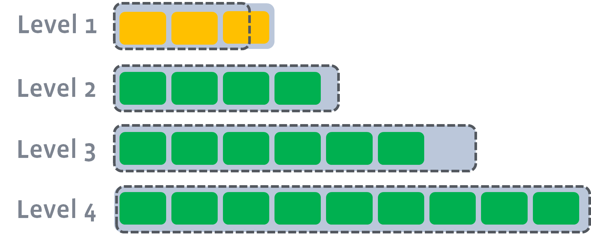
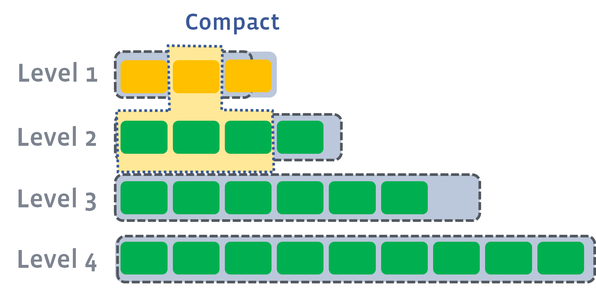
[참고](https://meeeejin.gitbooks.io/rocksdb-wiki-kr/content/leveled-compaction.html)

테이블마다 서로 다른 키 범위를 저장하면 읽기 중에 접근해야 하는 테이블 수가 줄어든다.
테이블의 메타데이터를 확인해 범위에 검색 키가 포함되지 않는 테이블은 필터링한다.

각 레벨의 테이블 크기와 수는 제한된다.
1번 레벨 또는 더 높은 인덱스 레벨의 테이블 수가 임계값에 도달하면 범위가 겹치는 해당 레벨의 테이블과 다음 레벨의 테이블을 병합한다.

레벨 간 크기는 기하급수적으로 증가한다.
각 레벨의 테이블 크기는 이전 레벨의 테이블 크기보다 월등히 크기 때문이다.
가장 최신 데이터는 항상 인덱스가 낮은 레벨에 있고 상대적으로 오래된 데이터는 점차 높은 인덱스 레벨로 이동한다.

### 크기 단계별 컴팩션
또 다른 방식에는 **크기 단계별(size-tiered) 컴팩션 방식**이 있다.
레벨이 아니라 테이블의 크기를 기준으로 디스크 테이블을 그룹화한다.
즉, 작은 테이블과 큰 테이블을 나눠서 비슷한 크기의 테이블끼리 그룹화한다.

0번 레벨에는 멤테이블에서 플러시되거나 컴팩션을 통해 생성된 가장 작은 크기의 테이블이 있다.
컴팩션을 통해 병합된 테이블은 같은 크기의 테이블이 저장된 레벨에 저장된다.
즉, 이 과정을 재귀적으로 반복하면 크기가 큰 테이블은 높은 레벨로 옮겨지고 크기가 작은 테이블은 낮은 레벨로 옮겨진다.

크기 단계별 컴팩션의 문제 중 하나는 **테이블 기아 현상(table starvation)** 이다.
컴팩션된 테이블의 크기가 여전히 작은 경우 높은 인덱스 레벨의 테이블은 컴팩션 기회를 얻지 못한다. 따라서 툼스톤톤이 정리되지 않고 따라서 읽기 비용이 증가한다.
이런 경우 레벨에 테이블 수가 많지 않더라도 컴팩션을 강제로 수행해야 한다.

이 외에도 워크로드에 맞게 최적화할 수 있는 여러 알고리즘이 있다.
아파치 카산드라는 **타임 윈도우(time window) 컴팩션 알고리즘**을 사용한다. 유효기간이 있는 데이터를 처리하는 시계열 워크로드에 특화된 컴팩션 알고리즘이다.
> 유효기간이 있는 데이터란 일정 시간이 지나면 데이터가 없어지는 경우를 말한다.
> https://cassandra.apache.org/doc/latest/cassandra/operating/compaction/index.html

타임 윈도우 컴팩션은 데이터를 컴팩션하거나 다시 쓰지 않고도 데이터가 쓰여진 시간을 참고해 만료된 시간 범위에 속하는 파일을 한 번에 삭제할 수 있다.

## 읽기, 쓰기, 메모리 공간 증폭
최적의 컴팩션 알고리즘을 구현할 때 고려해야 할 요소가 많다.

중복 데이터가 차지하는 공간을 회수하면 **공간 오버헤드**를 줄일 수 있다.
하지만 연속된 테이블 재작성으로 인해 **쓰기 증폭**이 증가한다.

반대로 데이터를 연속적으로 쓰지 않으면 읽기 증폭, 공간 증폭이 발생한다.
- 읽기 증폭 : 읽기 중에 같은 키의 레코드를 조정할 때 발생하는 오버헤드
- 공간 증폭 : 중복 레코드가 더 오랜 시간 동안 유지되기 때문

> 데이터베이스 학계에서 B-트리와 LSM 트리 중 어뜬 트리가 쓰기 증폭이 더 낮은지 여부가 논쟁이다.
> B-트리의 경우 writeback 작업, 그리고 같은 노드를 연속적으로 업데이트할 때 쓰기 증폭이 발생한다.
> LSM 트리의 경우 컴팩션 중 파일 간 데이터를 복사할 때 쓰기 증폭이 발생한다.

즉, 데이터를 디스크에 불변 방식으로 저장할 때 다음 세 가지 문제가 발생한다.
- 읽기 증폭
	- 데이터를 읽기 위해 여러 테이블 참조할 때 발생
- 쓰기 증폭
	- 컴팩션 과정에서 발생하는 연속된 재작성할 때 발생
- 공간 증폭
	- 같은 키에 대한 여러 레코드가 존재할 때 발생

## RUM 예측
**RUM 예측(RUM Conjecture)** 은 읽기(Read), 업데이트(Update), 메모리(Memory) 오버헤드를 기준으로 비용을 계산하는 보편적인 스토리지 자료 구조의 **비용 모델**이다.

RUM 예측에 따르면 세 가지 오버헤드 중 **두 개를 줄이면 나머지 오버헤드가 불가피하게 증가한다**.따라서 최적화는 세 가지 중 한 가지 요소를 희생해야 한다.

가장 이상적인 솔루션은 낮은 메모리, 쓰기 오버헤드를 유지하면서 읽기 비용을 최소화하는 것이지만 현실적으로 불가능하고 트레이드-오프가 존재한다.

B-트리는 읽기에 최적화된 자료 구조이다.
B-트리에 쓰려면 우선 디스크에서 레코드를 **찾아야** 하며, **동일한 페이지**에 대한 **연속된 쓰기**로 인해 **디스크 페이지**를 여러 차례 업데이트해야 할 수 있다.
또한 항후 업데이트를 위한 공간과 삭제된 공간은 **공간 오버헤드**를 발생시킨다.

LSM 트리는 쓰기 작업을 위해 레코드를 찾을 필요가 없다. 또한 향후 쓰기를 위해 공간을 **추가 할당**하지 않는다.
하지만 **중복 데이터**로 인한 **메모리 오버헤드**가 존재한다.
기본으로는 결과를 반환하기 위해 여러 테이블을 참조해야 하므로 **읽기 작업**의 비용이 높지만 여러 **최적화 기법**으로 해결할 수 있는 문제다.

RUM 비용 모델은 완벽하지 않다.
레이턴시, 접근 패턴, 구현 복잡도, 유지보수 오버헤드, 하드웨어 관련 문제를 고려하지 않는다.
또한 데이터 일관성 유지, 이중화 오버헤드 등 분산 데이터베이스에서 중요한 고급 개념도 고려하지 않는다.

하지만 이 모델은 스토리지 엔진의 기본적인 기능을 이해하는데 도움이 되므로 일차적으로 비용을 어림잡는 규칙을 사용할 수 있다.

## 세부 구현 설명
### SSTable
**디스크 기반 테이블**은 일반적으로 **SSTable(Sorted String Table)** 을 사용해서 구현한다.
SSTable은 말 그대로 레코드를 키 순서로 정렬해 저장한다.

SSTable은 **인덱스 파일**과 **데이터 파일**로 구성된다.
**인덱스 파일**은 **B-트리** 등의 **로그 시간 룩업**이 가능한 자료구조 또는 **해시 테이블** 등의 **상수 시간(constant-time) 룩업**이 가능한 자료 구조를 사용해 구현한다.

데이터 파일은 레코드를 키 순서대로 저장하기 때문에 해시 테이블을 사용해도 범위 스캔을 쉽게 구현할 수 있다.
해시 테이블에서 해당 범위의 첫 번째 키를 찾고, 데이터 파일에서 해당 범위를 스캔하면 된다.

**인덱스 컴포넌트**는 **키와 데이터**(데이터 파일에 실제 레코드가 저장된 **오프셋**)으로 구성된다.
**데이터 컴포넌트**는 **키-값 쌍**으로 구성된다.

앞에서 설명한 **셀의 구조와 데이터 레코드 형식**은 SSTable에도 대부분 적용된다.
가장 큰 차이점은 셀은 **순차적으로 작성**되지만 SSTable은 수명 주기 동안은 **수정될 수 없다**는 것이다.

**인덱스 파일**에는 데이터 파일의 레코드를 가리키는 **포인터**가 저장되므로 인덱스 생성 시점에 모든 오프셋이 파악되어야 한다.

데이터 레코드가 **정렬**되어 있으므로 **컴팩션** 시에는 인덱스 컴포넌트에 접근하지 않고 **데이터 파일을 순차적으로 읽으면 된다**.
컴팩션 작업의 병합 대상 테이블의 순서는 같기 때문에 병합-반복 결과도 **순서가 보장**된다.
따라서 최종 병합된 테이블도 데이터 레코드를 **순차적으로 복사**하면 된다.
한번 생성된 파일은 더 이상 수정할 수 없다.

#### SSTable 첨부형 보조 인덱스
아파치 카산드라는 **SSTable 첨부형 보조 인덱스(SASI, SSTable-Attached Secondary Index)** 를 사용한다.
기본 키 외의 **다른 필드**를 사용해 테이블을 인덱싱할 수 있도록 인덱스 자료 구조와 이들의 **수명 주기**를 **SSTable의 수명 주기**와 동기화하고 SSTable 별로 인덱스를 생성한다.

LSM 트리는 데이터를 버퍼에 저장하므로 메모리와 디스크 기반 테이블 모두 인덱스를 생성해야 한다.
이를 위해 SASI는 멤테이블을 인덱싱하는 인메모리 자료구조를 별도로 생성한다.

레코드가 요청되면 여러 인덱스를 참고해 해당 레코드의 기본 키를 찾는다.
LSM 트리의 룩업 작업과 유사하게 레코드를 병합 및 조정한다.

SSTable의 수명 주기에 맞추면 **멤테이블 플러시** 또는 **컴팩션** 중에 인덱스를 생성할 수 있다는 장점이 있다.

### 블룸 필터
LSM 트리의 읽기 증폭은 읽기 작업이 여러 디스크에 저장된 테이블에 접근할 때 발생한다.
디스크 기반 테이블에 검색 키에 대한 레코드가 존재하는지 미리 알 수 없기 때문이다.

테이블 룩업을 방지하기 위해 메타데이터에 키 범위를 저장하고 검색 키가 범위에 속하는지 미리 확인할 수 있다.
하지만 이 정보는 부정확하다.
이러한 문제를 개선할 수 있도록 아파치 카산드라와 RocksDB 등은 **블룸 필터**를 사용한다.
#### 확률적 자료 구조
확률적 자료 구조는 일반적인 자료 구조보다 **공간 효율적**이다.
확률적 자료 구조는 대략적인 정보를 기반으로 부정확할 수 있는 쿼리를 수행한다.

- 집합에 속하는지 여부를 확인하기 위한 **블룸 필터(Blook filter)** 
	- Bloom Filter를 이용한 membership query의 결과 값은 '아마도 해당 집합의 원소인 것 같다', 또는 '확실히 해당 집합에 포함된 원소가 아니다'를 뜻한다
		- false positive는 존재, false negative는 없음
	- Bloom Filter를 사용하는 대표적인 경우는 membership query에 대한 디스크 I/O 줄여야 할 때이다
	-  보안 시스템뿐만 아니라 Chrome의 경우에도 보안 위험이 있는 URL 접근인지 파악하는 목적으로 Bloom Filter를 사용한다. [Hadoop](http://hadoop.apache.org/), BigTable, [Cassandra](http://cassandra.apache.org/) 같은 데이터베이스·저장소는 물론, [Squid](http://www.squid-cache.org/) 같은 웹 캐시 시스템에서도 Bloom Filter를 사용하고 있다.
	- Bloom Filter는 치명적인 단점이 있다. 한 번 삽입한 원소를 삭제할 수 없다는 것이다
	- 값을 아예 삭제하지 않거나 거의 삭제하지 않는 데이터베이스에 Bloom Filter를 적용할 때 효과를 기대할 수 있다. [Hadoop](http://hadoop.apache.org/), BigTable, [Cassandra](http://cassandra.apache.org/)는 주로 데이터 분석에 사용하기 때문에 모두 Bloom Filter를 적용하는 것이 유리한 데이터베이스·저장소이다
	- https://d2.naver.com/helloworld/749531
	- https://meetup.nhncloud.com/posts/192
- **카디널리티**를 에측하는 **하이퍼로그로그(HyperLogLog)** 
	- HyperLogLog에서는 오차 범위를 조정할 수 있다. 
	- 상대오차는 약 1.04 / sqrt(m)
		- m은 버킷의 수
	- https://d2.naver.com/helloworld/711301
	- https://redis.io/docs/data-types/probabilistic/hyperloglogs/
- **빈도수**를 예측하는 **Count-Min 스케치(Count-min Sketch)** 
	- Count-Min Sketch는 전체 원소 중 극히 일부만 빈도 값이 큰 분포를 다루기에 적합합니다. 그 외의 분포에서는 오차가 증가하기 때문입니다
	- https://d2.naver.com/helloworld/799782

등이 많이 사용되는 확률적 자료 구조다.

> '확률적 자료구조(probabilistic data structure)'를 이용하여 메모리를 매우 적게 사용하면서도 들어오는 모든 데이터를 실시간으로 처리하되 결과 값에는 약간의 오차를 허용하는 것을 말한다.
> https://d2.naver.com/helloworld/711301

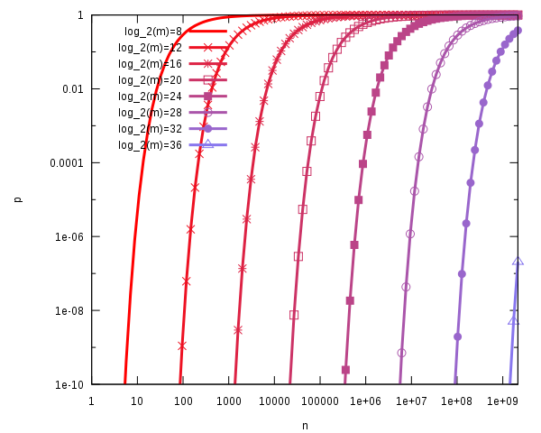
해시 함수 개수 k를 최적으로 했을 때, n과 m의 변화에 따른 false positive 확률

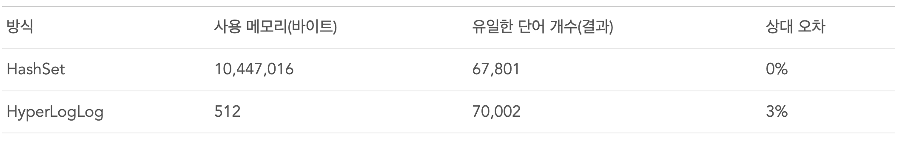

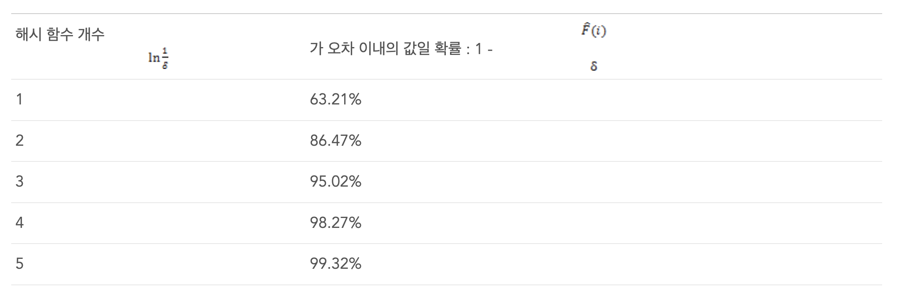


블룸 필터는 어떤 원소가 집합에 속하는지 여부를 확인할 수 있는 공간 효율적인 확률적 자료 구조다.
false positive는 발생할 수 있지만 false negative는 발생하지 않는다.

블룸 필터를 사용해 특정 키가 테이블에 존재할 수 있는지, 혹은 확실히 존재하지 않는지 알 수 있다.
블룸 필터가 음성을 반환한 파일은 쿼리 수행 중 무시된다.
다른 파일의 실제 존재 여부는 직접 확인해야 한다.
디스크 기반 테이블과 블룸 필터를 같이 사용하면 읽기 작업의 테이블 접근 횟수를 크게 줄일 수 있다.


블룸 필터는 큰 비트 배열과 여러 가지 해시 함수를 사용한다.
각 레코드의 키를 해시 함수에 대입해 비트 배열에서의 인덱스를 구하고, 해당 비트를 1로 설정한다.
모든 해시 함수의 결과가 가리키는 위치의 비트 값이 1인 키는 집합에 속한다는 것을 의미한다.
만약 한 개의 비트라도 0이면 해당 원소는 확실하게 집합에 속하지 않는다.

다른 키를 대입한 해시 함수의 결과가 같은 위치를 가리키는 해시 충돌이 발생할 수 있다.

양성 오류의 발생 확률은 비트 배열의 크기와 해시 함수의 수로 제어한다.
배열의 크기가 클수록 해시 충돌이 발생할 확률이 줄어들고 해시 함수가 많을수록 더 많은 비트를 확인할 수 있어 정확도가 증가한다.
> false positive가 일어날 확률은 비트 배열의 크기인 m이 클수록, 원소 개수인 n이 작을수록 낮다.
> 해시 함수 개수 k의 경우에는 일정 수준으로 증가할 때까지는 false positive가 일어날 확률이 낮아지지만, 일정 수준 이상 넘어서면 false positive가 일어날 확률이 높아진다. 게다가 해시 함수 수행 비용 또한 고려해야 하기 때문에 연산 비용을 고려한 k 값을 선택해야 한다.
> - Naver D2

비트 배열의 크기가 클수록 더 많은 메모리를 차지하고 해시 함수가 많을수록 성능에 안 좋은 영향을 줄 수 있다.
따라서 용인되는 확률과 불가피한 오버헤드 사이에서 적절한 타협점을 찾아야 한다.

확률은 예상된 배열 크기를 기반으로 계산할 수 있다.
LSM 트리의 테이블은 수정되지 않으므로 배열의 크기(테이블에 저장된 키의 수)는 미리 알 수 있다.

> 전체 원소의 개수 n, 비트 배열 V의 크기인 m, 해시 함수 개수 k, 이 셋 중 두 개의 값을 알거나 정하면, false positive 확률이 최소가 되도록 다른 변수 값을 구할 수 있다는 뜻이다.


### 스킵리스트
데이터를 메모리에 **정렬**해서 저장하는 여러 자료 구조가 있다.
**스킵리스트(skiplist)** 는 단순함때문에 최근에 더 많이 쓰이고 있는 자료 구조다.
스킵리스트는 싱글 링크드리스트보다 구현이 그리 복잡하지 않으며 확률적 복잡도도 탐색 트리와 비슷한 수준이 보장된다.


스킵리스트는 삽입과 업데이트시 구조를 회전 또는 재배치하지 않고 **확률적으로 균형을 유지**한다.
따라서 스킵리스트는 인메모리 B-트리보다 **메모리 친화적이지 않다**.
스킵리스트의 노드는 크기가 작고 임의의 메모리 공간에 할당되기 때문이다.
이러한 문제는 **전개형(unrolled) 링크드 리스트**를 사용해 해결할 수 있다.

> In computer programming, an **unrolled linked list** is a variation on the [linked list](https://en.wikipedia.org/wiki/Linked_list "Linked list") which stores multiple elements in each node. It can dramatically increase [cache](https://en.wikipedia.org/wiki/CPU_cache "CPU cache") performance, while decreasing the memory overhead associated with storing list metadata such as [references](https://en.wikipedia.org/wiki/Reference "Reference"). It is related to the [B-tree](https://en.wikipedia.org/wiki/B-tree "B-tree").


스킵리스트는 높이가 다른 여러 노드로 구성된다.
이들을 연결한 계층 구조를 통해 일부 요소를 건너뛸 수 있다.

각 노드에는 키가 있고 링크드 리스트의 노드와 달리 일부 노드에는 두 개 이상의 후속 노드가 있을 수 있다.
높이가 h인 노드는 한 개 이상의 높이가 최대 h인 이전 노드와 연결된다.
가장 낮은 레벨의 노드는 모든 높이의 노드와 연결될 수 있다.

노드의 높이는 삽입 시 임의의 함수를 통해 결정된다.
높이가 같은 노드는 레벨을 형성한다.

레벨이 무한대로 증가하지 않도록 레벨 수를 제한하고 자료 구조에 저장할 수 있는 최대 원소 수를 기준으로 최대 높이를 결정한다.
레벨이 높아질수록 노드의 수가 급격하게 줄어든다.

탐색은 최상위 레벨의 포인터에서 시작한다.
포인터를 따라가다가 검색 키보다 더 큰 키가 저장된 노드를 찾으면 이전 노드가 가리키는 다음 레벨의 노드로 이동한다.
즉, 현재 노드 키보다 검색 키가 큰 경우 앞으로 계속 이동하고 더 작다면 다음 레벨의 이전 노드로 이동한다.

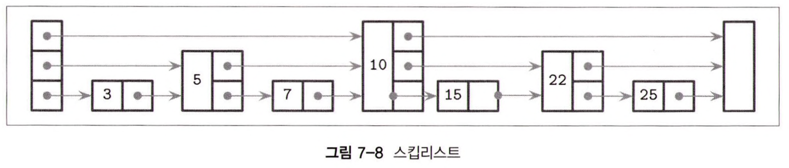

삽입 작업도 동일한 단계로 삽입 지점(삽입 키가 저장된 노드 또는 바로 앞의 노드)을 찾고 새로운 노드를 삽입한다.
트리와 유사한 계층 구조를 형성하도록 노드의 높이는 확률 분포를 기반으로 생성된 임의의 수로 설정한다.
새로운 노드의 키보다 작은 키가 있는 노드의 포인터가 새로운 노드를 가리키도록 수정한다.
더 높은 레벨의 포인터는 그대로 유지하고 새로운 노드의 포인터는 각 레벨의 다음 노드를 가리킨다.

노드 삭제 시 삭제된 노드의 포인터는 해당 레벨의 이전 노드로 옮겨진다.

노드의 모든 포인터가 완전히 업데이트됐는지 여부를 나타내는 `fully_linked` 플래그를 사용해 선형화 가능한 방식으로 구현하면 **동시성**을 지원하는 스킵리스트를 만들 수 있다.
이 플래그는 **CAS**를 사용해서 설정하는데 스킵리스트의 구조 변경 작업은 여러 레벨의 노드 포인터를 업데이트하기 때문에 적합한 방식이다.

메모리 모델이 없는 언어는 동시에 참조된 노드가 사용 중에 해제되지 않도록 **참조 카운팅 기법(reference counting)** 또는 **해저드(hazard) 포인터**를 사용한다.
노드는 오직 상위 레벨에서만 접근할 수 있기 때문에 **데드록**이 발생할 수 없다.

> https://ko.wikipedia.org/wiki/%EC%B0%B8%EC%A1%B0_%ED%9A%9F%EC%88%98_%EA%B3%84%EC%82%B0_%EB%B0%A9%EC%8B%9D
> https://blog.naver.com/jjoommnn/130127286459

**아파치 카산드라**는 **세컨더리 인덱스 멤테이블 구현**에 스킵리스트를 사용한다.
**와이어드 타이거**는 **일부 인메모리 작업**에 스킵리스트를 사용한다.

> WiredTiger 스토리지 엔진은 내부적인 잠금 경합 최소화(Lock-free algorithm) 을 위해서 "**하자드 포인터(Hazzard-Pointer)**" 나 "**스킵 리스트(Skip-List)**" 와 같은 새로운 기술을 채택하고 있습니다. 또한 최신의 RDBMS 가 가지고 있는 **MVCC 기능**이나 **데이터 파일 압축**, **암호화 기능**을 모두 가지고 있습니다.
> https://hoing.io/archives/6045#_Skip-List

https://source.wiredtiger.com/develop/arch-block.html
> wiredTiger 스토리지 엔진에서 Lock-Free를 구현하기 위한 또 다른 기술이 스킵 리스트 자료 구조입니다. 또 스킵 리스트는 wiredTiger 엔진에서 RDBMS의 Undo 같은 역할을 합니다. 다른점이 있다면 데이터 페이지의 레코드를 직접 변경하지 않고, 변경된 데이터를 스킵 리스트에 추가합니다. 사용자가 쿼리가 데이터를 읽을 때에는 변경 이력이 저장된 스킵 리스트를 검색해서 원하는 시점의 데이터를 가져갑니다. 이렇게 변경된 내용을 직접 데이터 페이지에 덮어쓰지 않고 별도의 리스트로 관리하는 이유는 쓰기 작업 처리를 빠르게 하기 위함입니다. 변경된 내용을 스킵 리스트에 추가하기만 하면 되는데 스킵 리스트에 추가하는 작업은 매우 빠르고, 사용자의 응답 시간도 빨라집니다. 이런 방식 때문에 wiredTiger 스토리지 엔진은 여러 쓰레드가 하나의 데이터 페이지를 동시에 읽거나 쓸 수가 있어서 동시 처리 성능이 매우 향상되는 것 입니다.

http://redisgate.kr/redis/configuration/internal_skiplist.php

### 디스크 접근
테이블 내의 데이터는 대부분 디스크에 저장되기 때문에 스토리지 기기는 보통 데이터를 블록 단위로 제공한다.
많은 LSM 트리 구현이 디스크 접근과 중간 캐싱에 페이지 캐시를 사용한다.
또한 페이지 만료, 고정 등의 기법도 로그 구조 스토리지에 똑같이 적용할 수 있다.

명확한 차이점은 **인메모리 데이터**는 수정할 수 없기 때문에 **동시 접근**에 **잠금** 및 **래치**가 필요없다는 점이다.
참조 카운팅 기법을 사용해 현재 참조된 페이지가 메모리에서 제거되는 것을 방지하고 컴팩션으로 인해 파일이 삭제되기 전에 진행 중인 작업을 완료할 수 있다.

또 다른 차이점은 LSM 트리의 데이터 레코드는 페이지와 얼라인되지 않을 수 있다는 점이다.
일부 레코드는 페이지 경계를 넘나들기 때문에 메모리에서 여러 페이지를 읽어야 할 수도 있다.
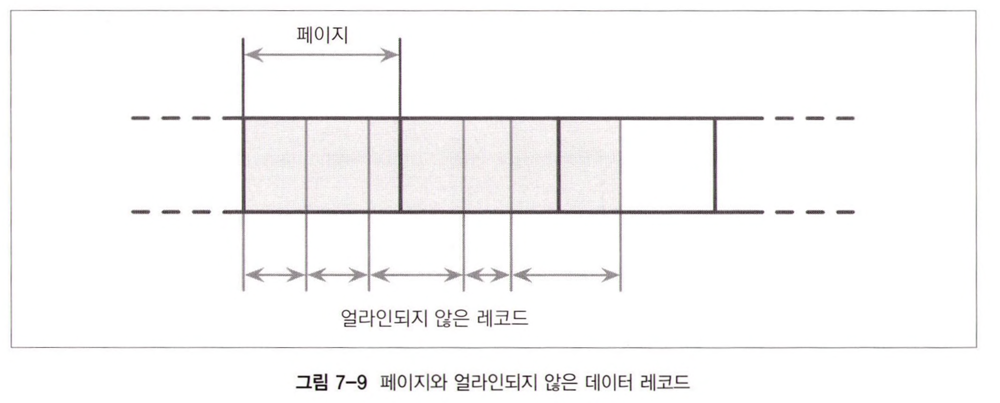
그리고 **포인터**는 페이지 ID가 아니라 **절대 오프셋**을 이용해 구현할 수 있다는 점도 다르다.

### 압축
B-트리의 압축과 LSM 트리 데이터의 압축도 비슷하다.
가장 큰 차이점은 LSM 테이블은 **불변 자료 구조**이며 일반적으로 **싱글 패스**로 저장한다는 점이다.

데이터를 **페이지 단위**로 압축하면 압축된 페이지는 압축되지 않은 페이지의 크기 보다 작기 때문에 페이지와 **얼라인**되지 않는다. 페이지와 얼라인되도록 남는 공간을 0으로 채울 수도 있지만 그러면 압축의 효과가 줄어든다.

압축된 페이지에 접근하려면 저장 시 데이터의 주소 범위를 기록해둬야 한다.

압축된 페이지의 **오프셋**과 **크기**를 기록해두는 **간접 레이어**를 통해 압축된 페이지에 접근할 수 있다.

압축된 페이지는 압축되지 않은 페이지보다 항상 크기가 작다.

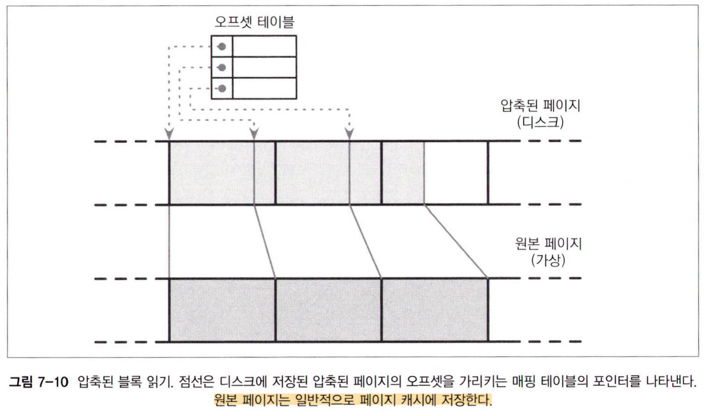
컴팩션 및 플러시 시 압축된 페이지를 순차적으로 추가하고 관련 압축 정보는 별도의 파일 세그먼트에 저장한다.
페이지가 요청되면 압축된 페이지의 오프셋과 크기를 참조해 압축을 해제하고 메모리에 실체화한다.
## 비정렬 LSM 스토리지
지금까지 설명한 대부분의 스토리지 구조는 데이터를 정렬된 상태로 저장한다.
- B-트리 페이지는 인플레이스 업데이트 방식을 사용해 순서를 유지한다.
- FD-트리의 정렬된 배열은 두 배열을 병합한 결과물이다.
- SSTable은 데이터 레코드를 메모리에 저장 및 병합한다.

이 절에서는 데이터를 임의의 순서로 저장하는 자료 구조에 관해 설명한다.
순서를 보장하지 않는 스토어는 일반적으로 별도 로그가 필요 없고 레코드를 삽입 순서대로 저장하기 때문에 쓰기 비용이 줄어든다.

### 비트캐스크
**리악(Riak)** 에서 사용되는 스토리지 엔진 중 하나인 **비트캐스크(Bitcask)** 는 정렬되지 않은 **로그 구조** 기반의 스토리지 엔진이다.
지금까지의 설명과는 다르게 **멤테이블**을 **버퍼**로 사용하지 않고 데이터 레코드를 **로그 파일**에 바로 저장한다.

비트캐스크는 레코드를 검색할 수 있도록 각 키의 최신 데이터 레코드에 대한 참조를 `keydir`이라는 자료구조에 저장한다.
`keydir`에서 참조하지 않는 이전 데이터 레코드들이 여전히 디스크에 남아있을 수 있는데, 이러한 데이터들은 컴팩션 시 가비지 컬렉터가 정리한다.
`keydir`은 인메모리 해시맵 형태이며 시스템 가동 시 로그 파일을 사용해 재구성한다.

쓰기 요청 시 새로운 데이터 레코드는 로그 파일에 순차적으로 추가하고 새로운 레코드의 위치를 가리키는 포인터를 `keydir`에 추가한다.

읽기 요청 시 `keydir`에서 해당 키를 찾고 이 포인터를 이용해 레코드를 찾는다.
`keydir`에는 키별 한 개의 값만 존재하므로 **포인트 쿼리**는 여러 소스의 데이터를 **병합**하지 않아도 된다.

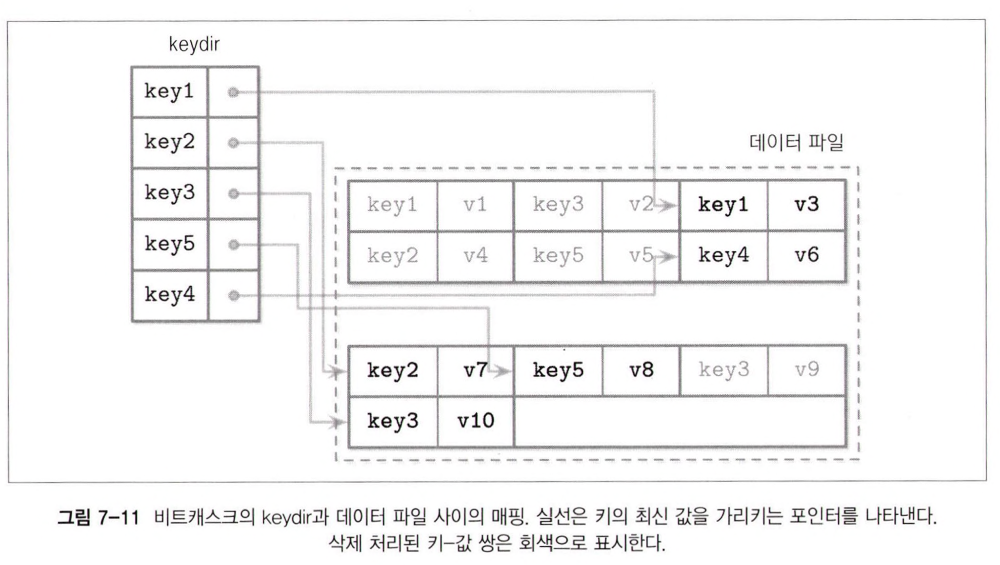

컴팩션 시 모든 로그 파일의 내용을 순차적으로 읽고 병합한 뒤에 새로운 위치에 쓴다.
실제 데이터 레코드만 유지하고 삭제 처리된 레코드는 삭제한다.
`keydir`의 포인터는 재배치된 레코드를 가리키도록 업데이트한다.

데이터 레코드는 로그 파일에 바로 쓰기 때문에 별도의 선행 기록 로그가 필요 없다.
따라서 **공간 오버헤드**나 **쓰기 증폭**이 줄어든다.
그러나 이 방식의 단점은 `keydir`과 데이터 파일의 레코드가 정렬되어 있지 않아 범위 스캔이 불가능하고 포인트 쿼리만 수행할 수 있다는 점이다.

반면 장점은 단순함과 높은 포인트 쿼리 성능이다. 데이터 레코드의 여러 버전이 존재하지만 `keydir`을 통해 오직 최신 버전의 레코드만 접근할 수 있다.

하지만 모든 키를 메모리에 저장한다는 점, 시스템 가동 시 `keydir`을 재구성해야 한다는 점은 일부 시스템에서 문제가 될 수 있다.

즉, 포인트 쿼리에 매우 적합하지만 범위 스캔은 전혀 지원하지 않는다.

### 위스키
범위 스캔은 여러 애플리케이션에서 중요한 기능이므로 정렬되지않은 스토리지 자료 구조의 쓰기 및 공간 사용의 장점은 유지하면서 범위 스캔을 지원하는 스토리지 자료 구조가 필요하다.

위스키(WiscKey)는 **LSM 트리**에 키를 **정렬**된 상태로 유지하고 **vLog(value log)** 라는 정렬되지 않은 **추가 전용 파일**에 데이터 레코드를 저장해 **가비지 컬렉션**과 **정렬 작업**을 분리한다.

위스키는 모든 키를 메모리에 저장하고 시스템 가동 시 해시테이블을 재구성해야 하는 비트캐스크의 문제를 해결할 수 있다.

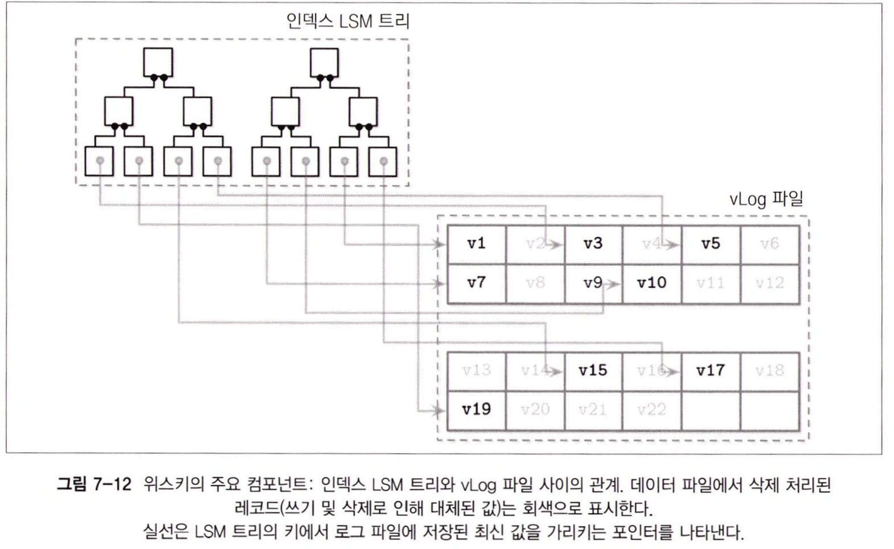
vLog 파일에 데이터 레코드는 임의의 순서대로 저장한다.
정렬된 LSM 트리에는 로그 파일에 저장된 최신 레코드를 가리키는 키를 저장한다.

일반적으로 키는 데이터 레코드보다 크기가 훨씬 더 작기 때문에 **컴팩션** 시 효율이 매우 높다.
위스키는 특히 업데이트 및 삭제 빈도가 낮아 **가비지 컬렉션**이 회수해야 하는 디스크 공간이 크지 않은 환경에 더 적합하다.

vLog 데이터는 정렬되지 않아 범위 스캔 시 랜덤 I/O가 발생한다.
위스키는 범위 스캔 시 SSD의 내부 병렬 처리를 통해 블록을 병렬로 프리페치해서 랜덤 I/O 비용을 줄인다.
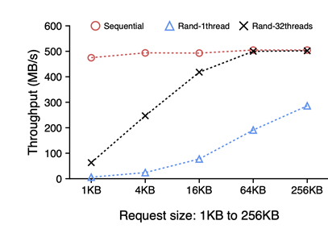
하지만 여전히 블록 전송 비용은 높다. 한 개의 데이터 레코드를 패치하기 위해서 레코드가 포함된 페이지 전체를 읽어야하기 때문이다.

컴팩션 시 vLog 파일을 순차적으로 읽고 병합한 뒤에 새로운 위치에 쓴다. 포인터도 새로운 위치를 가리키도록 업데이트한다.
위스키는 vLog 파일 전체를 스캔하는 것을 방지하기 위해 활성 상태의 키가 저장된 vLog의 세그먼트에 대한 정보가 저장된 `head`와 `tail` 포인터를 사용한다.


vLog에서 valid한 값을 한 곳에 모아서 관리하기 위해 두개의 포인터를 추가한다.  
head : 새로운 value가 추가되는 지점을 가리킨다.  
tail : Garbage Collector의 시작점을 가리킨다.

vLog의 데이터는 정렬된 상태가 아니며 키의 활성 상태에 대한 정보가 없기 때문에 키 트리를 스캔해 어떤 키가 활성 상태인지 확인해야 한다.
이 작업을 가비지 컬렉션 중에 수행하면 복잡도가 증가한다.
일반 LSM 트리는 컴팩션 중에 키 인덱스에 접근하지 않고 파일을 조정한다.

[참고](https://velog.io/@dls4585/%EB%85%BC%EB%AC%B8%EB%A6%AC%EB%B7%B0-WiscKey-Key-Value-Store%EC%97%90%EC%84%9C-Key%EC%99%80-Value%EC%9D%98-%EB%B6%84%EB%A6%AC1)
https://www.pingcap.com/blog/titan-storage-engine-design-and-implementation/

## LSM 트리 동시성 제어
LSM 트리의 가장 큰 **동시성 문제**는 **테이블 뷰 전환**과 **로그 동기화**와 관련되어 있다.
> 테이블 뷰 전환 : 플러시 및 컴팩션으로 인해 변경되는 메모리와 디스크 기반 테이블

멤테이블도 일반적으로 동시에 접근하지만 인메모리 자료 구조의 동시성 제어는 이 책에서는 다루지 않는다.

플러시 작업은 다음 규칙을 따라야 한다.
- 새로운 멤테이블은 읽기 및 쓰기가 가능해야 한다.
- 기존(플러시 대상) 멤테이블은 읽을 수 있어야 한다.
- 플러시 대상 멤테이블은 디스크에 저장된다.
- 플러시된 멤테이블 삭제와 디스크 기반 테이블 생성은 원자적으로 수행돼야 한다.
- 플러시된 멤테이블에 수행된 작업의 로그가 저장된 선행 기록 로그 세그먼트는 삭제되어야 한다.

예를 들어 아파치 카산드라는 작업 수행 순서를 강요해 위 규칙을 따른다.
모든 쓰기 관련 작업은 플러시 전에 수행된다.
따라서 플러시 프로세스(컨슈머)는 어떤 프로세스(프로듀서)가 자신에게 의존하는지 알 수 있다.
> 왜 컨슈머, 프로듀서?

일반적으로 동기화 단계는 다음과 같다.
- 멤테이블 전환
	- 전환 후에는 새로운 멤테이블이 모든 쓰기 요청을 처리하는 기본 멤테이블이 된다.
	- 기존 멤테이블은 계속해서 읽을 수 있다.
- 플러시 완료
	- 기존 멤테이블을 테이블 뷰의 플러시된 디스크 기반 테이블로 대체한다.
- 선행 기록 로그 삭제
	- 플러시된 멤테이블과 관련된 로그가 기록된 로그 세그먼트를 삭제한다.

각 단계는 데이터 정확성과 밀접한 관계를 가진다.
- 기존 멤테이블에 계속해서 데이터를 쓰면 데이터 유실이 발생한다.
- 디스크에 데이터를 완전히 쓰기 전에 기존 멤테이블을 삭제하면 데이터는 불완전한 상태가 된다.

컴팩션 중에 테이블 뷰도 변경되지만 이 프로세스는 매우 간단하다.
기존 디스크 기반 테이블을 삭제하고 컴팩트된 버전을 추가한다.

새로운 테이블이 완전히 생성되고 읽을 수 있는 상태가 될 때까지 기존 테이블은 계속 접근할 수 있어야 한다.
나아가 동일한 테이블이 동시에 여러 컴팩션이 포함되는 상황은 피해야 한다.

B-트리는 지속성을 보장하기 위해서 로그 삭제는 페이지 캐시의 더티 페이지 플러시 작업과 조율된다.
LSM 트리는 지속성을 보장하기 위해 로그 삭제는 멤테이블 플러시 작업과 조율된다.
플러시가 완료되면 로그 매니저는 마지막으로 플러시된 로그 세그먼트 정보를 기반으로 로그를 안전하게 삭제할 수 있다.

로그 삭제를 플러시와 동기화하지 않으면 데이터 유실이 발생할 수 있다.
플러시가 끝나기 전에 로그 세그먼트가 삭제되고 노드에 장애가 발생하면 로그 리플레이 및 데이터 복원이 불가능하다.

## 로그 스태킹
많은 최신 **파일시스템**은 로그 구조 기반이다.
**메모리 세그먼트**에 레코드를 저장하고 **버퍼**가 가득차면 **추가 전용 방식**으로 디스크에 **플러시**한다.

**SSD**도 소규모의 랜덤 쓰기 처리와 쓰기 오버헤드 최소화, 웨어 레벨링 개선, 기기 수명 연장을 위해 **로그 구조 스토리지**를 사용한다.
> 데이터를 다시 덮어쓸때 장치내의 기억 소자에 최대한 고르게 분산 시키는 기술을 웨어 레벨링이라고 부릅니다. 웨어레벨링 기술을 이용함으로써 저장 장치의 저장 횟수 제한은 각 기억 소자 제한 횟수의 수백내지 수천배가 됩니다

**로그 구조 스토리지(LSS, Log-Structured Storage) 시스템**은 SSD가 싸지면서 인기를 끌었다.
LSM 트리와 SSD는 잘 어울리는 조합이다.
SSD의 성능을 저하시키는 **인플레이스 업데이트**로 인한 **쓰기 증폭**은 **순차 처리**와 **추가 전용 쓰기 방식**으로 줄일 수 있다.

여러 로그 구조 시스템을 쌓은 스택 구조에서는 쓰기 증폭, 단편화, 성능 저하와 같이 LSS로 해결하려고 했던 문제가 다시 발생할 수 있다.
따라서 애플리케이션을 개발할 때는 최소한 **SSD 플래시 변환 계층(flash translation layer)** 과 **파일시스템**을 염두에 두어야 한다.

### 플래시 변환 계층
SSD에서 로그 구조의 매핑 레이어가 필요한 이유는 소규모의 랜덤 쓰기를 물리적 페이지에 일괄 적용하고 SSD는 프로그램/삭제(Program/Erase) 사이클을 기반으로 작동하기 때문이다.
SSD는 이전 데이터가 삭제된(erased) 페이지에만 새로운 데이터를 쓸 수 있다.
즉, 비어있지 않은 페이지는 프로그램(programmed, 쓰기) 할 수 없다.

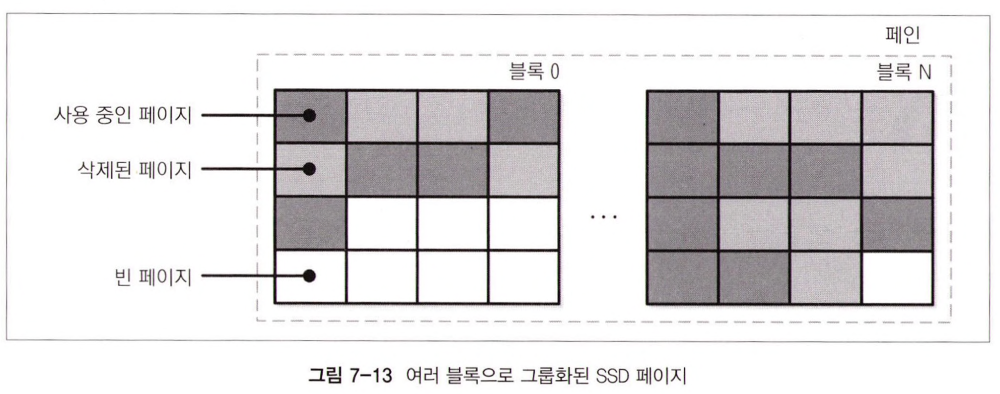
페이지는 개별로 삭제할 수 없다.
여러 페이지로 구성된 **블록 단위**로만 삭제할 수 있다.

**플래시 변환 계층(FTL)** 은 **논리적 페이지 주소**를 **물리적 위치**로 변환하고 페이지의 상태를 관리한다.
사용 가능한 페이지가 부족한 경우 FTL은 **가비지 컬렉션**을 수행하고 삭제된 페이지를 정리한다.

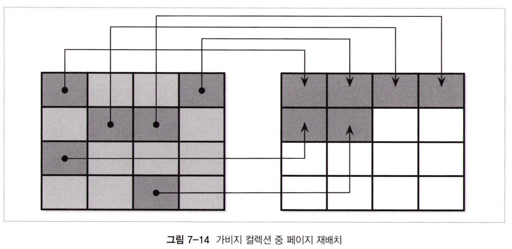

블록 내 모든 삭제된 페이지가 항상 제거되는 것은 아니다. 블록을 삭제하기 전에 FTL은 사용 중인 페이지를 빈 페이지가 있는 다른 블록으로 옮긴다.

모든 사용 중인 페이지가 재배치되면 블록을 안전하게 삭제할 수 있고 빈 페이지는 새로운 레코드를 쓸 수 있는 상태가 된다.

FTL은 페이지의 현재 상태와 상태 전환 여부 등 모든 필요한 정보를 가지고 있으며 **SSD 마모 평준화(wear leveling)** 도 수행한다.

> 마모 평준화는 장치에 부하를 고르게 분산시켜 높은 프로그램/삭제 사이클로 인해 블록이 조기에 사용할 수 없는 상태가 되는 핫스팟을 방지한다.
> 플래시 메모리 셀의 삭제/사이클 수는 제한적이기 때문에 메모리 셀을 고르게 사용하면 기기의 수명을 연장하는데 도움이 된다.

SSD에서 **로그 구조 스토리지**를 사용하는 이유는 **소규모 랜덤 쓰기**를 **일괄 처리**해 I/O 비용을 낮추기 위해서다.
이로 인해 작업 수가 줄어들고 결과적으로 **가비지 컬렉션** 수행 횟수도 줄어든다.

### 파일시스템 로깅
대부분의 파일 시스템은 **쓰기 증폭**을 줄이기 위해 수정 내용을 **버퍼**에 저장하는 **로깅 기법**을 사용하고, 기반 하드웨어를 최대한 사용한다.

**로그 스태킹**에는 여러 가지 방법이 있다.
각 레이어는 **자체적**으로 로그를 관리하고 일반적으로 각 로그는 **중복 작업**을 방지하는 데 필요한 정보를 드러내지 않는다.

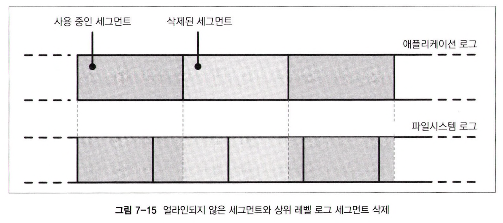
이 그림은 중복 로깅이 존재하고 가비지 컬렉션 패턴이 다른 상위 레벨의 로그와 하위 레벨의 로그 사이의 매핑을 나타낸다.

얼라인되지 않은 세그먼트는 상황을 더 악화시킨다.
상위 레벨의 로그 세그먼트를 삭제하면 단편화가 발생할 수 있고 일부 인근 세그먼트를 재배치해야 하기 때문이다.

계층 간에는 LSS 관련 스케줄링을 공유하지 않기 때문에 일부 하위 레벨 서브시스템이 이미 삭제되거나 곧 삭제될 데이터에 대한 불필요한 작업을 수행할 수 있다.

또한 정해진 표준 세그먼트 크기가 없기 때문에 얼라인되지 않은 하나의 상위 레벨 세그먼트가 여러 하위 레벨 세그먼트의 공간을 차지할 수도 있다.
이러한 오버헤드는 줄이거나 완전히 제거할 수 있다.

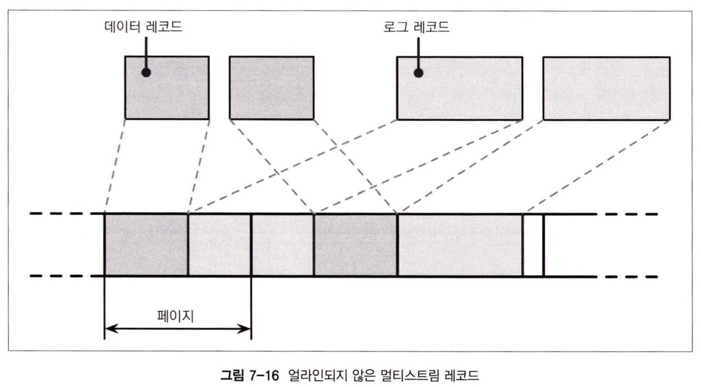
순차 I/O가 로그 구조 스토리지에서 가장 중요한 부분이지만 데이터베이스 시스템에는 여러 쓰기 스트림(write stream)이 존재할 수 있다.
> 데이터 레코드 쓰기, 로그 쓰기

하드웨어 레벨에서 인터리빙하는 순차 쓰기 스트림은 동일한 순차 패턴으로 해석되지 않을 수 있다.
블록이 쓴 순서대로 삽입되지 않을 수 있다는 의미다.

따라서 단편화가 발생하게 된다.
그래서 일부 데이터베이스 벤더는 인터리빙을 줄일 수 있도록 별도의 장치에 로그를 저장해 워크로드를 분리하고 성능과 액세스 패턴을 독립적으로 파악하는 것을 권장한다.

하지만 파티션과 하드웨어가 **얼라인**되고 레코드도 **페이지 사이즈**와 **얼라인**되도록 하는 것이 더 중요하다.

## LLAMA과 투명한 스태킹
Bw-트리는 **무잠금**, **로그 구조**의 접근 방식이 **투명한(LLAMA, latch-free, log-structured, access-method aware) 스토리지 서브시스템** 위에 쌓여 있는 계층이다.
이런 계층 구조 덕분에 **가비지 컬렉션**과 **페이지 관리**는 투명하게 유지하면서 트리의 크기를 동적으로 변경할 수 있다.
가장 관심을 가져야 하는 부분은 소프트웨어 레이어 사이의 조정의 장점을 나타내는 **투명한 접근 방식(access-method aware)** 이다.

논리적 Bw-트리 노드는 **물리적 델타 노드**를 가장 최신 노드부터 순서대로 연결하고 마지막엔 **원본 노드**가 있는 **링크드 리스트**다.
논리적 노드는 **인메모리 매핑 테이블**을 기반으로 디스크에 저장된 최신 내용을 가리킨다.
키와 값은 논리적 노드에 추가, 삭제될 수 있지만 물리적 구조는 불변의 상태를 유지한다.

로그 구조 스토리지는 **변경 사항(델타 노드)** 을 모아서 4Mb 크기의 플러시 **버퍼**에 저장한다.
버퍼가 가득 차면 바로 디스크로 **플러시**한다.
주기적으로 **가비지 컬렉션**을 수행해 사용하지 않는 델타와 원본 노드의 공간을 회수하고 최신 노드를 **재배치**해 **단편화**를 제거한다.

접근 방식을 알 수 없다면 뒤섞여 들어온 여러 논리적 노드에 속한 델타 노드는 **삽입 순서**대로 저장될 것이다.
그러나 LLAMA는 Bw-트리의 구조를 고려해 여러 델타 노드를 **연속된 물리적 위치**에 저장한다.
만약 삽입 후 삭제처럼 두 업데이트 작업이 서로 상반된다면 마지막 삭제 작업만 유지하듯이 노드르 **논리적으로 통합**한다.

LSS의 **가비지 컬렉션**도 논리적으로 Bw-트리 노드의 내용을 **통합**해 처리할 수 있다.
따라서 **가비지 컬렉션**을 통해 **공간 회수** 뿐만 아니라 **물리적 노드의 단편화**도 상당 부분 제거할 수 있다.

만약 가비지 컬렉션이 델타 노드를 연속된 공간에 다시 쓰기만 한다면 공간 크기도 같고 나중에 리더가 델타를 원본 노드에 적용해야 하는 것도 같다.
또한 다른 상위 레벨 시스템이 노드를 통합하고 새로운 연속된 위치에 쓰더라도 **LSS**는 여전히 이전 버전을 정리하는 **가비지 컬렉션**을 수행해야 한다.

Bw-트리의 구조를 고려해 가비지 컬렉션 중 모든 델타를 적용하고 여러 델타를 하나의 원본 노드로 쓸 수 있다.
이렇게 하면 Bw-트리 노드의 크기와 삭제된 페이지의 공간을 회수하는 동안 페이지를 읽을 때 발생하는 동안 **레이턴시**가 줄어든다.

신중하게 고려하면 스태킹으로 많은 이득을 볼 수 있다.
단단하게 결합된 여러 단일 레벨 구조가 항상 옳은 설계는 아니다.
적절한 API를 이용해 정보를 공유하면 효율성을 더 높일 수 있다.

### 오픈 채널 SSD
소프트웨어 계층 스태킹의 대안으로 간접 레이어를 건너뛰고 **하드웨어**에 바로 접근하는 방법이다 있다.
예를 들어 **오픈 채널 SSD(Open-Channel SSD)** 에 맞춰 개발하면 **파일 시스템**과 **플래시 변환 계층**을 사용하지 않아도 된다.
최소 두 개의 로그 계층이 줄어들기 때문에 마모 평준화와 가비지 컬렉션, 데이터 배치 및 스케줄링을 더 세밀하게 제어할 수 있다.

**LOCS(LSM Tree-Based KV Store on Open-Channel SSD)** 가 이 방식을 사용한다.
리눅스 커널에 구현된 **LightNVM**도 오픈 채널 SSD를 사용한다.

플래시 변환 계층은 일반적으로 데이터 배치와 가비지 컬렉션, 페이지 재배치를 담당한다.
하지만 오픈 채널 SSD는 FTL을 거치지 않고 내부 구현과 드라이브 관리, I/O 스케줄링에 접근할 수 있다.
이러한 방식은 개발자 관점에서 더 많은 주의가 요구되지만 성능이 크게 향상될 수 있다.
`O_DIRECT` 플래그를 사용하면 커널 페이지 캐시를 바이패스 해 더 세밀하게 제어할 수 있지만 페이지 관리를 직접 해야한다는 단점이 있다.

하드웨어가 소프트웨어가 통합 설계된 오픈 채널 SSD 시스템인 **소프트웨어 정의 플래시(SDF, Software Defined Flash)** 는 SSD의 특성을 고려한 **비대칭 I/O 인터페이스**를 사용한다.
읽기와 쓰기 단위의 크기가 다르고, 쓰기 단위 크기는 삭제 단위(블록)와 같기 때문에 쓰기 증폭이 크게 줄어든다.

이와 같은 설정은 **가비지 컬렉션**과 **페이지 재배치**를 수행하는 소프트웨어 계층이 하나뿐이기 때문에 **로그 기반 스토리지**에 이상적이다.
나아가 SDF의 모든 채널은 **별도의 블록 디바이스**처럼 접근할 수 있기 때문에 개발자는 SSD의 **내부 병렬화**를 활용해 성능을 높일 수 있다.

간단한 API 뒤에 **복잡한 구현**을 숨기는 것이 좋아 보일 수 있지만 소프트웨어 레이어의 **시맨틱**이 다른 경우 더 복잡해질 수 있다.
시스템의 **내부 구현**을 일정 부분 노출시키는 것이 **시스템 통합**에 도움이 될 수도 있다.

