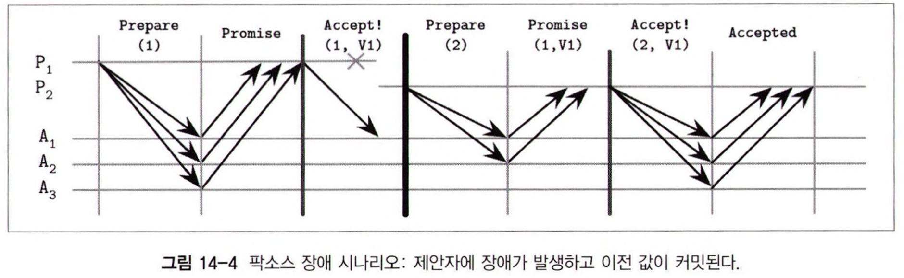
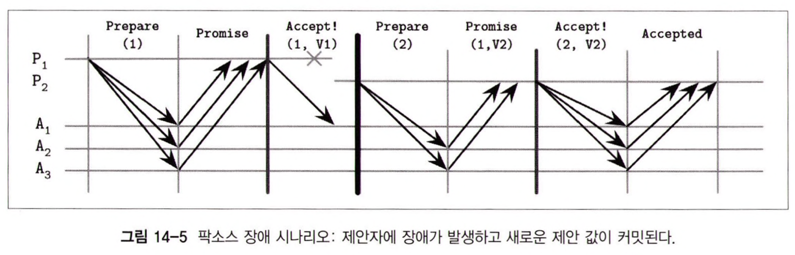
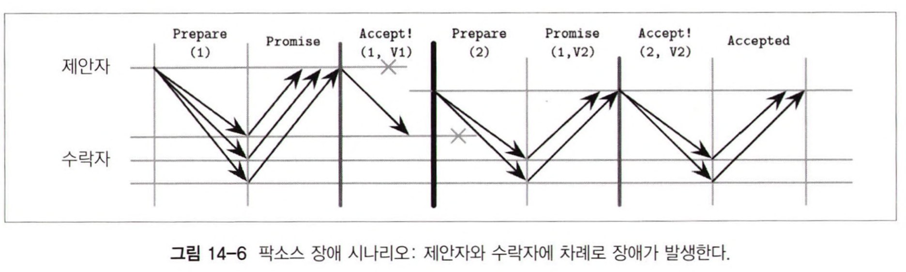

```toc
```

- FLP 불가능성 이론에 따르면 완전 비동기 시스템에서 일정 시간 내에 합의를 보장할 수 없다
- 메시지 전달이 보장된다고 해도 각 프로세스는 다른 프로세스에 장애가 발생했는지 또는 통신에 문제가 생겼는지 알 수 없다.


- 합의 알고리즘은 비동기 모델에서의 안정성을 보장하고, 외부 장애 감지기는 프로세스의 상태에 대한 정보를 수집해 라이브니스를 보장한다.
- 하지만 장애 감지는 부정확할 수 있기 때문에 합의 알고리즘은 장애가 감지될 때까지 기다리거나, 잘못된 감지로 인해 알고리즘을 다시 시작하는 상황이 발생할 수 있다.


- 합의를 통해 이벤트를 특정 순서로 수행하고, 노드 사이의 일관성을 유지할 수 있다.


- 이론적으로 합의 알고리즘에는 세 개의 속성이 있다
    - 일치성(Agreement)
        - 모든 정상 프로세스는 동일한 값에 대해 합의한다
    - 유효성(Validity)
        - 합의 값은 참가 프로세스 중 한 프로세스가 제안한 값이다
    - 유한성(Termination)
        - 모든 정상 프로세스는 결국 합의에 도달한다


- 합의가 성립되면 어떤 프로세스도 결과에 이의를 제기할 수 없다
- 유한성은 알고리즘이 어떤 결론에 도달하지 못하고 끝나지 않거나 장애가 발생한 프로세스가 복구되기만을 기다리는 상황이 방지한다.

## 브로드캐스트

- 브로드캐스트 알고리즘을 사용해 프로세스 사이에 정보를 전파할 수 있다
- 조건과 보장하는 부분이 다른 다양한 브로드캐스트 알고리즘이 존재한다.


- 한 개의 코디네이터가 모든 노드에 데이터를 전파해 데이터를 복제할 때 주로 브로드캐스트를 사용한다
- 하지만 신뢰적인 통신을 보장하는 일은 간단하지 않다.


- 최선형(best effort) 브로드캐스트 알고리즘은 가장 단순하지만 확실하게 메시지를 브로드캐스트 할 수 있는 방법이다
- 이 알고리즘에서 송신 노드는 모든 대상 노드에 대한 메시지 전달을 보장한다.
- 단, 노드에 장애가 발생하면 다른 노드가 재시도하지 않기 때문에 코디네이터에 장애가 발생하면 브로드캐스트는 실패한다.


- 신뢰적 브로드캐스트(Reliable broadcast)는 장애 감지 알고리즘과 대체(fallback) 매커니즘을 사용해 구현할 수 있다.
- 가장 간단한 방법은 모든 노드가 자신이 전달 받은 메시지를 다시 자신이 알고 있는 다른 노드에게 전달하는 것이다.
- 이는 브로드캐스트를 시작한 노드에 장애가 발생해도 메시지를 전달할 수 있지만 메시지의 수가 N² 개가 되어버린다


- 이상적으로 우리는 브로드캐스트의 신뢰성을 높이고자 사용되는 메시지의 수를 최소화해야 한다.

### 원자적 브로드캐스트

- 앞에서 말한 알고리즘은 메시지 전달은 보장하지만 전달 순서는 보장하지 않는다.
- 메시지는 결과적으로 알 수 없는 시점에 목적지에 도착한다.
- 메시지를 특정 순서로 전달하기 위해서는 신뢰성과 전 순서(total order)를 보장하는 원자적 브로드캐스트(atomic broadcast or total order multicast) 알고리즘을 사용해야
  한다.


- 원자적 브로드캐스트는 다음 두 가지 필수 속성을 보장한다
    - 원자성
        - 모든 프로세스가 전달받은 메시지는 일치한다. 일부만 받고 이런 일이 없다.
    - 순서
        - 모든 정상 프로세스는 메시지를 같은 순서로 전달한다


- 메시지는 원자적으로 전달된다
- 즉, 모든 메시지는 모든 프로스세으게 전달되거나 아예 전달되지 않는다
- 메시지는 성공적으로 전달된 다른 메시지의 전후에 위치한다.

### 가상 동기화

- 가상 동기화(virtual synchrony)는 브로드캐스트를 사용해 그룹 간 통신을 지원하는 대표적인 프레임워크다
- 원자적 브로드캐스트는 정적 프로세스 그룹을 대상으로 하지만 가상 동기화는 동적 그룹을 대상으로 한다.


- 가상 동기화는 프로세스를 여러 그룹으로 나눈다
- 그룹 내 모든 구성원들은 메시지를 동일한 순서로 전달 받는다.
- 메시지의 순서는 사용자가 직접 정의한다.


- 모든 프로세스의 그룹 뷰는 동일하며, 메시지는 그룹별로 지정된다
- 같은 그룹에 속한 프로세스끼리만 동일한 메시지를 볼 수 있다


- 구성원이 그룹에 들어오거나 나가거나, 장애가 발생하면 모든 구성원에 변경 사항을 알리고 그룹 뷰도 변경한다.
- 모든 메시지는 메시지를 생성한 그룹 ID와 고유하게 매핑된다 .


- 가상 동기화는 메시지 수신과 전달을 구분한다
- 특정 뷰에서 보낸 메시지는 오직 해당 뷰 안에서만 전달될 수 있다
    - 수신한 그룹과 메시지에 매핑된 그룹을 비교해서 보장


- 메시지는 특정 그룹에 속하므로 뷰가 변경되기 전에 그룹 내 모든 프로세스가 메시지를 수신하지 않으면 메시지가 전달되었다고 보장할 수 없다.
- 즉, 메시지는 뷰가 변경되는 시점 사이에 전달되므로 원자적 전달이 보장된다.


- 순서를 보장하는 일부 브로드캐스트 알고리즘은 개별 프로세스(시퀀서)를 사용해 메시지를 순서화한다
- 이는 구현이 쉽지만 리더의 상태를 계속해서 확인해야 한다는 단점이 있다
- 하지만 시퀀서를 사용하면 모 메시지에 대해서 프로세스 간 합의를 하지 않아도 되고 시퀀서 자체 뷰를 활용할 수 있어서 성능 면에서 유리하다
- 요청을 파티셔닝할 경우 확장도 가능하다.


- 이런 기술적 이점에도 불구하고 거의 사용되지 않는다.

https://medium.com/@macworks/virtual-synchrony-575219a01252

### 주키퍼 원자적 브로드캐스트

- 주키퍼에서는 ZAB(Zookeeper Atomic Broadcast)라는 원자적 브로드캐스트 알고리즘을 사용한다.


- ZAB의 프로세스는 리더 또는 팔로워 역할을 한다.
- 리더는 임시직이며 알고리즘의 단계를 수행하고, 팔로워에게 메시지를 브로드캐스트하며, 이벤트의 순서를 결정한다.
- 클라이언트는 클러스터 내 하나의 노드와 연결하는데 리더라면 직접 처리하고, 팔로워면 리더에게 요청을 전달한다


- 리더의 고유성을 보장하기 위해 타임라인을 에포크로 나누고 단조 증가하는 식별 변호를 할당하낟
- 에포크별로 하나의 리더만 존재할 수 있다
- 또한 정상일 확률이 높인 프로세스를 선출해 예비 리더를 선출한다
- 이는 성능 최적화의 일환이다


- 예비 리더가 선출되면 다음 세 가지 단계로 프로토콜을 수행한다
    - 발견 단계
        - 새로운 리더는 각 프로세스가 알고있는 마지막 에포크를 수집하고, 그중 가장 큰 에포크보다 더 큰 에포크를 제안한다.
        - 팔로워는 이전 에포크에서 마지막으로 수행한 트랜잭션의 식별자를 보내며 제안을 수락한다
        - 이 단계가 완료되면 프로세스는 새로운 에포크보다 작은 에포크에 응답할 수 없다
    - 동기화 단계
        - 이전 리더에 발생한 장애를 복구하고, 뒤처진 팔로워를 동기화
        - 새로운 리더는 모든 팔로워에게 새로운 에포크를 대표하는 새로운 리더가 선출된 것을 알리고 응답을 기다린다
        - 모든 응답이 오면 리더가 확정된다
        - 이 단계가 완료되면 팔로워는 현재 에포크에 새로운 리더가 선출되는 것을 수락하지 않는다
        - 새로운 리더는 모든 팔로워가 동일한 히스토리를 갖도록 이미 커밋된 제안들을 이전 리더로부터 전달한다
        - 새로운 에포크의 메시지 전파를 시작하기 전에 먼저 이전 제안이 모두 동기화되어야 한다.
    - 브로드캐스트 단계
        - 모든 팔로워가 동기화되면 메시지 전파를 다시 시작한다
        - 리더는 클라이언트의 메시지를 수신해 순서를 정하고 팔로워에게 전파한다
        - 팔로워의 응답이 정족수를 충족하면 커밋한다.
        - 이 방법 덕분에 중단 없는 2단계 커밋이 가능하다
        - 팔로워는 리더의 제안을 거부할 수 없지만 다른 에포크의 리더의 제안에는 응답하지 않아야 한다
        - 리더에 장애가 발생하거나, 파롤워가 분리되거나 메시지 지연으로 인해 장애 발생이 의심될 때까지 브로드 캐스트 단계를 반복한다


- 모든 프로세스는 모든 단계를 성실하게 수행하고 프로토콜을 따른다고 가정한다


- 리더와 팔로워는 다른 프로세스의 라이브니스를 하트비트로 판단한다.
- 리더가 과반의 팔로워로부터 응답을 받지 못하거나, 팔로워가 리더에 장애가 발생했다고 판단하면 새로운 선출 과정이 시작된다


- 메시지는 순서대로 전달되어야 하므로 리더는 이전 메시지에 대한 응답을 수신할 때까지 다음 메시지를 보내지 않는디.
- 팔로워가 메시지를 중복 수신해도 순서만 맞으면 문제가 되지 않는다
- ZAB는 하나의 리더가 쓰기 요청을 수신하고, 수행 순서를 정해 브로드캐스트하므로 동시다발적으로 요청을 처리할 수 있다.


- ZAB의 전역적 메시지 순서는 복구 효율을 향상시킨다
- 동기화 단계에서 각 팔로워는 가장 최근에 커밋된 제안의 식별자를 반환하므로 가장 높은 식별자를 반환한 팔로워로부터 메시지를 복사한다.


- ZAB의 장점은 높은 효율성이다
- 브로드캐스트는 두 번의 메시지 교환이면 충분하고 리더 노드의 장애는 최신 프로세스가 누락된 메시지를 스트리밍하면 해결할 수 있다
- 리더가 오래 유지되면 성능적으로도 좋다
- 리더는 로컬 뷰 기반으로 이벤트 순서를 설정할 수 있으므로 히스토리를 재구성하는 추가적인 합의 단계가 줄어든다

| ZAB 관련 정보를 더 찾아보려고 했는데 책에서 나온 내용 이상으로 다룬 자료가 잘 안 보이네요..

## 팍소스

- 원자적 브로드캐스트는 장애가 발생할 수 있는 비동기 시스템에서의 합의와 동등한 수준의 문제다
- 모든 참가 노드가 메시지 순서에 동의하고 알 수 있어야 하기 떄문이다.


- Paxos는 가장 많이 사용되는 합의 알고리즘이다


- 팍소스의 참가자는 제안자, 수락자, 학습자 중 하나의 역할을 수행한다
    - 제안자(Proposer)
        - 클라이언트로부터 전달받은 값을 제안하고, 수락자들의 의견을 수렴
    - 수락자(Acceptor)
        - 제안자가 제안한 값을 수락 또는 거부
        - 제안을 수락하는 데 과반의 동의 필요
    - 학습자(Learner)
        - 수락된 제안의 결과를 저장하는 복제 노드 역할


- 모든 참가자는 모든 역할을 맡을 수 있고 동시에 여러 역할을 수행하는 것도 가능
- 모든 제안은 클라이언트가 제안한 값과 단조 증가하는 제안 번호로 구성된다
    - (id, timestamp)
    - 타임스탬프가 같은 경우 노드의 id를 비교키로 사용
- 이 번호를 기반으로 전역적 작업 순서와 작업들 사이의 관계 정의

https://www.youtube.com/watch?v=d7nAGI_NZPk
https://gruuuuu.github.io/integration/paxos-raft/
https://medium.com/the-sixt-india-blog/raft-and-paxos-a-brief-introduction-to-the-basic-consensus-protocols-powering-distributed-systems-1a0ef7ca3acb
https://medium.com/@dsfan/how-to-understand-paxos-61e9b38d9479

### 팍소스 알고리즘

- 팍소스 알고리즘은 선출(voting)과 복제(replication) 단계로 구성된다.
    - 선출 단계에서 여러 제안자들은 리더가 되기 위해 서로 경젱한다
    - 복제 단계에는 제안자가 수락자에게 값을 전파한다


- 제안자는 클라이언트와 처음으로 접촉한다.
- 클라이언트에게 전달 받은 제안 값에 대한 수락자의 의견을 수집한다
- 이 과정이 완료되면 합의 값에 대한 정보를 학습자에게 전파해 합의 결과를 반영한다


- 하나의 제안자만이 과반의 동의를 받을 수 있으며 의견이 정확히 반으로 갈린 경우 다시 시작한다


- 제안 단계에서 제안자는 `Prepare(n)` 메시지(n은 제안 번호)를 과반의 제안자에게 전송하고, 응답을 수렴한다.
    - 제안 번호를 먼저 수락자에게 전달
    - 과반이 수락하면 해당 제안 번호를 갖고 다음 과정 진행
- 제안자의 메시지를 수신한 수락자는 응답 시 다음 조건을 충족해야 한다
    - 이미 어떤 값을 응답한 경우 그 값보다 낮은 값을 응답하지 않는다
    - 응답한 값보다 높은 제안 번호가 온 경우 그 값을 응답할 수 있다
    - 이미 다른 제안을 수락한 경우(응답이 아니라 수락, `Accept!(m, vaccepted)` 메시지 수신) `m`번 제안을 이미 수락했다는 의미로 `Promise(m, vaccepted)` 메시지를 응답


- 복제 단계에서 수락자의 과반수가 제안을 응답한 경우 제안자는 `v`(제안값), `n`(제안 번호)를 가지고 `Accept!(n, v)` 메시지를 수락자에게 전송해 제안을 커밋하고 복제를 시작한다
- `v`는 수락자로부터 받은 응답 중 가장 번호가 높은 제안의 값이거나, 자신이 제안한 값이다


- 수락자는 `m > n`, `Prepare(m)` 메시지에 응답하지 않은 경우에만 `n`번 제안을 수락할 수 있다
- 만약 제안을 거절할 경우 제안자가 최신 상태를 유지할 수 있도록 수락자는 자신이 알고 있는 가장 높은 제안 번호로 응답한다.


- 제안 값에 대한 합의가 이뤄지면 일관성을 보장하기 위해 다음 제안자들도 해당 값을 수락해야 한다
- 따라서 수락자는 항상 자신이 알고 있는 가장 높은 제안 번호로 응답한다


- 학습자는 과반의 수락자로부터 통지를 받으면 합의 값을 알 수 있다
- 수락자는 학습자가 최대한 빨리 값을 알 수 있도록 수락하는 즉시 값을 전달한다
- 다수의 학습자가 존재하면 각 수락자는 모든 학습자에게 값을 전달하며, 특별(distinguished) 학습자로 지정된 일부 학습자는 전달받은 값을 다시 다른 학습자에게 전달한다.


- 기본적인 팍소스 알고리즘은 값을 결정할 때마다 리더를 선출한다. 제안자가 한 번에 여러 값을 제안하는 것을 허용하면 알고리즘의 단계를 줄일 수 있는데 이 방식은 멀티 팍소스에서 자세하게 다룬다

### 팍소스에서의 쿼럼

- 쿼럼은 작업을 수행하는 데 필요한 최소 응답 수이며 일반적으로 참가자의 과반수와 같다
- 이러한 쿼럼 덕분에 일부 참가자에 장애가 발생하거나, 네트워크 파티션이 발생해도 프로토콜의 정확성을 보장하는 중재자가 최소 하나는 존재함을 보장할 수 있다.
- 즉, 참가자가 과반수의 제안을 수락한 경우 해당 값은 프로토콜에 의해 보장된다
    - 두 다수 집단에는 최소 하나의 공통된 참가자가 있다


- 팍소스는 장애가 발생해도 안정성을 보장한다.


- `f`개의 프로세스 장애가 발생했을 때 라이브니스를 보장하기 위해서는 `2f + 1`개의 프로세스가 필요하다

### 장애 시나리오

- 제안자가 모든 수락자에 값을 전달하기 전에 장애가 발생하는 경우 새로운 제안자가 값을 커밋하고 다른 참가자에게 전파할 수 있다.



- P1의 1번 제안이 수락되고 A2만 V1 값을 수신한 뒤에 P1에 장애 발생
- P2의 2번 제안을 쿼럼(A1, A2)가 수락하고, P1의 합의값인 V1이 커밋된다


- 알고리즘의 상태는 여러 노드에 복제되기 때문에 제안자에 장애가 발생해도 여전히 합의에 도달할 수 있다
- 제안자가 값을 전달한 뒤에 장애가 발생하면 다음 제안자가 해당 값을 다시 제안할 수 있으며, 최초 제안자는 이러한 사실을 알 수 없다.


- 만약 클라이언트가 최초의 제안자와만 통신할 수 있다면 클라이언트는 팍소스 수행 결과를 알지 못하는 상황이 발생할 수도 있다



- 하지만 제안자에 장애가 발생했을 때 해당 제안 값이 커밋되지 않을 수도 있다


- A1이 V1을 수신한 뒤에 P1에 장애가 발생
- P2는 2번 제안으로 새로운 라운드를 시작하고, 쿼럼은 이를 수락하지만 A2, A3가 먼저 응답해 A1에는 다른 값이 커밋되어있지만 P2는 자신이 제안한 값을 커밋한다



- A1이 V1을 수락한 뒤에 P1에 장애 발생
- 다음 제안자에게 마지막으로 커밋된 값인 V1을 알리기 전에 A1에 장애 발생
- 새로 라운드를 시작한 P2는 A1로부터 값을 응답받지 못하고 새로운 값 V2를 커밋
- A1로부터 응답을 받는 모든 제안자는 A1의 값을 무시하고 더 최근에 수락된 값을 선택


- 둘 이상의 제안자가 경합하면 어느 누구도 과반수를 확보하지 못해 모두 실패할 수도 있다
- 여러 제안자가 계속 재시도하고 모두 커밋하지 못하는 상황을 방지하기 위해 다른 제안자들이 대기하는 동안 특정 제안자를 커밋시키는 랜덤 백오프(random backoff) 방식을 사용한다.


- 팍소스 알고리즘은 수락자의 과반이 정상일 때만 장애가 허용된다

### 멀티 팍소스

- 멀티 팍소스(Multi-Paxos) 알고리즘은 제안 단계를 반복하지 않고 이전 제안자를 그대로 유지하기 위해 특별 제안자라는 리더의 개념을 추가한다
- 리더의 존재는 알고리즘의 효율성을 크게 향상시킨다.
- 리더가 존재하는 경우 제안 단계를 건너뛰고 복제 단계를 바로 수행할 수 있다.


- 새로운 리더가 이미 선출된 후 이전 리더를 통해 읽기를 진행하면 값이 정확하지 않을 수도 있다
- 이러한 상황과 다른 프로세스가 커밋하는 것을 방지하기 위해 멀티 팍소스는 리스(lease) 개념을 사용한다.
- 리더는 주기적으로 참가자의 상태를 확인하고 정상이면 리스를 연장한다
- 참가자는 리스 기간 동안 다른 리더의 제안에 응답하지 않을 것을 약속한다.


- 리스는 정확성을 보장하는 기법이 아니라 쿼럼 대신 리더를 통해 읽기를 수행하는 성능 최적화 기법이다
- 리스는 참가자 간 제한된 클럭 동기화를 통해 안정성을 보장하지만, 클럭 간 시간 오차가 크면 선형화 가능성이 보장되지 않을 수도 있다.


- 멀티 팍소스는 어떤 대상에 대해 수행된 연산들을 기록한 로그의 복제본이라고 볼 수도 있다
- 각 참가자는 수신한 메시지를 로그에 기록한다.


- 로그가 무한정 커지는 것을 방지하기 위해 로그의 내용을 현재 상태에 반영할 수 있어야 한다
- 모든 내용이 적용되고, 상태 스냅숏이 생성되면 해당 로그는 삭제할 수 있다
    - 스냅숏에 대한 변경과 로그 삭제는 원자적으로 이루어져야 한다


- 단일 결정형 팍소스(single-decree Paxos)는 한 번 쓴 값은 수정하지 못하는 write-one 레지스터와 비슷하다
- 반면에 멀티 팍소스는 여러 값을 기록할 수 있는 추가 전용 로그와 비슷하다
- 한 번에 하나의 값을 쓸 수 있고, 모든 값에는 순서가 있으며, 값은 수정될 수 없다
- 액티브 디스크 팍소스(Active Disk Pasxos), CAS 팍소스(CASPaxos)와 같은 합의 알고리즘은 상태 기계 복제 대신 read-modify-write 레지스터를 제공하고 프로세스 간 상태를
  공유한다.

https://www.microsoft.com/en-us/research/publication/active-disk-paxos-with-infinitely-many-processes/

https://vadosware.io/post/paxosmon-gotta-concensus-them-all/

### 패스트 팍소스

- 모든 제안자가 리더를 통하지 않고 수락자와 직접 통신하면 메시지 교환 횟수가 1회 줄어든다
- 이를 위해선 쿼럼의 크기를 `f + 1`에서 `2f + 1`로 늘리고 총 `3f + 1`개의 수락자가 필요하다
- 이러한 방식을 패스트 팍소스(Fast Paxos)라고 부른다


- 일반 팍소스 알고리즘의 복제 단계에서 제안자는 제안 단계에서 수집한 값 중에서 원하는 값을 선택할 수 있다
- 패스트 팍소스는 일반 팍소스와 동일한 방식읠 클래식(classic) 라운드와 수락자가 다른 값을 선택할 수 있는 패스트(fast) 라운드록 구성된다.


- 패스트 팍소스 알고리즘은 제안 단계에서 과반수의 응답을 수집한 제안자는 코디네이터, 그 외는 모두 제안자라고 지칭한다


- 코디네티어는 복제 단계에서 원하는 값을 선택할 수 있을 경우 패스트 라운드에서 대신 수락자에 `Any` 메시지를 전송한다.
- 수락자는 제안자가 보낸 값을 코디네이터로부터 받은 값처럼 취급하고 클래식 라운드와 같은 방식으로 진행할 수 있다.
- 즉, 수락자는 독립적으로 값을 선택할 수 있다


- 여러 제안자가 메시지 교환 횟수를 줄이기 윟래 패스트 라운드에 참여하고, 수락자가 각자 다른 값을 전달받은 경우 충돌이 발생한다
- 이 경우 코디네이터가 개입해서 새로운 라운드를 시작하고, 복구를 진행한다
    - 수락자가 같은 값으로 수렴할 수 있도록 제안 단계를 다시 시작


- 패스트 팍소스의 단점은 요청이 많으면 충돌로 인해 메시지 수와 요청 레이턴시가 증가한다는 것이다
- 또한 라운드가 줄었지만 복제본 수의 증가로 참가자 간 교환되는 메시지 수가 늘어나 일반 팍소스보다 레이턴시가 더 높아질 수도 있다.

https://vadosware.io/post/paxosmon-gotta-concensus-them-all/#paxos-gets-faster-fastpaxos-20042005

### 평등주의적 팍소스

- 특별 제안자를 리더로 사요하면 리더에 장애가 발생했을 때 시스템은 리더를 새로 선출해야 한다.
- 또한 리더에 부하가 집중돼 성능에 저하가 발생할 수 있다
    - 파티셔닝을 통해 이를 방지할 수 있다


- 리더와 제안 번호를 사용해 수행 순서를 정의하는 대신 특정 작업의 커밋을 담당하는 리더를 선출하고, 종속 관계를 조회 및 설정해 순서를 정의하는 방법도 있다.
- 이런 방식을 평등주의적 팍소스(Egalitarian Paxos, EPaxos)라고 한다
- 충돌이 발생하지 않는 쓰기를 복제된 상태 기계에 독립적으로 커밋하는 방식은 Generalized Paxos라는 이름으로 처음 제안되었고, EPaxos는 이를 구현한 첫 사례다.


- EPaxos는 일반 팍소스와 멀티 팍소스의 장점을 모두 가진다
- 일반 팍소스는 매 라운드마다 리더를 선출해 가용성이 높지만 메시지 교환이 복잡하다
- 멀티 팍소스는 처리량이 높고 메시지 수는 적지만 리더가 병목 지점이 될 수 있다


- EPaxos의 첫 단계는 제안의 리더를 선출하는 사전 수락(pre-accept) 단계다
- 모든 제안은 다음 항목을 포함한다.
    - 종속 관계
        - 현재 제안에 간섭할 수 있는 모든 작업의 목록
        - 커밋되지 않은 작업도 포함
    - 시퀀스 번호
        - 종속 관계 사이의 순환 종속성 제거
        - 종속 관계에 있는 작업의 시퀀스 번호보다 큰 값으로 설정


- 위 정보를 수집한 뒤 `Pre-Accept` 메시지를 복제 노드의 패스트 쿼럼(fast quorum)에 전송하낟
- 패스트 쿼럼은 3f/4개의 복제 노드를 가리키며, f는 장애 허용 노드 수다.


- 복제 노드는 로컬 작업 로그에서 현재 작업과 충돌할 수 있는 제안을 종속 관계에 업데이트하고 리더에 다시 전달한다
- 리더와 패스트 쿼럼의 종속 관계 목록이 일치할 경우 리더는 제안을 커밋할 수 있다.


- 리더가 충분한 수의 응답을 받지 못하거나 종속 관계가 일치하지 않을 경우 해당 제안을 새로운 종속 관계와 시퀀스 번호로 업데이트한다.
- 새로운 시퀀스 번호는 모든 복제 노드가 알고 있는 시퀀스 번호보다 큰 번호로 설정한다
- 리더는 [f/2] + 1개의 복제 노드에 업데이트된 제안을 전달하고 제안을 커밋한다.


- EPaxos에는 2가지 경로가 존재한다
    - 빠른 경로(Fast path)
        - 종속 관계가 일치할 경우 리더는 패스트 쿼럼에 제안을 커밋할 수 있다
    - 느린 경로(Slow path)
        - 종속 관계가 일치하지 않을 경우 리더는 각 노드가 종속 관계를 갱신한 뒤에 커밋할 수 있다


- 작업 A, B의 수행 순서가 유의미하고 순서에 따라서 결과가 달라질 때 서로 간섭한다고 표현한다


- 클라이언트에 응답하고 복제 노드에 비동기적으로 Commit 메시지를 전송하면 커밋이 완료된다


- 종속 관계는 사전 수락 단계에서 수집되므로 요청을 수행하는 시점에 이미 수행 순서는 확정된다
- 중간에 다른 작업이 끼어들 수 없으며 시퀀스 번호가 가장 큰 작업 뒤에만 추가될 수 있다.


- 작업을 수행하기 위해서 각 복제 노드느 종속 관계 그래프를 만들고 역순으로 커맨드를 수행한다
- 서로 간섭하는 작업만이 서로 의존하기 때문에 이러한 상황은 자주 발생하지 않는다.


- EPaxos도 Paxos처럼 제안 번호를 사용해 가장 최신이 아닌 메시지가 전파되는 것을 방지한다
- 시퀀스 번호는 에포크와 노드별로 단조 증가하는 카운터, 복제 노드 ID로 구성된다
- 복제 노드는 낮은 번호의 제안을 받은 경우 수락하지 않고 자아 높은 시퀀스 번호와 종속 관계 목록으로 응답한다.

https://vadosware.io/post/paxosmon-gotta-concensus-them-all/#paxos-cares-about-equality-egalitarian-paxos-aka-epaxos-2013

### 플렉서블 팍소스

- 쿼럼은 일반적으로 프로세스의 과반수를 의미한다.
- 과반수의 정의에 의해 어떤 쿼럼 사이에는 하나 이상의 노드가 겹친다.
- 결국 쿼럼을 과반수로 정의하는 이유는 합의가 보장되어야 한다는 안정성 때문이다


- 멀티 팍소스에서는 리더 선출 단계가 자주 발생하지 않는다
- 결국 R + W > N 조건이 유지되면 항상 쿼럼 사이에 교집합이 존재한다
- 합의 알고리즘에도 이를 적용할 수 있다.
- 즉, 리더 선출 단계와 제안 수락 단계에 이를 적용할 수 있다.


- 전체 노드를 N, 제안 단게를 Q1, 수락 단계를 Q2라고 할 때 Q1 + Q2 > N이 만족하면 된다
- 제안 단계보다 수락 단계가 더 자주 발생하므로 Q1을 늘리면(Q1 = N - Q2 + 1) Q2는 N/2개로 줄어들 수 있다
- 이러한 접근 방식을 플렉서블 팍소스(Flexible Paxos)라고 한다


- 플렉서블 팍소스에는 가용성과 레이턴시 사이에 트레이드-오프가 존재한다
- 수락 단계에서 필요한 노드 수는 줄지만 리더 선출에 더 많은 응답이 필요하므로 더 많은 참가자가 정상 작동해야만 한다.
    - 최대 N - Q2개의 노드 장애가 허용된다.


- 수직 팍소스(Vertical Paxos)도 쿼럼의 교집합 개념을 활용하는 팍소스 알고리즘이다
- 읽기 쿼럼과 쓰기 쿼럼을 구분하며, 두 쿼럼 사이에는 교집합이 존재해야 한다.
- 리더는 번호가 낮은 제안에 대해서는 더 작은 읽기 쿼럼을 수집하고 자신의 제안에 ㄷ해서는 큰 쓰기 쿼럼을 수집한다.
- 준비 단계와 수직 단계의 퀆을 out 쿼럼과 decision 쿼럼을 분류하고 플렉서블 팍소스와 유사한 방식으로 쿼럼을 정의한다.

https://vadosware.io/post/paxosmon-gotta-concensus-them-all/#paxos-limbers-up-flexible-paxos-aka-fpaxos-2016
https://vadosware.io/post/paxosmon-gotta-concensus-them-all/#paxos-goes-vertical-vertical-paxos-2009

### 합의를 도출하는 일반적인 방법들

- 팍소스는 역할과 단계까 많고, 여러 변형이 존재해 어렵다
- 더 단순한 개념과 규칙을 사용해 단일 결정형 팍소스를 구현할 수 있다
- 하지만 이 방식은 실제 구현 및 사용 사례가 없는 비교적 새로운 개념이다.


- 하나의 클라이언트와 여러 서버
- 각 서버에는 여러 레지스터 존재
- 레지스터는 한 번만 쓸 수 있으며, 식별할 수 있는 인덱스가 있다
    - 값이 없는 상태, 있는 상태, nil 중 하나의 상태


- 다른 서버에 있는 인덱스가 같은 레지스터들은 레지스터 세트를 형성
- 각 세트에는 하나 이상의 쿼럼 존재
- 레지스터 상태에 따라서 쿼럼은 미정(Any, Maybe v) 또는 결정(None, Decided v) 상태일 수 있다.
    - Any
        - 이후 작업에 따라 쿼럼은 원하는 값 수락 가능
    - Maybe v
        - 쿼럼이 제안을 수락한 경우 그 값은 오직 v만 가능
    - None
        - 쿼럼은 값을 수락할 수 없다
    - Decided v
        - 쿼럼은 이미 v를 수락


- 클라이언트는 서버와 메시지를 교환하고, 값과 레지스터 상태를 상태 테이블에 저장한다.
- 이 상태 테이블 기반으로 쿼럼의 결정을 알 수 있다.


- 정확성을 보장하기 위해 클라이언트가 서버와 통신하는 방법과 쓸 수 있는 값과 쓸 수 없는 값을 제한해야 한다
- 읽기 시 클라이언트는 해당 레지스터의 세트의 쿼럼으로부터 읽은 확정된 값만을 반환한다.


- 알고리즘 안정성을 위해 불변 조건을 유지한다
- 따라서 쓰기는 몇 가지 더 복잡한 규칙이 있다
- 클라이언트는 임의의 새로운 값을 제안할 수 없고 입력 값 또는 레지스터에서 읽은 값만을 쓸 수 있다
- 같은 레지스터 세트의 여러 퀄머은 서로 다른 값을 수락할 수 없다
- 클라이언트는 이전 레지스터 세트의 제안을 덮어쓸 수 없다.

#### 제너럴라이즈드 팍소스

- 한 번만 쓰기 레지스터를 활용해 Generalized Paxos 알고리즘을 구현할 수 있다
- 클라이언트느 지정된 몇 개의 레지스터에만 쓸 수 있고 레지스터 세트의 쿼럼은 서버의 과반수를 의미한다


- 수락 과정은 두 단계로 구성된다
- 첫 번째 단계에서 레지스터에 값을 쓰는 것이 안전한지 확인하고, 두 번째 단계에서 레지스터에 값을 쓴다.


- 1단계
    - 클라이언트는 `P1A(register)` 메시지를 서버에 전송해 쓰려는 레지스터에 값이 없는 상태인지 확인한다
    - 레지스터에 아직 값이 없을 경우 `register - 1`까지의 모든 레지스터를 `nil`로 설정해 클라이언트가 이전 레지스터에 쓰는 것을 방지한다
    - 서버는 지금까지 쓰여진 레지스터 목록을 반환한다
    - 과반수의 서버가 응답한 경우 클라이언트는 인덱스가 가장 큰 레지스터의 값 또는 값이 없을 경우 자신이 제안한 값을 선택한다
    - 과반수가 응답하지 않으면 1단계를 다시 시작한다
- 2단계
    - 클라이언트는 `P2A(register, value)` 메시지를 전송해 1단계에서 선택한 값을 모든 서버에 알린다
    - 과반의 서버가 응답하면 확정된 값을 반환한다
    - 과반이 응답하지 않으면 1단계부터 다시 시작한다


- 이러한 방법은 팍소스 알고리즘을 이해하는 데 도움이 된다
- 상태를 원격 노드 간의 상호작용의 관점 대신에 마지막으로 알려진 상태 관점에서 보면 수락 과정을 단순화할 수 있고, 불확실성을 제거할 수 있ㄲ다
- 불변 상태와 메시지 전달 구현도 더 쉽다.


- 일반 팍소스와 유사한 부분도 있다
- 이전 레지스터 상태가 `Maybe v`인 경우 클라이언트는 `v`를 다시 커밋한다
- 더 낮은 인덱스의 값이 없는 레지스터를 `nil`로 설정하는 것도 일반 팍소스에서 리더 간 충돌 발생 시 더 높은 제안 번호로 다시 제안하는 것과 유사하다

## 래프트

- 참가자는 상태 기계가 수행한 작업을 로그에 기록
- 입력 값은 모두 같고, 작업은 같은 순서로 로그에 기록되므로 수행 결과 또한 동일하다


- 래프트는 리더의 개념을 일급 시민(first-citizen)으로 확장해 합의를 단순화한다
    - Paxos나 ZAB와 달리 리더가 합의에 대해 더 강력한 권한을 가지는..?
- 하나의 복제 노드를 리더로 선출해 원자적으로 커밋하고, 메시지 순서를 정의한다.


- 래프트에서 노드는 다음 중 하나의 역할을 수행한다
    - 후보자
        - 리더 역할은 일시적으로 유지되며 어떤 노드도 리더가 될 수 있다
        - 리더가 되기 위해서 노드는 후보자 상태로 전환하고 과반의 표를 얻어야 한다
        - 어떤 후보자도 과반의 표를 얻지 못한 경우 새로운 임기를 시작하고 선출 과정을 다시 시작
    - 리더
        - 클라이언트의 요청을 처리
        - 복제된 상태 기계와 상호 작용
        - 임기 동안 역할 유지
        - 임기는 순차 증가하는 숫자로 식별되며, 임의의 기간 동안 지속된다
        - 이전 리더에 장애 발생, 응답하지 않거나, 네트워크 파티션 또는 메시지 지연으로 인해 장애가 발생되었다고 판단되면 새로운 리더를 선출한다
    - 팔로워
        - 로그를 저장하고 리더와 후보자의 요청에 응답하는 수동적인 참가자
        - 모든 참가자는 팔로워로 시작


- 클럭 동기화 없이 전역 부분 순서를 보장하기 위해 시간을 임기(또는 에포크) 다누이로 나눈다
- 임기 동안 리더는 단 하나만 존재하며 안정성이 보장된다
- 임기는 단조 증가하는 숫자로 식별되며, 모든 작업은 임기 번호와 임기 내 메시지 번호의 조합으로 고유하게 식별된다.


- 각 메시지에는 임기 번호가 있어 각 참가자는 자신의 임기가 뒤쳐졌다는 사실을 알 수 있다. 만약 뒤쳐졌다면 더 높은 임기 번호로 업데이트한다
- 따라서 특정 시점에는 여러 임기가 존재할 수 있으나 충돌이 발생하면 더 높은 번호가 선택된다
- 노드는 새로운 선출 과정이 시작되거나 자신의 임기가 최신이 아닌 것을 알았을 경우에만 임기를 업데이트한다.


- 시스템 시작시, 팔로워가 리더로부터 메시지를 수신하지 못해 장애라 판단한 경우 새로운 리더를 선출한다
- 참가자는 후보자로 전환해 과반수의 표를 얻어 리더가 되려고 시도한다.


- 리더 선출
    - 후보자는 `RequestVote` 메시지를 모든 참가자에게 전송한다
    - 메시지는 현재 임기, 알고 있는 마지막 임기, 알고 있는 마지막 로그 항목의 ID로 구성된다
    - 과반의 표를 얻으면 후보자는 현재 임기의 리더로 선출된다
    - 참가자는 최대 하나의 후보자를 선택
- 주기적 하트비트
    - 하트비트 매커니즘을 사용해 참가자의 라이브니스를 보장
    - 리더는 주기적으로 모든 팔로워에 하트비트를 전송
    - 팔로워가 설정된 선출 타임아웃 전에 하트비트를 받지 못한 경우 리더에 장애가 생겼다고 판단
- 로그 복제/브로드캐스트
    - 리더는 `AppendEntries` 메시지를 보내 로그에 새로운 항목을 추가할 수 있다
    - 이 메시지에는 리더의 임기, 인덱스, 바로 전에 전송한 로그의 임기, 하나 이상의 새로운 항목을 포함한다.

### 래프트의 리더

- 모든 커밋된 항목이 저장된 노드만이 리더가 될 수 있다
- 선출 과정에서 팔로워의 로그가 후보자보다 더 최신인 경우 팔로워는 투표를 거부한다
    - 임기 ID가 더 높거나, 임기가 같지만 로그 항목이 더 많을 경우


- 로그 항목은 항상 순서대로 복제되므로 마지막으로 추가된 항목의 ID를 비교하면 참가자가 최신 상태인지 알 수 있다.


- 선출된 리더는 클라이언트의 요청을 수신하고 팔로워에 전달한다
- 자신의 로그에 새로운 항목을 추가하고 병렬로 모든 팔로워에게 전송한다.


- `AppendEntries` 메시지를 받은 팔로워는 항목을 자신의 로그에 추가하고 리더에 확인 응답을 보낸다
- 충분한 수의 팔로워가 응답할 경우, 해당 항목은 커밋된 것으로 간주하고 리더의 로그에 이를 표시한다.
- 오직 리더만이 커밋 여부를 결정할 수 있다
- 커밋된 항목은 참가자 쿼럼으로의 복제가 보장되고 로그에 기록된 순서로 상태 기계에 적용해도 안전하다


- 최산 상태의 후보자만이 리더가 될 수 있기 때문에 팔로워는 리더의 최신 상태 여부에 대해 걱정할 필요가 없다

### 장애 시나리오

- 여러 팔로워가 후보자가 되기 위해 경합하는 경우 어떤 팔로워도 과반수의 표를 얻지 못하는 상황이 생길 수 있다
- 이를 투표 분산(split vote)라고 한다.
- 래프트는 무작위 타이머를 사용해 선출 과정이 투표 분산으로 귀결될 확률을 낮춘다
    - 150ms ~ 300ms
    - 매 선거가 시작될 때마다 후보자 노드들의 선거 타임아웃(Election Timeout) 값을 랜덤하게 재조정한다
- 이 덕분에 추가적인 코디네이션 없이 선출 과정에 소요되는 시간을 줄일 수 있다.


- 팔로워는 중단되거나 응답이 늦을 수 있다
- 리더는 메시지를 전달하기 위해 최선의 노력을 해야 한다
- 팔로워가 예상 시간 내에 확인 응답을 보내지 않으면 메시지를 재전송한다
- 나아가 성능 최적화를 위해 여러 메시지를 병렬로 전송한다


- 리더가 제안하는 모든 항목에는 고유 식별자가 있어 중복 전송해도 로그 수행 순서가 보장된다
- 팔로워는 시퀀스 ID를 이용해 중복된 메시지를 제거한다


- 시퀀스 ID는 로그 순서를 보장하는 데에도 쓰인다
- 리더가 보낸 바로 이전 항목의 ID 및 임기가 자신이 가진 가장 높은 순번의 항목과 일치하지 않는 경우 더 높은 순번의 항목을 거부한다
- 서로 다른 복제 노드에 저장된 두 로그 항목의 임기와 인덱스가 같다면 이 두 로그 항목의 내용은 같고, 그 전에 저장된 항목들도 모두 동일하다.


- 래프트는 커밋되지 않은 메시지를 커밋되었다고 잘못 표시하지 않는다
- 이미 커밋된 메시지가 진행중으로 표시될 수는 있지만 커밋될 때까지 재시도하므로 다른 문제는 발생하지 안흔다.


- 팔로워가 리더의 장애를 감지하면 새로운 선출 과정을 시작한다
- 새로 선출된 리더는 클러스터의 상태를 마지막 로그 항목으로 복원해야 한다.


- 리더는 우선 공통 항목(리더와 팔로워 모두가 동의하는 가장 높은 순번의 로그 항목)을 찾고 팔로워에 해당 항목 뒤에 추가된(커밋되지 않은) 모든 항목을 삭제하도록 요청한다
- 마지막으로 리더의 로그에서 가장 최신 항목을 보내 팔로워의 로그를 업데이트 한다.
- 리디의 로그는 삭제나 수정이 불가능하고 오직 추가만 가능하다


- 결국 래프트 알고리즘은 다음 특성을 가진다
    - 임기 동안 하나의 리더만 선출
    - 리더는 자신의 로그 항목을 삭제하거나 재배치하지 않고 새로운 메시지 추가만 한다
    - 리더는 모든 로그 항목을 커밋하지 전에 우선 복제하므로 커밋된 항목은 모든 리더가 공통적으로 저장하여 이를 되돌릴 수 없다
    - 로그 항목은 커밋 전에 복제되므로 모든 차기 리더의 로그에 존재한다
    - 메시지는 메시지 번호와 임기 ID로 식별한다


- 이는 CockroachDB, etcd, consul 등 다양한 분산 시스템에 사용되고 있다

https://raft.github.io/

## 비잔틴 합의

- 지금까지 설명한 모든 합의 알고리즘은 비잔틴(Byzantine) 장애를 허용하지 않는다.
- 비잔틴 장애를 고려하지 않으면 합의에 필요한 참가자 수와 커밋에 필요한 메시지 수를 줄일 수 있다.


- 그러나 비잔틴 장애에 대응할 수 있어야하는 경우도 있다
- 비잔틴 장애는 악의적 의도나 버그, 설정 오류, 하드웨어 문제 또는 데이터 손상에 의해 발생할 수 있다.


- 대부분의 비잔틴 합의 알고리즘은 쿼럼의 모든 노드가 통신해야 하므로 N² 개의 메시지가 필요하다
    - N : 쿼럼의 크기
- 노드는 서로 또는 리더에 의존할 수 없으므로 각 단계마다 전달받은 결과를 다수의 응답과 비교해 검증해야 한다.


- PBFT(Practical Byzantine Fault Tolerance)는 노드 장애가 독립적으로 발생한다고 가정한다
- 장애는 발생할 수 있지만 무기한 지속되지는 않고 결국 복구된다고 가정한다.


- 메시지 위조 및 네트워크 공격을 방지하기 위해 노드 간의 통신 내용은 모두 암호화한다
- 복제 노드는 서로 공개 키를 알고 있고 이를 사용해 아이덴티티를 검증하고 메시지를 암호화한다
- 단, 노드는 메시지를 복호화하므로 노드에 장애가 발생한 경우 시스템 내부에서 내용이 유출될 수 있지만 이는 알고리즘 자체의 문제는 아니다

### PBFT 알고리즘

- PBFT는 안정성과 라이브니스를 보장하기 위해 최대 (n - 1) / 3개의 노드 장애를 허용한다
- 따라서 f개의 노드에 장애가 발생할 수 있다면 시스템에는 최소 `n = 3f + 1`개의 노드가 있어야 한다
- 알고리즘은 비정상 노드 수보다 많은 수의 정상 노드로부터 응답을 수집해야 한다.


- PBFT의 합의 또한 장애가 발생하더라도 모든 정상 복제 노드는 제안 값과 순서에 동의해야 한다.


- PBFT는 뷰 단위로 클러스터를 구분한다.
- 각 뷰는 기본 노드(primary node)와 여러 백업 노드로 구성된다
- 기본 노드에 장애가 발생할 경우 뷰가 변경될 수 있다
- 클라이언트는 기본 노드에 작업을 요청하고 기본 노드는 요청을 백업 노드로 브로드캐스트한다
- 백업 노드는 요청을 처리하고 클라이언트에 결과를 전송한다
- 클라이언트는 `f + 1` 개의 복제 노드가 같은 결과를 반환할 때까지 기다린다.


- 클라이언트의 요청을 수신한 기본 노드는 다음 세 가지 단계를 수행한다.
    - 사전 준비
        - 기본 노드는 단조 증가하는 고유 식별자 뷰 ID와 클라이언트 요청 내용, 요청의 다이제스트가 포함된 메시지를 브로드캐스트한다
        - 다이제스트는 충돌 저항성이 높은 해시 함수를 사용하며, 요청자가 서명한다
        - 백업 노드는 자신의 뷰와 기본 노드의 뷰가 일치하고 다이제스트가 일치하면 메시지를 수락한다
    - 준비
        - 사전 준비 메시지를 수락한 백업 노드는 준비 단계를 시작한다
        - 뷰 ID, 메시지 ID, 요청 다이제스트를 포함하는 `Prepare` 메시지를 모든 복제 노드(기본 노드를 포함)로 브로드캐스트한다
        - 요청 내용 자체는 포함시키지 않는다
        - 사전 준비 단계에서 전달 받은 메시지의 뷰와 ID, 다이제스트가 모두 일치하는 `Prepare` 메시지를 최소 `2f` 개의 백업 노드로부터 받을 경우에만 다음 단계를 수행한다
    - 커밋
        - 백업 노드는 `Commit` 메시지를 모든 복제 노드로 브로드캐스트하고 `2f + 1` 개의 일치하는 `Commit` 메시지를 받을 때까지 기다린다


- 준비 과정에는 메시지 요청 내용이 아니라 다이제스트를 사용하므로 메시지 크기를 줄일 수 있다
- 메시지의 출처를 신뢰할 수 있도록 다이제스트는 모두 서명한다


- 노드들은 서로 메시지가 일치하는지 확인해 잘못된 메시지가 브로드캐스트되는 것을 방지한다
- 정상 노드만 메시지를 커밋할 수 있도록 모든 메시지를 교차 검증한다
- 클라이언트는 `f + 1` 개의 일치하는 메시지를 수신할 때까지 수행 성공 여부를 알 수 없다


- 복제 노드가 기본 노드에 장애가 발생했다고 판단하면 뷰가 변경된다
- 기본 노드의 장애를 감지한 노드는 더 이상 다른 메시지에 응답하지 않고 뷰 변경 알림을 브로드캐스트 한 뒤에 확인 응답을 기다린다
- 새로운 뷰의 기본 노드가 `2f`개의 뷰 변경 알림을 수신하면 새로운 뷰가 생성된다.


- 프로토콜의 메시지 수를 줄이기 위해 클라이언트는 요청한 작업을 잠정적으로 수행할 `2f + 1`개의 노드로부터 일치하는 응답을 수집할 수 있다
- 충분한 수의 잠정적인 응답을 수집하지 못한 경우 원래의 방식대로 `f + 1`개의 확정 응답을 기달니다


- 읽기 전용 작업은 한 번의 메시지 왕복으로 수행될 수 있다
- 클라이언트는 읽기 요청을 모든 노드에게 전송하며 값이 일치하는 `2f + 1`개의 응답을 수신하면 작업이 완료된다

### 복구와 체크포인트

- 복제 노드는 수락한 메시지를 로그에 저장한다
- 모든 메시지는 최소 `f + 1`개의 노드에서 수행될 때까지 유지되어야 한다
- 네트워크 파티션 발생 시 로그를 기반으로 뒤쳐진 복제 노드를 최신 상태로 복구한다
- 복구 또한 공격 벡터로 수행될 수 있으므로 복구 시 노드가 전달받은 상태가 유효한지 확인해야 한다.


- 상태를 나타내기 위해 각 노드는 특정 시퀀스 번호까지 메시지의 다이제스트를 계산한다
- 다만 이 과정을 모든 요청마다 수행하기에는 비용이 매우 높다
- 따라서 기본 노드는 `N`개의 요청마다 체크포인트를 저장한다
- 현재 상태에 마지막으로 반영된 요청의 시퀀스 번호와 최신 상태의 다이제스트를 브로드캐스트하고 `2f + 1`개의 복제 노드가 응답하면 해당 시퀀스 번호까지 모든 사전 준비, 준비, 커밋, 체크 포인트 메시지를
  삭제할 수 있다


- 비잔틴 장애 허용은 유용하지만 상당한 오버헤드가 발생하기 때문에 적절한 상황에 사용해야 한다.

https://steemit.com/consensus/@kblock/48-pbft-consensus-algorithm